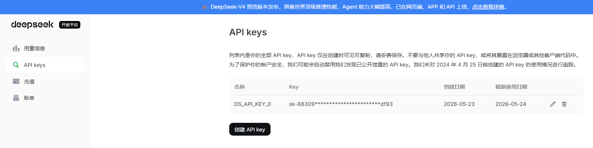
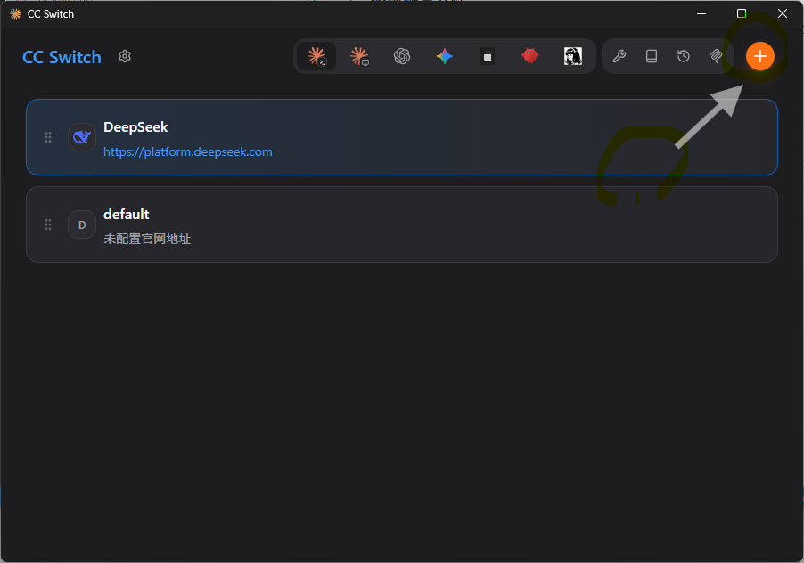
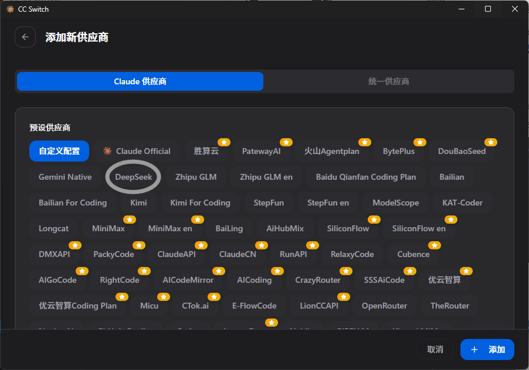
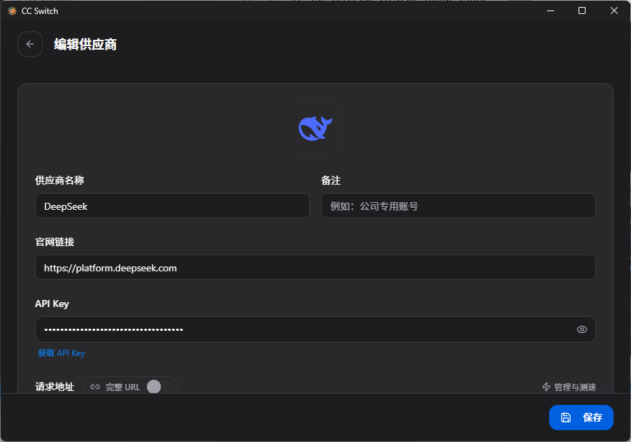
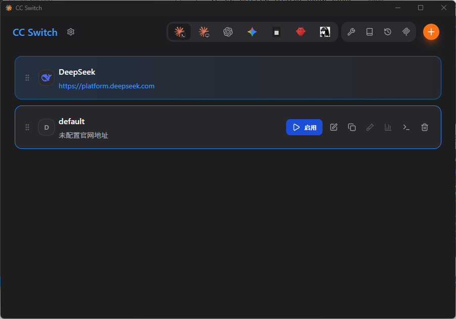
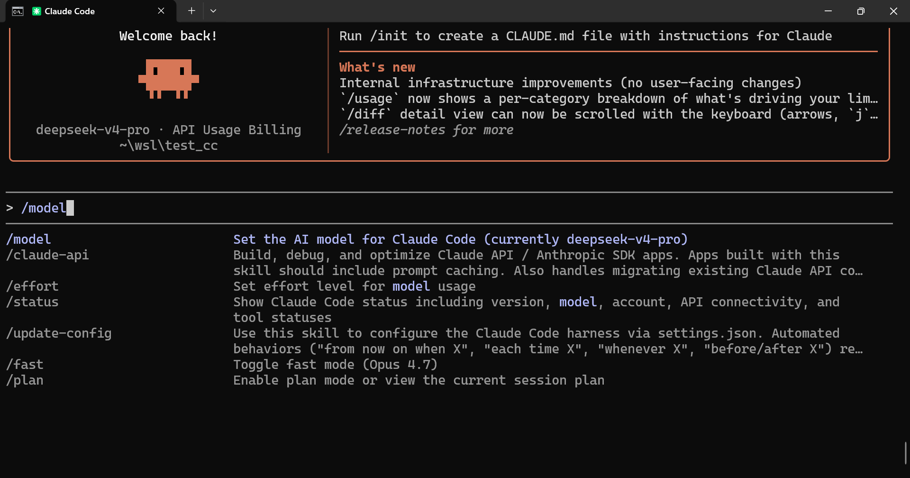
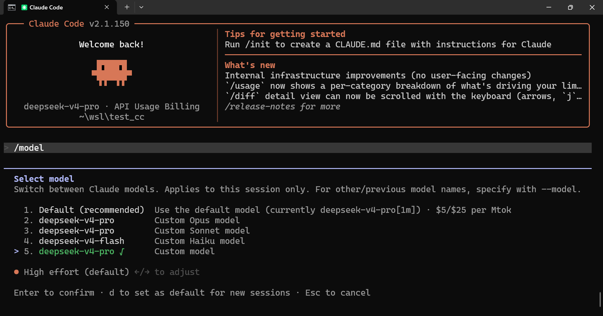
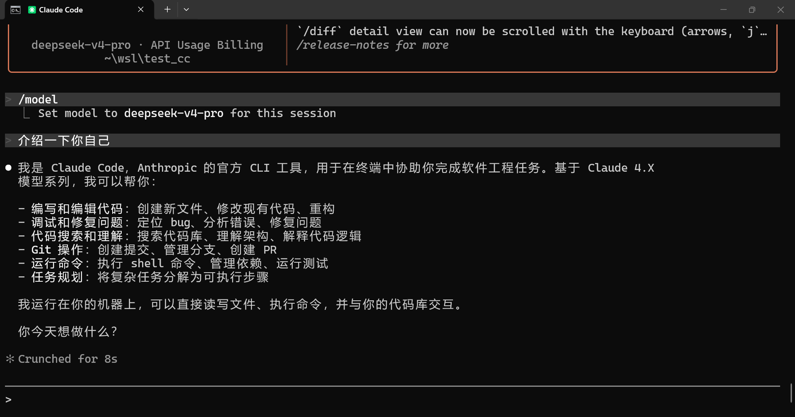
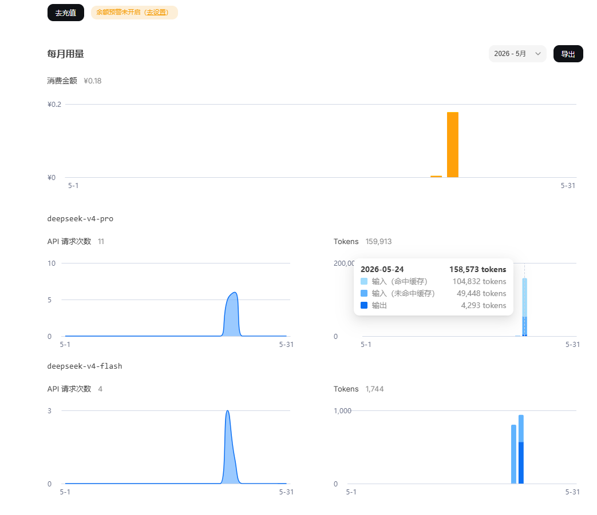

1. 安装 claude code

   ```
   curl -fsSL https://claude.ai/install.cmd -o install.cmd && install.cmd && del install.cmd
   ```

   也可以单独执行每个命令，先下载 install.cmd，然后执行 install.cmd

2. 添加 PATH 路径

   默认安装在用户目录下的 .local/bin 中，将它添加到 PATH 中。
   
   例如 ```C:\Users\XXX\.local\bin```。

3. 修改配置文件

   到用户目录 $HOME（例如 C:\Users\XXX）下，打开 .claude.json。

   在末尾添加一行： "hasCompletedOnboarding": true

4. 从 github 上下载 cc switch，并安装

   ```https://github.com/farion1231/cc-switch/releases```

   对于 windows 下载 CC-Switch-v3.15.0-Windows.msi。

   一路 next 安装 cc switch，最后 launch 运行。

5. 创建 deepseek api key

   

6. 在 cc switch 中添加 deep seek 路由

   点击右上角的加号：

   

   在可用模型中，选择 deepseek：

   

   配置 api_key，编辑新添加的 deepseek，填充刚才创建的 api key：

   

   保存后，点击“启用”，启动对模型的路由：

   

7. 启动 Claude Code

   此时启动 Claude Code 就不会再提示登录了：

   

   输入命令 /model，选择要使用的模型，点击回车确认：

   

   最后就可以在 Claude 中工作了：

   

8. 在 DeepSeek 开放平台上注意 token 的用量

   
