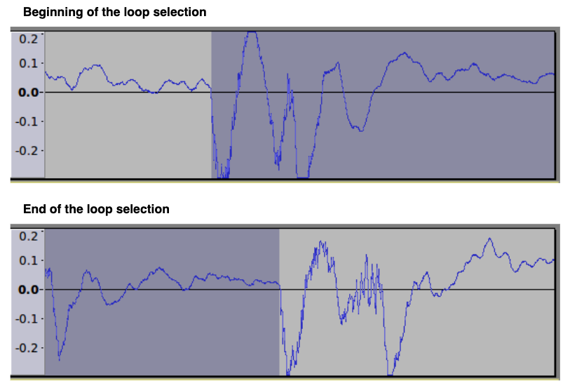
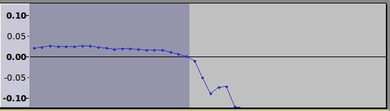

# Audacity Tips

## 导出

Audacity 只带出没有 Mute 的 channel。导出时从时间线的开始处开始，如果在一个 channel 的片段之前有空白，导出的音频中就会出现静音。导出的结尾是最后一个片段的结尾处。

## 创建 Looping 音频

1. Creating an audio loop

   要从一个 audio track 创建一个 audio loop，第一步是找到一个适合的 section。理想情况下，sound 应该是尽可能长的适度不变的（reasonably constant）。

   Looping 对于 mono tracks（单声道）更加容易，因此如果你有一个立体声 stereo 记录，但是一个 mono track（单声道）就足够了，track 可以首先转换成 mono，通过 Tracks > Mix > Mix Stereo down to Mono。

   Sound selection 的开始应该看起来尽可能地匹配 selection 的结束，seleciton 的两端应该被放置到和表示声波的蓝线在0振幅处（Y = 0）相交。

   View 菜单中有一个 item 可以在 zoomed in 的时候，从 selection 的一端跳到另一端
   - View > Skip to > Selection Start( Ctrl + [ )
   - View > Skip to > Go to Selection End( Ctrl + ] )

   要找到合适的 loop points，水平 zoom selection 的 start，然后 selection 的 end。要 zoom，将鼠标放置在 selection edge 然后滚动鼠标滚轮。向左或向右拖拽 selection edges 以找到 loop points，其具有相似的形状，振幅 amplitude，和斜率 slope，使得 loop 的 end 可以平滑地跟随 loop 的 start。

   

   要避免点击，Select > At Zero Crossings 可以确保 selection 的 start 和 end 精确位于 zero crossing point（可能轻微调整 selection edge）

   

   Loop 可以通过 Loop Play 测试（ Shift + Space ）。按下 Shift 时，播放和录制按钮都开始显示循环图标，因此可以直接点击按钮循环播放。Space 是播放。

2. 在 Audacity 中使用 loops

   如果 loop 用在 Audacity 中，selection 可能被 trimmed：Ctrl + T。Loop 可以使用 Copy 和 Paste 重复，尽管更方便的方法是使用 Repeat function: Effect > Repeat。

3. Exporting Loops

   Selection 可以使用 File > Export > Export Selected Audio 来导出。

   无损 lossless PC WAV 格式是用于 loops 的最佳格式。当导出时选择 WAV（Microsoft） signed 16-bit PCM 格式。很多有损，压缩格式，例如 MP3，WMA，和 ADPCM WAV 会导致在 file 的前面和后面添加 silence，或者其他不保证准确长度的问题。

   Seamless loops 应该正常地被导出为 lossless 格式，例如 WAV。如果要使用压缩文件格式，尝试 OGG Vorbis 格式。

### 使用 Timeline Quick-Play 来创建 loops

上面的过程可以通过使用 Timeline 辅助来创建 seamless loop：

1. 确保 Quick-Play 在 Timeline right-click 菜单中是 enabled 的
2. 在 Timeline right-click 菜单中选择 Enable dragging selection
3. 选择一个近似 loop 的 selection
4. 在 selection 内 Shift + Space 来循环播放 selection。
5. 在 selection 内 Shift + Left-Click 来调整 selection 的起点和终点，使得 loop 位置尽可能 seamless
6. 如果可能，在 start / end position 处 zoom in，以调整选择和播放区域
7. 注意如果 zooming in 导致 selection 区域扩展到可见 track 区域之外，Audacity 将会默认地导致 waveform 滚动。滚动行为可以从 Timeline right-click context 菜单中关闭。
8. 当 zoomed in 时，使用 Ctrl + [ 和 Ctrl + ] （或者 View > Skip to > Selection Start/End）来跳转到 selection 的开始和结束
9. Ctrl/Cmd + B 可以为 loop region 添加标签

如果 selection 可以无缝地 loops，playback 可以停止（Space）并且导出 selection，或者 trimmed selection（Ctrl/Cmd + T 来 trim selection）。Trimmed Selection 和两边的 waveform 分离开来。

### Online Loops

http://ibeat.org

http://www.looperman.com/