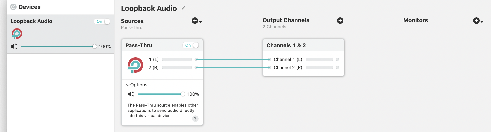

# Device Configuration

## 配置 audio sources

虚拟音频设备可以想简单的 pass-thru（通道）设备一样使用，但是 Loopback 提供更多的能力允许你配置 audio 从一个指定的 sources 流入到一个音频设备。这是通过 Device Editor 的 Sources 列完成的。

当创建一个设备时，它只包含一个特殊的 Pass-Thru source。

