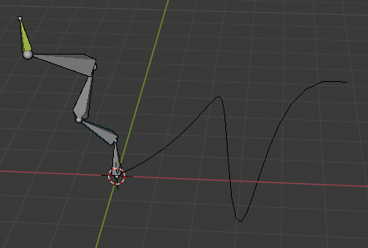
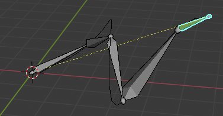

# Posing

一旦完成mesh到armature的skinning，就需要将armature配置到特定姿势pose

通过transform bones，deform或transform skinned objects

Pose在Pose Mode下完成

Reset Position下每个bone的position/rotation/scale都具有自然值（position=0，rotation=0，scale=1）。在Pose Mode下配置armature时，为每个bone创建了一个相对于Reset Position的offset

## Selecting

非常类似在Edit Mode下选择bones，区别是只能选择整个bone，不能选中root/tip joints

Flip Active：镜像选择到另一侧bones

Linked：选择active bone所属到chain上到所有bones
- All Forks

More/Less：选择或者扩展parent bone/child bone

Grouped：选择和当前bone属于同一个Layer或Group到bones

Pattern：根据名字模式选择bones

## Editing

Pose Mode下，bones表现得像objects

Bone的transform中心是root关节点

除了3D Cursor，pivot point只使用所选择的bones的median point，而不是active bone的root

- Basic Posing

  bone变换是基于armature的Rest Position（Idle）进行的。更进一步，所有变换操作都是在bone的local坐标系进行的，这在进行axis locking时非常重要。例如没有bone roll工具，执行bone roll就是lock local Y轴进行旋转而已。如果同时选择很多bones进行roll，每个都是绕着自己的Y轴进行旋转

### Clear Transform

变换一些骨骼后，通过clear transform回到rest position

Location/Rotation/Scale（Alt-G，Alt-R，Alt-S）：清除位移/旋转/缩放

All：清除所有transform

Reset Unkeyed：清除transform到它们的上一个关键帧

- Only Selected：只操作选择的bones，或者所有的bones

### Apply

- Pose as Rest Pose

  将当前pose定义为新的rest pose（将当前pose应用到Edit Mode）。Skinned objects/geometry也重置到默认状态（undeformed状态，没有施加armature modifier的状态，因为rest position也可能对object/geometry进行了deform），这意味着需要重新skin objects/geometry

- Pose Selected as Rest Pose

  类似Pose as Rest Pose，但是只应用于选择的bones

### In-Betweens

Breakdown——分解姿势（VFX breakdown，特效分解）

- Breakdowner

  在当前frame创建一个合适的breakdowner（分解姿势）。然后使用push/relax将breakdowner向rest position、下一个keyframe、上一个keyframe调整

- Push Pose from Breakdown

  插值当前pose使它接近下一个keyframed position

- Push Pose from Rest

  插值当前pose使它接近rest position

- Relax Pose to Breakdown

  只用于keyframed bones。当编辑这种骨骼的时候（使它离开了keyed position）。使用这个工具渐进地将它带回keyed position

  Push是到下一个keyframe，Relax是回到上一个keyframe

- Relax Pose to Rest

  渐进地回到rest position

### Propagate(TODO)

### Copy/Paste Pose

复制粘贴一个pose

- Copy Pose：将选择的bones的当前pose复制到pose buffer（全局剪贴板，记录的只是每个bone的rotation角度和scale值）
- Paste Pose：将剪贴板中的pose（每个bone的rotation角度和scale值）粘贴到当前posed armature
- Paste Pose Flipped：先将buffer中的pose沿着X轴镜像，然后粘贴

要点

    这个工具是session level的，因此可以在aramtures之间、scene之间、甚至files之间使用。但是pose buffer的声明周期是blender的session。

    只有一个buffer剪贴板

    只复制粘贴选择的bones pose

    粘贴时，bone selection不重要。被复制粘贴的pose是按照名字应用的。例如复制了一个名为forearm的bone，当前posed armature的forearm将得到复制的pose（基于rest position和bone local坐标系的旋转角和缩放值）。如果没有对应名字的骨骼，则不会发生任何事情

    被复制粘贴的值实际上是每个bone在它自己局部空间的position、rotation、scale。这意味着粘贴结果的pose可能于原始复制的pose非常不同，依赖于

    - bones的rest position
    - 它们parent的当前pose（position+rotation+scale）

### Flip Quats

### Show/Hide

既可以使用Layer显示隐藏bone，也可以像objects、vertices、control points使用H/Alt-H显示隐藏bones

H/Shift-H/Alt-H

隐藏的bones是特定于mode的。在Edit Mode下隐藏的bones在Pose Mode下仍然可以显示，反之亦然。

## Tool Setting

### Auto IK

Pose Mode下，在Properties Panel的Tool Setting中开启Auto IK，将启动一个临时的IK constraint，target是mouse，IK影响的bone chain是选择的bone的tip到最高层的parent的root

### X-Axis Mirror

沿着X轴对bone对pose操作进行镜像。镜像的bones具有相同的名字，和表示左右的不同后缀（.L .R \_left \_right等等）

### Relative Mirror(TODO)

在X-Axis Mirror时，考虑任何相对transformations

## Bone Constraints

就像Bone在Pose Mode下表现地像boject，他们也可以被约束。这就是为什么Constraints Tab在Object Mode和Edit Mode下都显示的原因。这个Tab包含当前bone的约束

Constraint可以用来控制骨骼pose时的自由度（类似物理系统的关节约束）。IK约束主要用于骨骼约束

最终骨骼的自由度约束是由所有的约束综合而成的。例如可以使用Limit Rotation限制forearm bone的旋转范围，再使用IK约束forarm跟随target。

### Inverse Kinematics

IK简化了动画的过程，可以使用更少的effort创建更高级的动画

IK允许你摆放骨骼链的最后一个bone，而其他bones自动被放置

#### Automatic IK

Automatic IK是快速posing的工具，在Pose Mode下开启。移动一个bone将会自动激活IK并且旋转骨骼链中的上游骨骼。骨骼链必须是connected的

被影响的骨骼链可以调整（Ctrl+WhellDown/PageUp增加骨骼链长度，Ctrl+WhellUp/PageDown减少骨骼链长度）。但是初始的骨骼链长度为0，意味着没有长度限制，尽可能的影响上游骨骼。Ctrl-PageUp首次使用将chain长度设为1（只移动选择的骨骼），Ctrl-PageDown将骨骼长度减少为0，则回到无限模式

这是比IK constraint更受限的特性，IK constraint可以被配置，但是这是可以快速posing的工具

#### IK Constraints

IK几乎总是通过Constraints完成。它于Automatic IK方法相同，但是提供了更多的选择和设置

#### Armature IK 属性面板（TODO）

选择IK使用的算法

#### Bone IK 属性面板

设置每个Bone在IK中的参数

- IK Stretch：拉伸到IK target的影响

- Lock：锁定axis，不允许沿着指定axis移动

- Stiffness：沿着指定轴运动的僵化程度，更高的僵化程度使得更倾向于选择其他bone使末端骨骼达到指定位置。如果开启Lock，关闭influence

- Limit：限制沿着指定轴的运动

### Spline IK

将骨骼链沿着curve对齐的约束。通过利用曲线提供的方便而灵活地得到优美地形状以及骨骼提供的可预测性和良好集成的控制，Spline IK是rigger工具箱中的无价的工具。尤其适合于rigging灵活的身体部分，例如尾巴，触手，以及非器官事物例如绳子等等。

#### Basic Setup

Spline IK不是严格的IK方法（就像IK Constraint），而是一个Forward Kinematics方法。然而它仍然共享一些IK Constraint的特性，例如操作多个骨骼，不可用于Objects，以及在所有其他Constraints被求值之后求值。如果标准IK和Spline IK同时影响骨骼链，Standard IK具有高优先级（后求值）。这样的设置最后避免，因为结果难以控制。

设置Spline IK之后，骨骼链将完全由曲线控制，并且骨骼链会与parent断开，骨骼不仅会旋转，还会缩放，最终使得骨骼链的每个joint都落在曲线上，而第一个root与曲线的start CP对齐，最后一个tip与曲线的end CP对齐，因此它不适合用于刚体骨骼（不可缩放）。之后通过活动曲线的CP就可以改变骨骼链的形状

Influence = 0

Influence = 1

Influence可以控制骨骼链在Rest Position和Curve Position之间的插值blend

要设置一个Spline IK，需要有一个骨骼链和一个curve

- 选择骨骼链的末端骨骼，在Bone Constraints面板中添加Spline IK约束
- 设置骨骼链上游长度
- 将Target字段设置为curve

#### Settings and Controls

- Roll Control

  控制Spline IK chain的roll（沿着骨骼的Local Y轴，即root-tip连线）。从最远的骨骼开始依次roll

  - Copy Rotation约束依然可用
  - Bones不继承曲线的tilt来控制它们的roll
  - 当一个dampened rotation从上游骨骼继承时，没有办法自动创建twisting效果

- Offset Controls（TODO）

  Root Joints不动，只是形状遵循曲线形状

- Length Control（TODO）

- Thinkness Controls（TODO）

Tips

- 为了达到最优变形，bones应该具有大致相同的长度
- Bones的Rest Positon应该大致遵循曲线的形状
- 为了控制曲线，建议使用Hook Modifier（尤其是Bone Hooks）控制曲线的CP，每个Control Point一个Hook。通常一个曲线只需要几个控制点（每3-5个bones一个CP就可以达到很好的效果）
- Constraint对Objects/Bones都有，因此有两个Constraint面板，一个用于Object，一个用于Bone
- 曲线的类型并不重要，只要可以从它extracted一个可以被Follow Path Constraint的Path就可以
