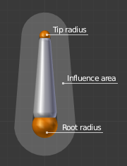

# Armatures

由骨骼组成的骨架

骨骼可以移动旋转，任何附加或关联于其上的东西都会随之移动、旋转、变形

Add>Armature添加Armature对象，默认包含一个bone

- origin，position，rotation，scale
- Object Data数据块，可以在Edit Mode下编辑
- Object Mode下操作整体，在Pose Mode下pose每个bone

Armature具有一个特殊状态——reset position，这是armature的默认形状，是Edit Mode下编辑的bones的默认position/rotation/scale

在Edit Mode下，总是看到reset position，而在Object Mode和Pose Mode下则看到armature的当前pose，除非激活Armature面板的Rest Position按钮

## Bones

Bones是Armature的基本元素。Bone的视觉效果在Armatures的Viewport Display Panel设置

Bones通常分为两类

- Deforming Bones

  当bones变换时，关联的vertices也进行相似变换

- Control Bones

  没有关联的vertices，控制其他bones或者objects在其变换时如何响应（IK，指示目标）

### Structure

每个Bone有3个部分

- 起始关节点（start joint），称为root或head
- body
- 末端关节点（end joint），称为tip/tail

在Edit Mode下，可以选择root或tip，像操作vertices一样移动bone。Root和Tip的相对位置定义了bone。Root和tip还具有radius属性，只用于envelope deformation方法

Armature>Display面板激活Axes，将显示每个bone的tip的local axes。Y axis总是沿着bone从root指向tip。这是bones的roll轴

基本上，bone通过是vertices跟随bone移动来控制geometry。为此需要定义一个特定vertex在一个bone上的受影响权重

最简单的方式是使每个bone影响geometry那些距离bone指定范围内的部分。这成为envelop技术，类似使用两个sphere定义胶囊体

### Tools

Select

- Select Box
- Select Circle
- Select Lasso

Roll：绕着local Y轴旋转bone

Bone Size

- Bone Envelope

Extrude：创建一个新的bone，连接到最近选择的joint

- Extrude to Cursor：在最近选择的joint和mouse直接创建一个新bone

### Selecting

当选择一个bone的root，同时也选择了它连接的parent bone，反过来，选择一个bone的tail，同时也选择了它连接children bone。当两个bone连接在一起时，parent的tail和child的root是同一个东西

Shortest Path选择

Mirror：反转selection到另一侧

More/Less

Linked

Parent/Child：移动选择到当前骨骼到一个child或parent

Extend Parent/Child：扩展到Parent/Child

Similar

- Children：扩展选择到所有后继节点
- Immediate Children：扩展选择到直接子节点
- Siblings：选择当前bone到所有兄弟bones
- Length：选择具有指定阈值内的长度的所有bones
- Direction（Y axis）：选择平行Y轴到bones
- Prefix：选择匹配名字前缀的bones（使用.分割）
- Suffix：选择匹配名字后缀的bones（使用.分割）
- Layer：选择相同layer上的bones
- Group：选择相同group中的bones
- Shape：选择使用相同shape（bone指示图形物体）的bones（在Pose Mode中）

Select Pattern

选择所有名字匹配一个给定pattern的bones

- *匹配任何多个字符
- ?匹配任何单个字符
- \[abc]匹配abc
- \[!abc]匹配任何不是abc的字符
- Case Sensitive：大小写敏感
- Extend：扩展当前选择

### Properties

#### Bendy Bones（TODO）

B-Bones使用许多小的的rigid bones替换很长的bones chains。Curved Bones的常用情景是spine columns或者facial bones

讲一个bone视为一个Bezier Curve的曲线段。每个Segments会跟随表示Bezier Curve细分的点的不可见的curve进行bend和roll。曲线每一端的控制点是bone的端点。B-Bones的形状可以使用一系列属性或者间接通过相邻bones进行控制。bone的每个端点（root/tail）都具有handle属性可以调整曲线曲率

#### Relations

将bones的集合归纳到不同的layers中以便于维护

- Bone Layers

  Moving Bones Between Layers：在Properties中或者3D View中移动bone到不同的layer中。Bone可以同时存在于不同的layer

- Bone Group

- Object Children

  - Relative Parenting：控制bone的transform如何应用到其child objects

- Parenting

  - Parent

  - Connected

- Transformations（TODO）

  默认children继承position/rotation/scale，就像标准的children objects。可以对每个bone进行修改

#### Deform

对每个bone设置deformation options

关闭此deform将阻止bone对geometry的变形，mute its influence。同时也将active bone从automatic weight计算中排除，当mesh使用Armature Deform/With Automatic Weights选项parented到armature上的时候

- Envelope

  Envelope是最通用的skining方法。它可以用于skining所有可用的object类型（meshes，lattices，curves，surfaces，和texts）。它基于bones和它们geometry的接近程度。每个bone有两个不同的影响区域

  - 内部区域：两个joints的半径构成的胶囊体的区域
  - 外部区域：基于胶囊体扩展的区域（通过Distance）

  Envelope Distance定义了一个volume，其表示bone影响被deform object的vertices的区域。内部区域对于vertices具有完全的影响（weight=1），外部区域按照距离胶囊体的远近weight成二次方衰减，直到volume边缘衰减为0

  Envelope Weight：控制bone整体对deformed object的影响（factor）。只对被多个bone共享的geometry有效（例如关节处的vettices）。越高的weight具有越高的影响。当设置为0，等效于关闭了Deform选项

  Radius：设置胶囊体两端的半径，胶囊体内对vertices具有完全的影响

  Envelope Multiply：控制当两个deforming方法同时开启时如何交互。默认的，当两个deforming方法（Envelope & Vertex Group）同时开启时，属于至少一个vertex group的vertices通过Vertex Group方法deform。其他vertices被Envelope方法deform。当开启这个选项时，这个bone在Envelope方法中能影响的vertices在相应的vertex group中的weight被乘以这个value，就是说vertices被以vertex group中更高的权重进行deform，因此综合了两种方法的影响

#### Viewport Display

使用另一个已存在的object的形状自定义bone的外观

Hide：因此选择的bone

- Custom Shape

  Blender可以允许给armature每个bone一个特定形状（在Object Mode和Pose Mode），使用另一个object作为模板。在Pose Mode下设置，Edit Mode下只以内置形状显示bone。因为自定义形状是为了方便用来pose的

  - Custom Object：为选择的bone定义自定义下形状的object

  - Override Transform：定义自定义形状的显示transform的bone（即可以不使用自身的transform显示shape，例如可以使用一个child bone作为shape的transform）

  - Scale：应用到自定义形状的额外scaling factor

  - Scale to Bone Length：是否随着bone在Edit Mode下的长度改变而resize

  - Wireframe：bone总是显示wireframe，而无视viewport display mode

  

  Shapes从不渲染，就像bone，只在3D View中可见。Setup之后，可以将Shape object在3D View中隐藏，而Bone的自定义形状仍然可以显示

  Shape Object只有Mesh可以工作

  Shape Object的origin将被放在bone的root

  Shape Object的object properties被忽略

  Shape Object沿着Bone的Local Y轴，一个unit拉伸到整个bone长度

  Rest to default value移除bone到自定义形状

  总结为一点：使用mesh作为shape object，中心（origin）位于-Y一端（-0.5），整体Y长度为1个unit

## Properties

- Motion Paths

  开启运动路径的可视化，运动路径是开始动画时骨骼留下的路径

- Inverse Kinematics

  Animation使用的IK解析器的类型

### Skeleton

将bones集合整理到不同的layers中，以方便操作

- Position

  Edit Mode总是看见Rest Position。默认情况下Object Mode和Pose Mode总是看见Pose Position。Pose Position和Rest Position可以在Object Mode和Pose Mode下切换显示Pose Position和Rest Position。

- Armature Layers

  每个armature有32个Armature layers，允许通过将bonesregroup到不同的layers来组织armature。这于在scene layers中组织objects是一样的。可以移动一个bone到一个layer中，隐藏或显示一个或多个layers

  每个layer是一个小button。对于Bone，点击一个layer button，就将bone赋予到整个layer中，按住Shift可以将bone设置到多个layer中。对于Armature，点击一个layer可以显示这个layer下的bones，按照Shift可以显示多个layers下的bones

  只有active layers中的bones才可见可编辑

### Viewport Display Panel

- Display As

  控制bones出现在3D View中的方式

- Name：在3D View中显示每个bone的名字

- Axis：在3D View中显示每个bone的local axis

- Shape：在Object/Pose Mode下自定义bone形状显示

- Group Colors：使用Bone Group colors显示bone的颜色

- In Front：bones总是显示在solid objects的上面，因此总是可见可选择

### Bone Group

创建、删除、编辑Bone Groups。Bone Groups就像Vertices Group，用于选择或者赋予一组bones一个颜色主题

在Pose Mode下操作

可以为一个Group赋予一个Color Theme（每个bone都具有这个颜色）

Bone Color Set：为Group选择一个颜色主题，每个颜色主题有3个颜色（Normal，Selected，Active）

Normal：用于unselected bones

Selected：用于selected bones

Active：Active bone的outline颜色

Group管理：Assign/Remove/Select/Deselect

### Pose Library Panel（TODO）

保存、应用、管理armature poses

## Structure

Armature模拟真实skeletons，但是不限于真实skeletons。除了自然的骨骼旋转，还可以移动甚至缩放它们。而且骨骼不必须和其他骨骼连接，如果你想要的话，它们可以完全自由。但是绝大多数自然和有用的setup都隐含一些骨骼和其他骨骼相关形成成为骨骼链chains of bones的结构，其创建了armature的某种程度上的肢体

### Chains of Bones

  骨骼链可以有分支（1对多）

  骨骼链通过将parent对tip和child对root焊接在一起完成

  根节点bone成为root bone，末端节点成为tip bone

  骨骼链对于posing特别重要（尤其是标准forward kinematics和自动的inverse kinematics）

  在Edit Mode下创建骨骼链，但是除非是connected的bones，它们之间的父子关系对于transform没有影响（因为就像是编辑mesh的vertices和edges），这只在Pose Mode下有效。

## Skinning

将血肉附加在骨骼上

Blender有两种skining类型

- 将Objects附加/约束在骨骼上，当在Pose Mode下骨骼变换时，附加的children也跟着变换，就像标准的parent/children关系一样。但是children从不会变形
- 对整个Mesh使用Armature Modifier，对objects的一部分附加的armature中的一部分骨骼。这是更复杂更强大的方法，也是唯一可以真正变形geometry的方法，改变vertices/control points的相对位置

### Armature Deform Parent

Armature Deform Parenting是创建和设置Armature Modifier的一种快捷方法

就像Lattice Parenting可以快速创建Lattice Modifier一样，Modifier都是deform geometry的vertices的，选择要deform的mesh object，给它设置一个deform的object，例如一个Armature或者一个Lattice

选择要被armature影响的所有child objects，最后选择armature。Ctrl-P并选择Armature Deform

Armature将会成为所有其他child objects的parent object，并且每个child object都会有一个Armature Modifier，并管理这个armature object

- With Empty Groups

  在child objects上为armature中的每个deforming bone创建并以其命名一个空vertex groups，如果child objects上没有相应的vertex group的话。新创建的vertex group是空的，没有赋予任何vertices。Vertex Group只为设置为Deforming的bone创建（Properties Panel/Bone/Deform Panel）

  你可以手工选择vertices并将它们赋予特定的vertex group，使特定的骨骼影响它们

  这个选项需要手工确定vertices的权重

- With Automatic Weights

  类似With Empty Groups，但不会使vertex group为空。它基于vertices与特定骨骼的距离（bone heat骨骼热图算法）计算一个骨骼对vertices的影响权重。这个影响将作为权重赋予vertex groups

  但是自动计算的权重不一定完全符合期望，此时需要手工修改vertices的权重

- With Envelope Weights

  类似With Automatic Weights，不同的是影响（weight）是基于Bone Envelopes设置计算的（基于influence volume计算权重）

  新包含/排除的vertices或者新的envelope设置不会立即生效，需要重新应用Armature Deform With Envelope Weights Parenting

  如果想envelope设置被立即使用，绑定Armature Modifier到Bone Envelopes

如果Parenting之前，已经为object定义了skined bones相同名字的vertex groups，它们的内容在Automatic和Envelope Weights选项下被完全覆盖，对于With Empty Groups则被使用
