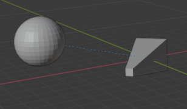
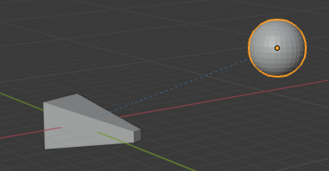

# Constraints

Constraints是控制物体一种属性（location、rotation、scale）的方式，或者使用静态常量值（limit），或者使用另一个物体target（例如copy之类的约束）

主要用于动画

- 通过到target的约束控制一个物体的动画（间接形式动画）。Target可以控制约束所有者的属性，因而活动target就会间接活动约束的所有者
- 可以活动约束的设置，例如活动influence

这样可以使得网球运动员的眼睛可以跟踪在大厅弹跳的网球，允许汽车的轮子一起转动等等

Blender的约束应用在Objects和Bones

联合使用一组约束可以形成一个Constraint Stack

约束是一种为rig添加复杂性和丰富性的不可思议的方式。但是不要过于激进地使用约束，在一个约束上添加另一个约束，直到失去对整个场景如何交互的控制

从简单开始。理解一个constraint的内外各种东西

Bone的Constraint只能在Pose Mode添加

## Animation

Constraints不改变object/bones的数据块，因此它们自身的transform数据不会变换。如果对被应用constraint的objects/bones记录keyframes，记录的是transform数据块的数据。考虑以下两种case：

- 使用Follow Path Constraint控制一个Cube沿着一个Curve运动，Blender在播放动画时自动执行transform计算
- 使用一个Child Of将Cube parent到另一个object上然后在不同的frame手动移动parent object

无论那种情况，Cube的transform的数据都是不变的，如果在不同的frame记录key，则记录的数据都是一样的。如果移除constraint播放动画cube是不动的。

若要bake constraint到animation中，需要使用Object>Animation>Bake Action或者Pose>Animation>Bake Action。这是通用的bake动画的机制，即bake最终object/bone的各种计算（Modifier、Constraint），记录object最终解析的transform。可以将其认为是真正地播放动画，然后记录objects/bones的最终计算transform。可以指定bake动画的起始和结束帧，指定步长step，即每个多少个帧记录一次keyframe。这可能没有手动指定keyframe的精确，但是绝大多数情况可能不需要非常精确的keyframe。Step越小动画越精确，但是也不必过小，因为keyframe之间都是通过插值获得的平滑变化

Check：Visual Keying
Check：Clear Constraints
Bake Data：Pose/Object

## Interface

### 添加/移除一个constraint

在Constraint Panel添加constraint。如果由另一个object和active object一起选中，则那个object就会成为constraint的target，如果constraint接受一个target的话

target可以是object或者bone，对于bone，可以是acitve armature中的bone，也可以是其他armature的bone，因此需要指定target armature

Copy Constraints to Selected：将active object的constraint复制到其余selected objects上

Clear Constraints：清除所有selected objects的constraints

### Track（TODO）

### Common

- Target：约束的target object

  默认使用object origin作为target point

  如果target是一个mesh或lattice，将会出现Vertex Group字段。输入vertex group，contraint将会约束vertex group的median point，而不是objects的origin

  如果target是armature，将会出现bone字段以及一个Head/Tail滑动条，用来选择哪个bone的哪个位置作为origin

- Space（空间坐标系）

  Constraints需要一个参考frame（坐标系）才能工作。参考frame成为constraint space。不同的参考frame将导致constraint不同的行为

  Copy Localtion只是简单地复制position，因此从哪个space向哪个space进行复制就很重要

  Target Space & Owner Space

      用来求值constraint target的space成为Target Space。用来求值constrainted object的space称为Owner Space

      Target space <-> Owner Space
  
  Space Types

  - World Space：world是object/bone的参考坐标系。Location是相对于World的origin 的。Rotation/Scale也是沿着world坐标轴的。到object、object的parent和任何更高的constraint stack的transformations都计算在内
  - Local Space：object/bone的parent成为参考坐标系。只有到object自身的transformations计算在内，到parent、更高的constraint stack的transformations不不考虑
  - Local With Parent（bones only）：bone属性相对于它的rest pose location和orientation求值，因此包含它自己的transformations和可能的parent引起的transformations
  - Pose Space（bones only）：bone属性相对于armature object local space求值。如果armature没有任何transformations，Pose Space等价于World Space

- Influence

  Influence滑动条决定constraint多大程度影响被约束的物体。0表示不受影响，1表示完全受影响，0-1之间表示部分受影响。但是主要部分影响可能很难控制

  Influence属性是可以动画的（keyframed）

### Stack

所有Constraints对object对影响成为Constraints Stack。

Stack自顶向下求值constraint对顺序对最终结果有很重要对影响。

## Motion Tracking（TODO）

- Camera Solver Constraint
- Object Solver Constraint
- Follow Track Constraint

## Transform

- Copy Location Constraint

  强制owner具有和target相同的location（对connected bone无效，因为它被parent bone控制location）

  X/Y/Z：控制沿着哪个轴约束

  Offset：允许owner相对于约束点偏移，不输入offset的具体值，而是使用初始（未设置constraint）之前owner的transform.location作为offset

  Space：约束所在的坐标空间

- Copy Rotation Constraint

  Order：欧拉角的应用顺序

  X/Y/Z：沿着哪些轴约束

  Mix：新的rotation和已存在的rotaion如何合并

  - Replace
  - Add
  - Before Original：新的rotation在已存在的rotation之前添加，就像被应用在owner的parent之上一样
  - After Original：新的rotation在已存在的rotaion之后添加，就像被应用在owner的child之上一样

  Space

- Copy Scale Constraint

  X/Y/Z

  Power：指数scale

  Make Uniform

  Offset：合并copied scale和owner的scale，而不是覆盖它

  Additive：对Offset使用加法而不是乘法

  Space

- Copy Transforms Constraint

  Location/Rotation/Scale

- Limit Distance Constraint

  强制owner保持远离、接近、等于给定的到target的距离。换句话说，owner的location被约束在target周围指定的球体的外部、内部、或者表面上

  当指定一个新的target时，Distance自动设置到owner到target的距离

  对Connected Bone无效，因为它被parent bone控制

  Distance

  Reset Distance：重置Distance到当前owner和target的距离

  Clamp Region：Inside/Outside/Surface

  For Transform：Transform operators立刻考虑constraint，并将transform限制到约束的值

- Limit Location Constraint

  限制Object、Unconnected bone沿着X/Y/Z移动的范围[lower, upper]

  Limit对于object从origin中心开始计算，对于bone从root开始计算

  尽管owner的显示和渲染的location被constraint约束，但是它自己的内部data-block仍然记录未约束的值（即超过约束范围的值）。如果移除constraint，则object立刻移动到内部记录的location

  在一个axis设置相同的min和max，将object在这个axis上锁定。尽管可行，但是使用Transformation Properties Axis Locking功能更方便

  For Transform：默认，constraint只是在显示和渲染的时候将物体拉回到限制范围。但是内部数据仍然是任意的。激活这个按钮，transform properties（内部数据块）也将被约束限制。

- Limit Rotation Constraint

  限制沿着每个轴的旋转

  这个constraint并不约束被IK solver操纵的bone。要限制IK bone的旋转，在Bone Properties设置

- Limit Scale Constraint

  不接受负值（负值scale可以用于镜像一个object/vertices）

- Maintain Volume Constraint

  限制mesh或者bone的volume到原始volume给定的比率

  维持体积，就是沿着一个（free）轴缩放时，另外的（non-free）轴向相反方向缩放，以维持恒定体积。例如x轴变成原来的2倍，则或者Y轴/Z轴缩小为原来的0.5倍，或者Y轴缩小为0.8， Z轴缩小为0.625，0.8x0.625 = 0.5

  X/Y/Z：可以自由缩放一个维持volume的axes

  Mode：指示如何处理不可缩放的axes

  - Strict：沿着每个轴缩放都维持volume
  - Uniform：只有uniform scaling才维持volume
  - Single Axis：只有沿着free axis的缩放才维持volume

  Volume：bone的rest volume

  Space

- Transformation Constraint

  这个constraint别其他“transform”约束更复杂， 更多功能。它允许在给定的范围值中将一种target的transform属性映射到owner的相同或不同的的transform属性，范围值对每个target和owner属性都可能不同

  还可以在Axes之间切换（将target一个轴的值映射到owner另一个轴上），将范围值不用做limits，而是作为标记marker，来定义input（target）到output（owner）的映射

  因此，你可以使用target沿着X轴的position来控制owern沿着Z轴的rotation，并声明沿着target X轴的1 unit对应owner Z轴的5 unit。典型地用于gears，rotation基于location

  Extrapolate

      默认地，min/max值绑定在input和output值上，所有范围之外的值剪裁到它们（y = c）。当激活这个按钮时，min/max不再是严格的limit，而是标记marker（锚点/CP），在input和对应的output之间定义一个比例（线性）映射（y = ax）

    ExtrapolateDisable

    

    ExtrapolateEnable

    

  Source：Input（from target）设置

  - Map From：使用哪个属性作为映射的输入（Location、Rotation、Scale）

  - From：对每个axis独立地指定min和max，控制input value的lower/upper范围，min约束到小于等于max

  - Source to Destination Mapping：指定target的哪个轴映射到owner的哪个轴

  Destination：Output（Owner）Setting

  - Map To：映射到owner的哪个类型属性

  - To：对每个axis指定output的value范围

  Space

  Influence

- Transform Cache Constraint（TODO）

## Tracking

- Clamp To Constraint

  将一个物体Clamp到一个curve。非常类似Follow Path Constraint，但是它不是使用target的curve的evaluation time，而是使用owner的实际的location属性（那些在Transform panel显示的position、rotation、scale），通过沿着target curve映射location来判断将owner放置哪里

  一个好处是可以在3D View中通过调整location直接观察owner的移动，这比Follow Path Constraint在F-curve上移动keys，一遍一遍播放动画更精确

  一个缺点是，Clamp To不能使owner沿着曲线遵循曲线的rotation，但是并不是总是需要rotation。因此在不需要rotation的时候，Clamp To比Follow Path更好处理

  Main Axis：选择一个作为Input映射的轴X/Y/Z

  Cyclic：循环映射

- Damped Track Constraint

  约束owner的一个local axis总是朝着Target，在其他软件中成为Look At。约束使用Swing rotation。尽管通常用于Bones，但是也可以用于约束Object朝向另一个object或bone

  To：选择object的哪个axis朝向target（-X、-Y、-Z、+X、+Y、+Z）

- IK Solver Constraint

  只用于Bones

  使用一个target快速创建IK Constraint：在Pose Mode选择一个bone，按下Shift-I（IK）

  Target

  Pole Target：pole rotation

  Iterations：解析迭代的最大次数

  Chain Length：IK effect包含多少个bones，0包含所有bones

  - Use Tail：包含bone的tail作为chain的最后一个元素

  - Stretch：允许IK拉伸

  Weight

  - Position：用于Tree-IK，对 target position control的weight
  - Rotations：Chain跟随target的rotation

  Rotation：Chain跟随target的rotation

- Locked Track Constraint

  它是一个Track To contraint，但是有一个轴被锁定，不能被旋转（改变的它的朝向）（这个轴保持方向不变，owner只能绕着它旋转），与此同时使另一个To Axis尽可能指向target。类似将target投影到和lock axis垂直到平面，然后owner绕着axis选择，使To Axis指向target到投影

  图示中的锥形的Z轴被lock，因此只能在XY平面旋转。Sphere位于XY平面之上。To Axis设置为锥形的X轴。当Sphere平行于XY平面移动时，锥形的X轴总是指向Sphere在XY平面的投影

  

  

  这个约束被设计用来和Track To Constraint一起使用。Track To可以用来是owner的一个轴指向primary target，而将这个轴作为Locked Track的lock轴，使owner的To Axis指向一个secondary target。

  Target

  To Axis

  Lock Axis

- Spline IK Constraint

  沿着一个curve对齐bones chain，使得骨骼的每个joint都落在curve上

  只能在Pose Mode下才会出现这个Constraint，在Object Mode和Edit Mode不会出现

  Target：target curve

  Spline Fitting

  - Chain Length：包含骨骼链上多少个骨骼。指定长度的骨骼链将从parent bone上分离，而完全被curve控制，除非已经包含了root bone，或者指定了Chain Offset（原地变形）
  - Even Division：忽略骨骼的相对长度，骨骼将被任意缩放以尽可能平均的长度fit 曲线
  - Chain Offset：保持骨骼链的root joint与curve start point的offset，即骨骼链在原地fit 曲线（joints不会落在curve上，而是沿着骨骼链fit 曲线的曲率），否则骨骼链的root joint会移动到曲线的start point
  - Use Curve Radius：使用曲线CP的radius缩放bones的X/Z轴，在bones的原始X/Z缩放之上。但是曲线的tilt不会影响bone的roll。Y轴是bone的中心线（head-tail），因此缩放X/Z有效地缩放骨骼的粗细
  - Y Scale Mode：指示当骨骼链fit 曲线时如何缩放一个骨骼的长度（沿着Y轴 head-tail 的长度）
    - None：bone重置到reset pose length
    - Fit Curve：bones被拉伸以覆盖整个曲线的长度
    - Bone Original：Y轴原来的scale被使用
  - XZ Scale Mode：沿着Y轴横截面（XZ平面）缩放骨骼
    - None：不缩放XZ
    - Bone Original：使用bones的原始XZ scaling
    - Inverse Scale：XZ的scale是Y的scale的倒数
    - Volume Preservation：类似Stretch To约束
  - Use Original Scale：指示Inverse Scale或者Volume Preservation应该应用在bones原始scaling之上，就像Stretch To约束

- Stretch To Constraint

  使owner向着target旋转和缩放它的Y轴，具有和Track To constraint相同的tracking行为，但是它总是使用Y轴（因此主要是应用于骨骼），而不能指定其他的axis，另外它还会沿着Y轴缩放（例如维持volume）。

  它可选地具有一个原始的volumetric特性，因此owner可以随着target靠近而压扁自己，或者随着target拉长自己。但是它不是真实的owner的volume，而是通过scale values定义的视觉效果volume。因此这个功能甚至可以用于non-volumetric的物体，例如empties、2D meshes、curve、surfaces

  对于bones，总是沿着骨骼的local的Y轴缩放

  Target

  Rest Length：当不发生变形（拉伸）时，owner和target之间的距离

  Volume Variation：volume variation对stretching amount对指数amount

  Volume Min/Max：volume保持的最小最大scale限制，每个通过一个Bulge（膨胀）factor系数定义

  Smooth：使得Limit逐渐不可见的smoothness factor

  Volume：缩放X、Z的哪个轴来维持视觉volume（XZ、X、Z、None）。None关闭volumetric功能

  Plane（TODO）：拉伸期间维持的Axis（X or Z）

- Track To Constraint

  对owner应用旋转，使得它的一个给定的To Axis总是指向target，同时另一个“Up”总是保持和globa Z轴（默认）对齐。非常类似3D中的billboard tracking

  这是首选的tracking constraint，因为它有一个更简单容易的约束机制

  这个约束于IK约束在某种程度上有很近的关系（总是指向/对齐target）

  Billboard Tracking：billboard在real-time CG programming（video games）中具有特殊意义。它使一个plane object总是面对camera（它们使tracker，camera使target）。主要用于树或者雾（粒子系统）

  Targets

  To：指定跟踪的local axis，指向target，负选项使得相关的axis远离target

  Up：upward-most local axis。尽可能与global Z轴（或者target Z轴如果Target Z按钮开启的话）对齐owner的轴

  Target Z

  Space

## Relationship

- Action Constraint（TODO）

- Armature Constraint

  Armature Modidier的constraint版本
  
  可以被用作一个Child Of的变体，可以同时具有多个parents，但是需要它们都是bones

  为一个armature中的一个bone添加Armature Constraint
  
  Constarint中可以添加多个target bones。每个target bone可以是任何armature中的bone

  每个target bone具有一个Blend Weight，确定这个target bone在所有target bones中所占的influence比例。使用Normalize Weight可以将所有target bones的weight标准化到0-1之间。Blend Weight后面的小点可以将它变成可动画属性

  当target bones变换时，就会按照influence比例将变换应用到这个bone上

  Preserve Volume：保持Bone的体积，否则bone在变换时会被缩放

  Use Envelopes（TODO）：要模拟armature modifier的envelope-only的行为，将所有相关的bone设置weight=1.0，然后开启这个选项。不像modifier，这个constraint总是需要显式列出target bones和关联的weight。这个选项只用来对所有bone开启envelopes

  Use Current Location（TODO）：Envelops相关

- Child Of Constraint

  标准Objects Parent/Children关系的constraint版本

  相比于传统的方法，使用Constraint实现parent/children有几个优势和增强

  - 同一个object可以有几个不同的parents（在各自constraint的influence的influence slider设置影响权重）
  - 和任何constraint一样，可以动画influence设置

  Target：parent object

  Location X Y Z：控制parent是否影响child沿着相应轴的位置

  Rotation X Y Z：旋转

  Scale X Y Z：缩放

  Set Inverse：默认地，当把owner parent到target上的时候，target变成owner space的原点。这意味着owner的location、rotation和scale将基于target的各自属性进行偏移。换句话说，当owner parent到target的时刻就会发生偏移。这可能不是想要的效果。因此，如果你想恢复owner到它之前的transformations，点击Set Inverse

  Clear Inverse：取消Set Inverse

  当创建constraint时，通常需要点击Set Inverse以cancel不想要的transform offset，因此owner回到之前的transform。对一个Child Of constraint，应该在所有其他constraints关闭（influence=0.0）时，并且开始变换target/parent之前应用Set Apply

  对于Location/Rotation/Scale，应该或者将3个轴全部enable，或者全部disable

- Floor Constraint

  使用target定义一个plane以及一个forbidden side，owner不能进入禁止侧。plane可以有任何的朝向

  Use Rotation：考虑target的旋转，即旋转plane

  Offset：从target origin偏移floor

  Max/Min：plane的哪一侧作为禁止侧（+X/Y/Z，-X/Y/Z）

  Space

- Follow Path Constraint

  将Owner放在target cuver object上，是它沿着curve（path）运动。

  选择好target curve之后，还有点击Animate Path，之后播放动画，owner才会沿着曲线运动

  默认只是position沿着curve运动
  - 如果check Follow Curve，owner会跟随curve的方向
  - 如果check Curve Radius，owner会沿着curve的radius缩放

  Owner总是在全局空间中求值

  - Location（Transform Panel中的值）成为它在curve上的位置的offset。Alt-G清除Transform Panel的position
  - Location offset还被curve的scale等比例影响
  - 激活Follow Curve，owner的rotation也会基于curve的orientation进行偏移。Alt-R清除Transform Panel的rotation

  Owner沿着curve的运动可以通过两种方式控制
  - 最简单的方式是在Curve的Path Animation panel中定义运动完成的帧数
  - 第二种方式更精确更强大，就是定义为target curve定义一个Evaluation Time曲线（在Graph Editor中）
  - 如果不想owner沿着曲线移动，可以给target curve一个flat Speed F-curve（它的值将控制owner沿着curve的位置）

  Follow Path是另一个和Locked Track one工作良好的constraint。一个例子是沿着一个path的flying camera。要控制camear的roll角度，就可以使用Locked Track和一个target object来指定up direction

  Follow Path vs Clamp To：二者都是约束owner沿着curve移动。但是Follow Path是animation-only（仅用于动画）的约束，owner在curve上的位置取决于时间。而Clamp To约束是静态约束，owner在曲线上的位置取决于选择的作为曲线求值输入的location属性的值

  Target：target curve

  Animate Path：添加一个F-curve

  Curve Radius：使用curve radius缩放owner

  Fixed Position：owner被锁定在curve上的某个位置，而不随着时间移动，可以通过Offset调整这个位置

  Offset：开始动画前offset的帧的数量

  Follow Curve：Owner沿着曲线方向
  - Forward：用于对齐曲线方向的axis，即owner的哪个axis对齐曲线方向
  - Up：用来尽可能与Global Z轴对齐的axis，当Follow Curve选项开启时，约束的行为共享以下Locked Track constraint的属性

- Pivot Constraint

  允许owner绕着target object进行旋转

  Pivot Offset：pivot到target的offset

  Pivot When：什么时候应用Pivot约束
  - Always
  - X/Y/Z/-X/-Y/-Z Rot

- Shrinkwrap Constraint

  Shrinkwrap Modifer的Object对应体。它移动owner的origin使其落在target的表面上

  Target只能使mesh

  Distance：从计算的落在target surface位置的offset

  Shrinkwrap Type

  - Nearest Surface Point：选择target surface上距离owner最近的点，这是默认和最常用的选项
  - Projection：沿着给定的axis投影owner origin到target surface的点
    - Projection Axis：选择使用投影的轴，如果不能投影到target的表面，则owner不发生任何改变
    - Axis Space：Projection Axis定义的坐标空间
    - Projection Distance：投影的距离，如果给定的距离内落不到target surface上，则owner不动
    - Project Opposite：向两个方向投影，选择最近的点
    - Invert Cull：当使用Project Opposite和Face Culling时，对相反方向反转Front和Back的选择
  - Nearest Vertex：和Nearest Surface Point类似，但是只选择target的vertices。不支持Snap Mode
  - Target Normal Projection：和Nearest Surface Point类似，但是产生更加平滑的投影（因而更慢）。相对于查询最近的点，它搜索target surface上插值smooth normal指向（或反向）owner的点

  Snap Mode：绝大多数Shrinkwrap类型支持额外的设置来控制owner如何移动到target点
  - On Surface：owner location总是改变的。Offset被应用于连接owner原始位置和选择的target point并指向owner的投影线
  - Outside Surface：类似On Surface，但是offset总是应用于target的outside
  - Above Surface：类似On Surface，但是offset被应用于target的smooth normal
  - Inside：owner如果已经在target内部，则不会移动。Offset沿着投影线向内收缩allowed volume
  - Outside：owner如果已经在target外部，则不会移动。Offset沿着投影线向外扩张allowed volume

  Inside和Outside可以被用作非常粗略的碰撞检测。两者的判定是基于target surface normal判定的，并且在接近90度或者更尖锐的角度处不是很稳定

  Align Axis To Normal：当Snap Mode可用时，这个选项对齐指定的owner local axis到target point的插值平滑normal。Alignment是通过最短旋转执行的
