# Duplicating

## Duplicate

简单地复制，不在新元素和原始元素之间创建任何连接（不像extrude）

复制的元素位于原始元素相同的位置，因此需要移动才能将它们分离

复制之后只有新的元素被选择

复制的元素与原始元素具有相同的vertex group、material indices、edge sharp、edge seam以及其他元素属性

## Extrude

复制vertices，创建与原始vertices的连接，vertices变成edges，edges变成faces

这个工具是创建新geometry非常重要的工具。

- Extrude Region

只有边界loop被extrude。内部区域只随着extrusion移动不改变，所有连续的区域作为一个整体extrude

- Extrude Individual

包含多个faces的选择区域，每个face独立地extrude，而不是作为一个整体。Faces沿着自己的normals进行extrude，而不是平均normal

- Extrude Along Normal

Region一起extrude，但是每个vertex沿着自己的normal移动

- Extrude To Cursor

Extrude到3D Cursor

## Inset Faces

创建嵌入faces。

Option

- Boundary

  Inset时开放edges是否被inset

  开放的edge是只被一个face使用的edge。如果一个点在face上移动，是不可能跨越这个edge而到达另一个face的

  选择带有open edges的faces
  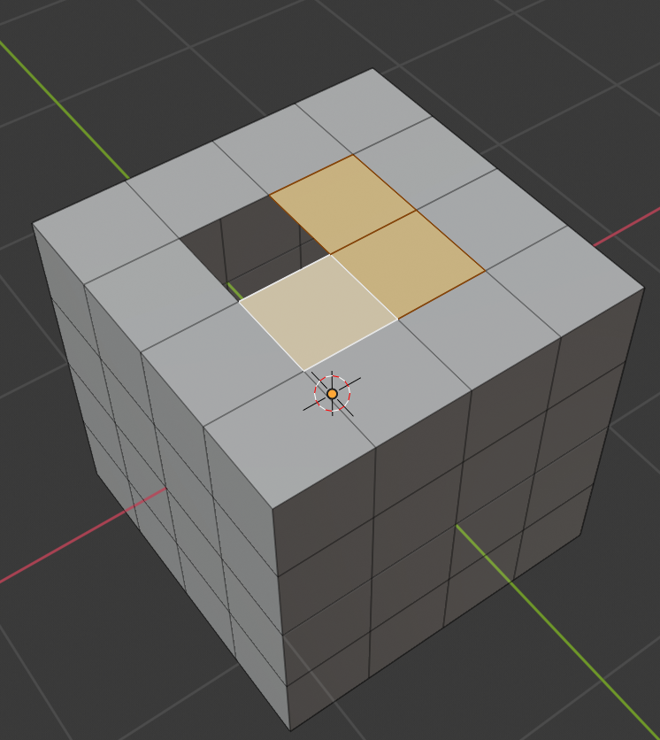

  不带boundary的inset
  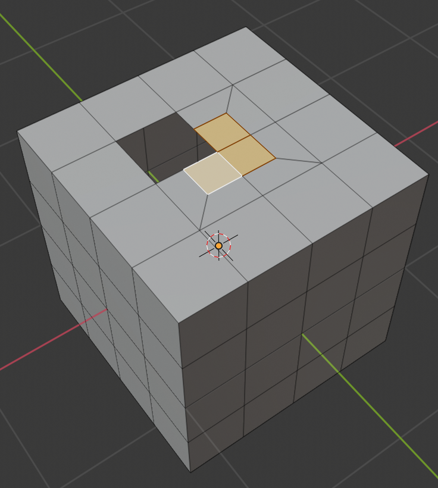

  带boundary的inset
  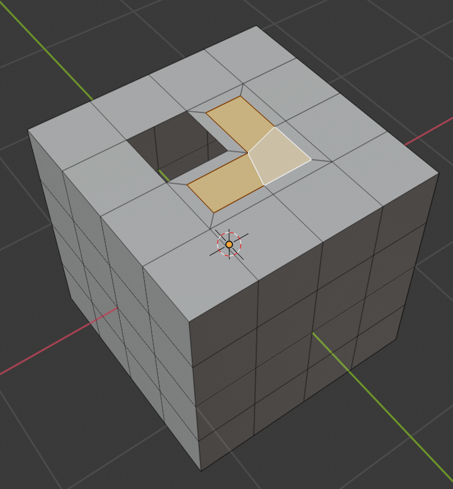

- Offset Even

  缩放offset，得到更加均匀的thickness

- Offset Relative

  按照周围geometry的长度缩放offset

- Edge Rail(TODO)

- Thickness

  inset offset距离

- Depth

  升高或降低新创建的inset faces，增加深度（沿着平均法向量）

- Outset

  Inset是在内部创建新的相似faces，Outset是在外部创建相似faces

  选择的Outset的face
  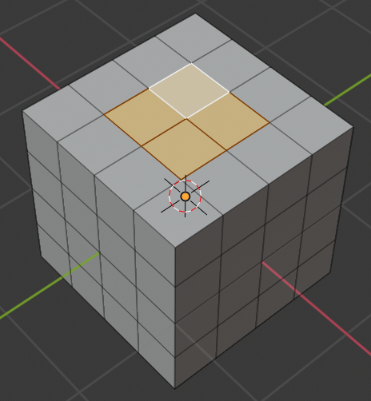
  Outset的结果(同时选择了Select Outer)
  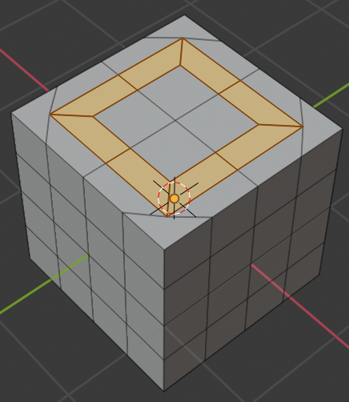

- Select Outer

  Inset/Outset之后，在原来的face只是创建了内环或外环的新的faces，此选项决定操作以后选择内部的faces，还是外部的faces

- Individual

  默认Inset工具操作连续的face region，此选项使其操作每个单独的face

- Interpolate

  插值mesh数据：UVs，Vertex Colors，Weights等等

## Spin

类似extrude，但是不是沿着法向量复制vertices，而是绕着一个指定的point和axis

创建lathe效果

围绕3D Cursor和view空间指定axis创建选择的元素的环形extrusion

- View空间决定extrusion的axis
- 3D Cursor使旋转的中心
- 工具激活后context面板中Active tool and workspace setting可以设置各种Option

Options

- Steps：指定沿着扫描sweep extrude多少个选择元素的copy
- Duplicate：只是简单复制选择的元素，不在它们之间进行bridge
- Angle：扫描旋转的angle
- Auto Merge：如果完成了一个完整的环绕（360），导致重叠的geometry，自动merge第一个和最后一个副本。等价于手工执行merge vertices by distance（spin之前开启）
- Center/Axis：调整Sweep原点的偏移和坐标系的旋转

## Screw Tool

沿着一个translation执行重复的Spin，创建一个screw-like或者spiral-shaped的物体

用于创建螺丝、弹簧、或者海螺壳结构等等

Screw Tool和Screw Modifier的区别是Screw Tool可以使用基本profile角度自动计算角度的前进。它还可以调整axis angular vector而不使用第二个modifer（例如使用Screw Modifer以及一个Bevel Modifier、Curve、Curve Modifier），产生vertex分布的更干净的方法和使用方式

Transform panel可以调整任何选择的元素（objects，vertices，edges，faces）对于选择的超过1个vertices的元素，调整它的median point

和很多工具一样，**Screw在View空间操作，因此视角方向对于结果非常重要**

Screw有两种使用方法

- 对于Open Section Edges，默认使用View空间垂直轴作为Profile向量
- 对于Closed Section Edges，需要自定义一个open的Profile Edges，作为旋转的profile。定义一个Profile Edges，可以定义多个Closed Section Edges

每个rotation（360，一轮）Profile绕着View空间通过3D Cursor的Y轴旋转一周，并在旋转过程轴translate，Section也跟着extrude并translate一周。每一处section和profile的相对位置都等于初始的相对位置。**一周结束之后，Profile向量的末尾作为下一轮旋转的开始，这一点十分重要，这也是Screw Tool创建非一致螺旋的核心原理**

Screw使用Open Line给定的两个point创建初始向量来计算旋转一周的高度和translation向量的基本角度，它被添加到每一圈的spin上

如果选择的元素具有两个open line，blender将不知道使用那个作为translation向量。Translation向量也随着一起extrude，如果不需要它，需要Screw之后手工删除

避免错误的简单方式：只有一个open profile，所有其他profile都是closed

Extrusion的方向通过两个因素确定

- View Space
- 3D Cursor

Section和Translation向量在View空间中绕着通过3D Cursor的Y轴进行extrude

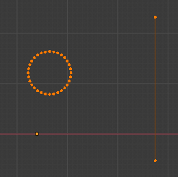

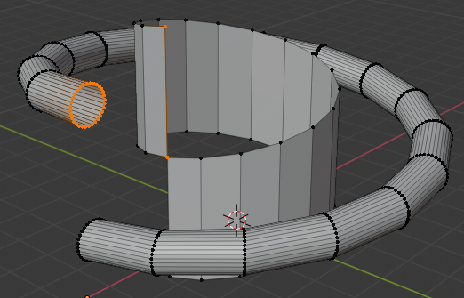

以下展示不同的使用实例，都是使用一个circle作为横截面进行extrude

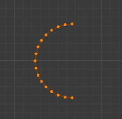

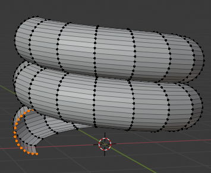

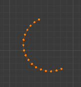

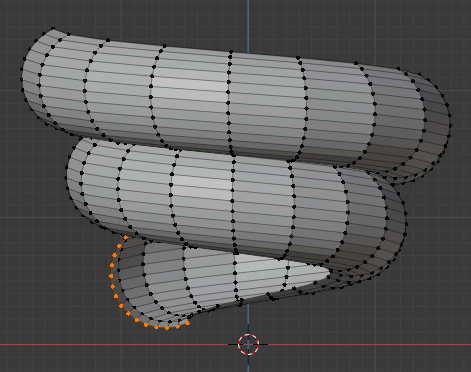

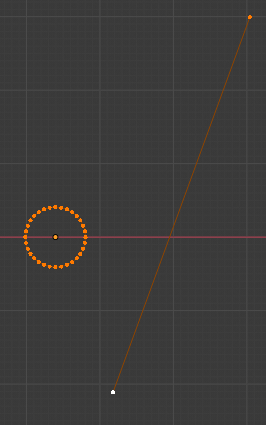

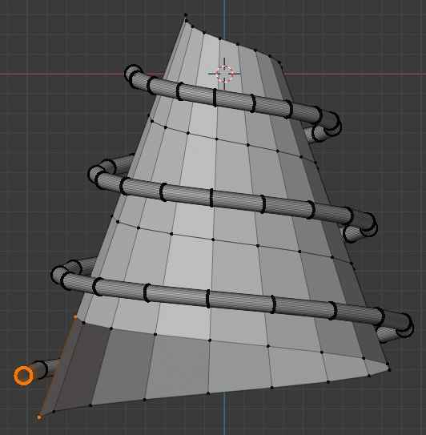

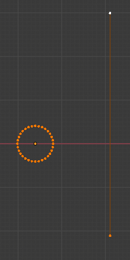

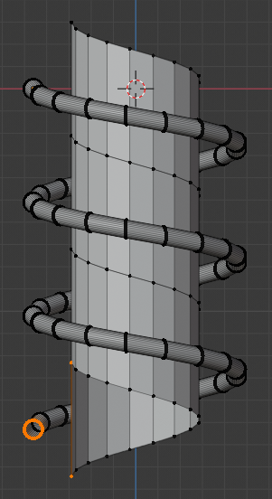

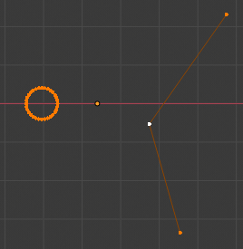

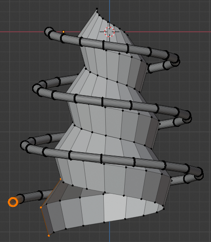

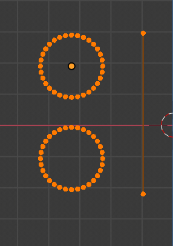

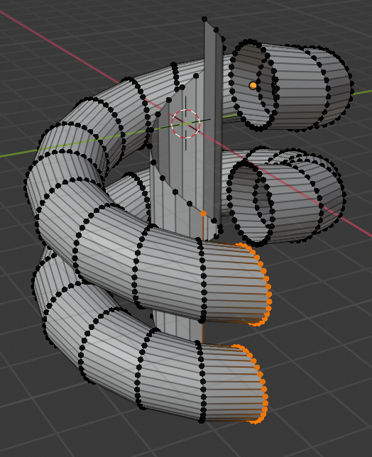

Option

- Center：控制旋转中心的offset
- Steps：控制旋转一周的resolution/smooth
- Turns：旋转多少周
- Axis：调整旋转的坐标系空间
