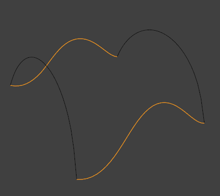

# Face Tools

## Fill

从选择的vertices或edges的任何group创建triangular faces，只要它们形成一个完整的周长

之所以要triangular是因为只有这样才能确定如何group vertices，如果允许不共面的quad，则有很多fill方案。可以之后将需要合并的triangular faces dissolve成quad

- Beauty：将新的triangles整理为更好的排列

与创建n-gons不同，fill支持创建hole

- Beeautify Faces

  只用于已存在的faces。将重新整理选择的triangles，得到更平衡的结果

  - Max Angle：限制到flat surfaces的edge rotation

- Grid Fill

  用于一个连接的edge loop。在edge loop上选择两个对立的连续部分，剩余的两个部分作为横截面profile curve，创建连续的基于grid的faces（quads和triangles）填充这个edge loop，使得它们从一个侧面遵循选择的部分，另一个侧面遵循未选择的部分。

  也可以直接使用一个edge loop，由blender自己选择两个侧面
  
  - Span和Offset：用于选择整个edge loop的情形，控制blender如何选择两个侧面
  - Simple Blending：使用一个简单的插值算法从编辑loop生成grid，但不视图保持原来形状，而是创建相似但更平滑的形状

  选择edge loop侧面

  

  grid fill的结果

  

## Solidify

  与Extrude Along Normal似乎是一样的效果。沿着法向量一致extrude一组face，创作一个体积。也可以按照Modifier使用。可以在Adjust Last Operation面板调整thickness

## Intersect

- Knife

  在geometry中沿着交界线intersection cut faces。类似Knife Tool或者Boolean Tool，但是它不计算boolean的内外部分。Faces沿着交界线被cut，创建新的edge，就像使用Knife Tool沿着交界线手工cut一样

  - Source

    - Selected/Unselected：使用选择的geometry cut未选择的geometry

    

    - Self Intersect：在选择的geometry之间进行cut

    

  - Separate Mode

    - All：在创建的new edge处将所有geometry split（rip）

      

    - Cut：只创建新edge，并不split faces（只用于Selected/Unselected）

      

    - Merge：将所有交界线处的edge合并

      

    - Merge Threshold（TODO）

- Boolean

  在selected geometry和unselected geometry之间进行boolean操作。就像Boolean Modifier。但是Boolean Modifer用于non-destructive编辑，而且需要两个object。而Intersect Booleean可以直接在Edit Mode执行boolean操作

  - Boolean：Difference、Union、Intersect
  - Swap：交互selected和unselected geometry执行boolean操作的顺序
  - Merge Threshold（TODO）

Intersect Knife可以模拟UModeler的Draw Tools，而Intersect Boolean可以模拟UModeler的Push/Pull创建Hole的操作，而且更加强大

## Wireframe

从faces创建一个wireframe，将edge变成wireframe管道，和Wireframe Modifier类似

与Intersect Boolean一样，不用单独的object，直接在Edit使用部分mesh就可以得到Wireframe效果

## Poke Faces

将每个选择额的faces分割为triangle fan。在face中心创建一个center vertex作为fan的中心

- Poke Offset：控制center vertex沿着face法向量凸起或凹陷
- Offset Relative：将Poke Offset乘以center距离face vertices的平均长度，使得更大的face，offset与更大
- Poke Center：center的类型
  - Weighted Mean：edge length的加权平均中心
  - Mean：简单平均中心
  - Bounds：包围盒中心

## Triangulate Faces

将选择的triangles转换为quads。Angle参数控制合并的角度，Compare参数按照特定属性限制合并

## Triangles to Quads

## Weld Edges into Faces（TODO）

## Rotate & Reverse（TODO）

按照顺时针、逆时针、镜像方向旋转顶点数据（顶点颜色、UV）
