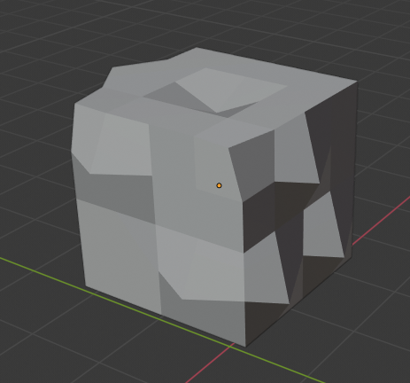

# Modifier

## Array

以指定的偏移（位置/旋转）重复复制Mesh

可以施加多个Array Modifier创建多维（高阶）Array Modifier

## Bevel

Non-destructive Bevel所有edges/vertices

## Boolean

## Build

逐渐显示Mesh的构造和解构过程（逐渐显示/消失元素）

## Decimate

尽可能维持形状地减少vertex/face的数量，LowPoly化

## Edge Split

将所有sharp edge复制分离，断开此处faces的连接，将mesh分离成多个看起来相连但实际上分离的faces。这样在Smooth Shading时，每个分离的部分独立的shading，使得sharp edge保持锐利。这样可以不必手动选择作为一个group的smooth group的faces，而是通过一个angle阈值自动计算出来

## Mask

允许object的vertex基于vertex groups动态隐藏

在Object Object Context面板中的Vertex Group创建新的Group，选择Vertices，赋予其中

## Mirror

沿着local的X、Y、Z轴镜像，通过Object Origin镜像一个Mesh。也可以使用其他物体作为mirror的中心，而不是它自身的origin

许多Modeling task都涉及创建对称的objects。这个modifier提供了一个简单有效的方式

可以同时控制沿X/Y/Z轴的镜像，因此一个修改最多可以镜像到8个空间

Bisect：如果开始时object在mirror两侧都有mesh，可以沿着镜像平面Bisect mesh，只使用一侧mesh进行镜像

Flip：选择Bisect的哪一侧mesh

Mirror Object：自定义镜像平面的位置和方向

Vertex Group：镜像指定vertex group。Group必须以.L .R .left .right等结尾，并且镜像一侧的对应group存在且为空

Merge：位于镜像平面上的vertex被合并为一个vertex

Merge Light：镜像平面两侧指定距离的vertex被合并为一个vertex

Clipping：在Edit Mode防止定义移动到镜像平面的另一侧。一旦开启Clipping，合并在镜像平面上的vertex将不能在移动开

## Multiresolution

像Subdivision Surface一样subdivide一个mesh，但是在Sculpt Mode以另一个subdivision编辑

## Remesh

重新生成mesh的拓扑。输出遵循原来mesh的曲率变化，但是新拓扑只包含quads

以八叉树方向重建拓扑，以及体素化

## Screw

以一个Profile object（Mesh/Curve），沿着指定的轴创建螺旋式形状

Axis Object：自定义旋转坐标系

Axis：旋转轴

Screw：一个螺旋的高度

Angle：一个Screw高度旋转的角度

Step：螺旋细分程度

Iteration：旋转的迭代次数

## Skin

使用vertices和edges创建一个skinned表面，使用逐顶点半径更好地定义形状。输出几乎都是quads，只在交界部分存在一些三角形

这是快速创建用于sculpting以及平滑任意拓扑结构有机形状的方法

每个顶点的Transform panel中Vertex Data可以设置这个vertex的radius。选中vertex，Ctrl-A交互控制radius

Branch Smoothing控制分支处vertex的平滑程度

## Solidify

将任何Mesh的表面添加深度/厚度。即使是封闭的球体表面也可以创建为有厚度的中空球体，通过Boolean操作切开一个切口就可以看见。Cube表面可以创建有厚度的墙

类似Extrude，推挤表面faces并bridge

Fill Rim：填充厚度侧面的face，否则只是简单的复制并偏移faces，而不bridge它们与原始faces

Only Rim：只保留原始faces和创建的侧面垂直的边缘Face，没有复制的faces

Offset：确定向那个方向extrude

## Subdivision Surface

将faces细分为更小faces，产生一个平滑的外观。允许通过建模简单、lowpoly的mesh来创建复制的平滑的表面，避免了保存和维护大量的数据，并给物体以有机组织的外观

所有的Modifier都可以复合使用，每个modifier都在前面所有的modifier的结果上进行进一步计算。甚至同一类型的modifier也可以重复使用多次，对于Array Modifier尤为明显

- Type：Subdivision算法

  - Catmull-Clark：产生平滑曲线外观
  - Simple：不改变原来的形状，只是简单地将faces细分为更小的faces。等价于Mesh Tools中的Subdivision工具

- Render：渲染时（最终模型）的subdivision等级

- Viewport：3D Viewport中显示的subdivision等级

## Triangulate

将所有的faces（quads和polygons）转换为triangular faces。和Edit Mode中的Triangulate工具一样。只有在Object Mode下应用modifer之后才能看到得到的triangular faces

## Weld

查找指定阈值范围内的vertices，合并它们，collapsing周围geometry

## Wireframe

通过遍历所有的faces，将edges变成four-sided polygons，来将mesh转换为wireframe。Mesh必须有faces被wireframed

可以定义wireframe厚度，材质等等属性

Offset：定义wireframe生成于mesh的内部还是外部。0将使得edges成为wireframe的中心

Crease Edge用于和Subdivision Surface Modifer一起使用，调整边缘和结合点的平滑/尖锐程度

Boundary：在mesh island编辑创建wireframes

Replace Origianl：用生成的wireframe mesh替换原来的mesh。否则原来的mesh保留，wireframe mesh在其上面生成

Material Offset：使用指定的index material作为wireframe的material。它是从第一个材质的偏移

Vertex Group：限制modifier只应用在指定的vertex group

- Factor：vertex影响最终结果的系数
- Invert：反转vertex group权重

## Armature（TODO）

## Cast

向这一些预定义的形状（Sphere、Cylinder、Cuboid）偏移一个Mesh、Curve、Surface、或者lattice的形状

等价于Edit Mode的To Sphere工具，或者其他程序的Spherify/Spherize工具，但是不仅限制于sphere

Smooth Modifier是Cast Modifer很好的代替者，因为cast shape有时需要smoothing以看起来平滑

Cast Type：选择Cast的target形状

Axis X/Y/Z：控制沿着哪个轴进行cast

Factor：控制原始形状和target形状之间的插值混合系数，0完全等于原始形状，1完全等于目标形状，不仅限定在0～1之间，范围之外的按照数学上Lerp的计算进行插值

Radius/Size：定义target形状的大小

Vertex Group：限制modifier只应用于vertex group之内的顶点

- Invert：反转Vertex Group，限制Modifer只应用于Vertex Group之外的顶点

Control Object：控制效果的物体。它的origin成为cast的中心，它的transform也影响投影的效果。通过在动画中改变这个object的transform，可以对modified object进行动态deform动画

使用Control Object控制投影变形

## Curve

沿着Curve deforming一个mesh

工作于global坐标系

默认沿着X轴deform，即object的local X沿着曲线切线（每个曲线点的local坐标系的x轴）对齐。Mesh上的每个点按照相对origin的相对位移在每个曲线对应点上进行变换。因此Object沿着曲线、尤其是垂直曲线移动可能变大或变小。每个vertex都是沿着不同的curve normal偏移的

当object移动超出曲线之后，物体将继续沿着曲线末端的切线继续移动

这个Modifier工作于global空间，换句话说，geometry相对于曲线的实际位置对于获得正确的结果是决定性

通常希望物体的origin沿着曲线移动

object自动移动到曲线的起点

对于3D曲线，曲线的Tilt控制deformed object的旋转。Radius也控制object沿着曲线的scale

Vertex Group：限制效果只应用到vertex group中的vertices

- Invert：反转选择的vertex group的影响，vertex group表示不被modifier影响

Deformation Axis：X/Y/Z/-X/-Y/-Z 指定其中一个轴，当object沿着这个轴当移动将会导致object沿着曲线移动并变形

## Displace Modifier

基于图像当强度（灰度值）偏移vertices。Procedual/Image纹理都可以使用

Displacement可以沿着特定local axis，沿着vertex normal进行偏移。Texture的RGB每个channel都有一个系数调整它的影响，因此可以控制只使用一个channel的数据

在Object Context的Image面板中可以添加image，在Modifier面板中进行引用

Direction

- X/Y/Z：可以控制沿着哪个local axis偏移vertices
- Normal：沿着Normal偏移vertex
- Custom Normal：沿着custom normals（即vertex在每个face有不同的normal）的平均值偏移向量，而不是vertex normal
- RGB to XYZ

Space：X/Y/Z是定义在哪个空间的坐标轴

Textrure Coordinates：用于获得每个vertex值的纹理坐标空间

UV坐标从Mesh Face的UV坐标获得对texture采样的坐标（UV Map指定使用哪个UV Map）。其他的类型都使用vertices在某个坐标系的XY坐标作为采样的纹理坐标。此时，默认地，一个图像大小覆盖默认Plane大小，即2x2。图像中心在原点，图像的Rect从左下角（-1，-1）到右上角（1，1），vertex在此区间的位置坐标被标准化为采样用的UV坐标。超出Rect的部分按照指定的类型repeat（clip/tile）

Global：使用vertex在全局坐标系的位置坐标采样

Local：使用vertex在局部坐标系的位置坐标采样

Object：使用指定Object的局部坐标系的位置坐标采样。如果未指定object，则使用自身的坐标系，即Local

Object Image Context面板上具有通用地调整image属性的选项。但是对于被用作displace的image，调整的就是vertices变化的距离

Midlevel：被modifier认为没有displacement的纹理值。低于这个阈值的纹理值向负方向移动，高于这个阈值的纹理值向正方向移动

Strength：displacement的强度，基于Midlevel的乘积系数

## Hook

使用另一个object（通常是一个empty或者bone，但是可以是任何object）来deform一个mesh、curve或者lattice

当作为Hook的object移动时，它将移动相应的vertices或者控制点。可以认为它是被活动的Proportional Editing

可以直接选择要操作的vertices

在Edit Mode中，选择vertices，点击modifier面板上的Assign按钮将它们赋予hook

- Object：作为Hook的物体

- Vertex Group：hook影响的vertices

- Radius：比例编辑的影响半径，只有半径之内的vertices被修改，而且按照距离成比例编辑

- Strength

- Falloff Type：Radius的Falloff类型

- Uniform Falloff：hook on non-uniform scaled objects，尤其是lattices，通常都是非一致缩放

## Laplacian Deform

Pose一个mesh并保持surface的几何细节

定义一组anchor的vertices，移动它们其中一些（它们的相对位置/旋转应该发生变化）。Modifier根据anchor vertices原始的相对位置和新的相对位置计算整个mesh的变形以遵循anchor的变化

在Object Data Context面板创建一个Vertex Group，命名为Anchor。选择作为Anchor的vertices（类似bone），将其assign到整个Vertex Group。添加Laplacian Deform Modifier，选择这个Anchor Vertex Group，点击Bind。在Edit Mode中Transform其中一些Anchor Vertices，回到Object Mode，Modifier就会根据Anchor相对位置的变化deform mesh

定义Mesh上的anchor

变换一些anchor

Repeat设为5的deform结果

## Lattice

根据一个Lattice object的形状deform一个物体

Mesh，Curve，Surface，Text，Lattice

可以通过parenting一个object到一个lattice快速设置lattice modifier

## Mesh Deform

类似Lattice，但是允许任意一个闭合形状的Mesh作为deformation cage

## Shrinkwrap Modifier

将一个物体收缩到另一个物体到表面。移动每个vertex到另一个物体到表面（可以设置offset）

mesh、lattices、curves、surfaces、texts

## Simple Deform

应用简单deform。可以指定一个object（empty）作为deform的坐标空间

Limit：限制deform的vertices区间

- Twist：沿着指定的轴扭转mesh

- Bend：绕着指定的轴弯曲mesh

- Taper：沿着指定的轴将mesh变成锥形

- Stretch：类似Taper，但是不是直线锥形，而是曲线Falloff

## Smooth

类似Edit Mode中的Smooth Edit工具

Modifier和Edit Mode中对应工具的区别是Modifier是Non-destructive的，任何时候修改mesh，modifier都会自动执行，而Edit Tool是一次性的

是相邻faces之间的夹角变得平坦。不会subdivide mesh，vertices的数量保持不变

## Smooth Corrective（TODO）

减少mesh高度变形失真区域

通常用于Armature Modifier之后

## Smooth Laplacian

减少一个mesh上的noise，保持最小的形状改变

也可以使用负数Factor放大噪声

通常用于从真实世界重构的mesh（扫描）中的噪声

## Surface Deform

使用任何一个mesh surface控制另一个mesh surface的deforam，本质上就是传输motion/deformation信息。

一个最常用的情形是使用一个proxy mesh进行cloth模拟，然后用它deform最终显示cloth的mesh（这个mesh可能不适合用来模拟）

## Warp Modifier

可以认为是运行时可animated的Proportional Editing，当然也可以用于modeling

使用两个object，一个from，一个to，确定proportional editing向量，等价于鼠标移动向量

Radius：指定影响半径

Falloff Type：指定Falloff曲线

Texture：可以使用一个纹理控制对每个vertex的影响

## Wave

添加类似波浪运动效果到mesh上

Mesh、Latices、curves、surfaces、texts
