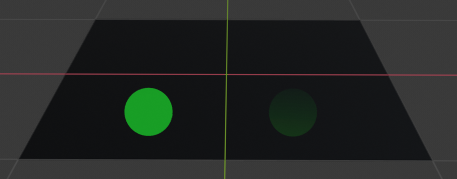
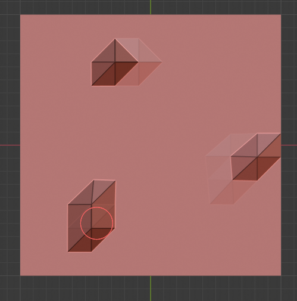
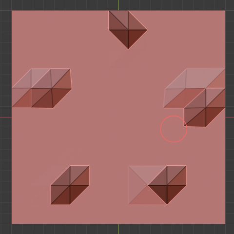

# Brush

## Brush Control

- F：大小
- Shift-F：强度
- Ctrl-F：选择画刷纹理
- Ctrl：反转stroke toggle

按下hot key之后，或者通过移动鼠标增加或减少数值或者输入精确数字

## Selection Masking

只在选择的vertices或faces上进行绘制

选项在3D View header上开启（在Weight Paint Mode下），于Edit Mode的face/vertex选择模式是一样图标。当它们关闭时，没有mask，可以任意绘制。当它们开启时，只能在选择的元素上绘制。

- 即使modifier激活的情况下，original mesh edges也会显示
- 可以选择faces使得painting只操作在选择的faces上的vertices

### Detail About Selecting

Face Masking和Vertex Masking只能选择一种

可以在Edit Mode下选择好vertices，然后进入Weight Paint Mode，也可以在Weight Paint Mode下直接选择

Ctrl-LMB：选择一个face
Shift-LMB：选择多个faces
A：All
B：Box Selection
C：Circle Selection

可以切换到Edit Mode观察Weight Paint Mode下选择的结果

Hide/UnHide Faces/Vertices：也可以在Edit Mode下选择faces/vertices并按H将其隐藏，然后进入Weight Mode，之后将只绘制可见的元素。最后按Alt-H取消隐藏

Cliping Region：Alt-B并LMB拖拽一个矩形区域，选择的区域将从mesh中“cut out“（其他区域被隐藏），因此可以只绘制切出来的区域。Alt-B使整个mesh重新显示出来

所有绘制工具使用View空间

## Brushes

对于painting/sculpting模式，每个brush类型暴露为一个工具。Brush可以从tool setting中被修改

- Brushes：选择一个preset brush type，或者一个自定义brush。它们是一个工具不同设置的联合（stroke、texture、options）

  - Add Brush：添加一个自定义brush，新的brush从当前brush复制
  - Brush Specials（TODO）

要保存一个custom brush，enable Fake User（增加一个引用计数）。每次Blender关闭时，只会保存那些引用计数大于等于1的资源

## Texture & Texture Mask

### Texture

  在Paint Mode，纹理被用于color的source；在Sculpting，纹理被用来决定brush的strength

- Mapping

  设置纹理映射到brush stroke的方式

  - View Plane：当前View空间视角用于投射brush texture到model上。例如texture跟随mouse，使得看起来texture在model上拖拽。在2D绘制中，texture随着brush移动
  - Area Plane：沿着local surface normal投影brush texture，防止texture在View空间视角下在极端角度处拉伸变形
  - Tiled：沿着Screen堆砌texture，因此移动brush看起来独立于texture而移动。主要用来tileable image，而不是procedural texture
  - 3D：允许brush利用procedural textures的全部优势。这个模式使用vertex坐标而不是brush的位置来决定texture的那块区域被使用
  - Random：对每个轻擦，涂抹，随机选择一个纹理坐标
  - Stencil（TODO）：从相机空间投影绘制到mesh或canvas上
    - Image Aspect
    - Reset Transform

- Angle（Ctrl-F）：旋转texture brush的角度。也可以直接输入数字值
  - Rake R：Angle跟随brush stoke的方向（Shortcut sculpting only）。不可用于3D texture
  - Random R：每个轻擦的角度是随机的
    - Random Angle：约束角度随机的范围

- Offset：在X/Y/Z轴上偏移texture map

- Size：沿着每个轴的scale。对于Drag Sculpting texture不可用

- Sample Bias：添加给texture采样的值（sculpting only）

### Texture Mask（TODO）

Brush strength使用一个texture mask。压力相关

### Stroke

Stroke Method E

  定义stokes如何应用到canvas

- Dots(Sculting only)：在每次鼠标移动时应用绘制

- Drag Dot：在canvas上只应用一次轻擦绘制，之后拖拽移动这个stroke

- Anchored(Sculting only)：类似Drag Dot，在brush位置stoke一次，但是拖拽改变dot的直径

  - Edge to Edge：brush按下的位置和brush的当前位置构成dot的直径，这样拖拽brush既改变dot的大小也改变dot的位置

- Space：创建一组dots风格到stroke
  - Spacing：表示brush radius到百分比的空白距离

- Airbrush：brush在鼠标hold的时候仍然绘制（这样即使鼠标没有移动，stroke也随着时间而加深），通过Rate确定两次绘制的间隔。而其他方法brush只在brush改变位置的时候修改它的颜色。对grab sculpting brush不可用

- Line：点击拖拽鼠标可以在Screen Spce定义一个直线。line dabs被Spacing分割成一系列dots。按下Alt，line stroke被约束到45度增量

  - Ctrl-LMB：按直线反向雕刻（凹陷而不是凸出）
  - Shift—LMB：按直线Smooth

- Curve：使用bezier curve定义stoke curve（dabs按照Spaing分割）。曲线总是在Screen Space的，不随着3D View空间变换而改变。绘制好曲线之后，Ctrl-LMB或者Enter使用曲线进行绘制，每次一个Stroke

  - Ctrl-RMB：添加一个新的CP，拖拽展开handle。点击而不拖拽时，Handles和CP收缩在一起，不能通过LMB/RMB分离，使用Shift—RMB进行分离
  - Shift-RMB：以对称方式调整CP的Handle
  - LMB/RMB：以非对称方式调整handle，调整CP位置
  - Selection：handle/cp可以通过LMB选择，通过Shift-LMB扩展选择，A/Alt-A全部选择或取消。选择cp或handle后，可以通过G/R/S进行移动/旋转/缩放，旋转只绕着屏幕空间X轴旋转
  - Delete Points：X
  - Draw Curve：Ctrl-LMB在空白处点击，或者Enter，每次绘制一个stroke

- Adjust Strength for Spacing（TODO）：对不同对spacing自动调整strength以给出一致的结果

- Jitter：绘制时为brush添加随机波动

- Input Samples：最近几次（Input Samples）的鼠标位置被平均起来以平滑brush stroke

## Falloff

Falloff允许控制brush的Strength falloff（从圆心向边界）。修改curve的形状将使brush更柔软或更坚硬

类似Unity的曲线编辑器，可以选择一个preset曲线，通过LMB添加更多的CP调整曲线的形状

Normal Falloff：当faces远离视角（趋向与视线平行时）brush strokes开始fade away，防止出现醒目的edges

Angle：从什么角度开始fade away

## Display

显示brush的cursor。在3D View中显示为Circle，半径匹配brush的大小

- Show Brush：显示或隐藏brush
- Color：Circle的颜色

## Symmetry

- Mirror：沿着选择的local axes镜像brush strokes
- Radial：通过local原点和指定axes轴对称绘制stroke

轴对称=3

轴对称=5

