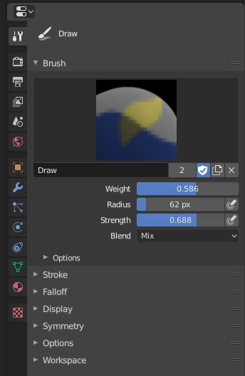

# Weight Paint

## Introduction

Vertex Group可能有非常大量的关联vertices，因此非常大量的weight（每个vertices一个weight）。Weight Painting是管理大量数量的weight信息的非常直观的方法

它主要用于rigging meshes，在这里vertex group被用来定义bone对mesh的相对影响。但是它也被用来控制例子发射、毛发密度、很多modifiers、shape keys等等

Weight Paint Mode使用彩虹光谱显示active vertex group中每个vertex关联的weight。默认地，blue表示unweighted（平静的），red表示完全weighted（hot，full power，醒目）

可以通过使用weight brushes在vertices上面绘制为它赋予权重。开始绘制一个mesh自动添加weight到active vertex group（如果需要创建一个新的vertex group）

### Weighting Color Mode

Weight使用cold-hot颜色渐变系统表示。Blue（cold，0），Red（hot，1），中间部分按照彩虹光谱插值

对于unreferenced vertices，Blender还有一个特殊的visual notation（option）。它们显示为black。这样你可以看见referenced areas（blue & red），与此同时unreference areas显示为black。这对查看weighting errors非常有用

可以自定义光谱渐变（但没有太多意义）

## Weight Paint Tools

在属性面板Active Tool and Workspace Setting设置工具的各种属性

- Draw：在Object上绘制指定的weight
  - Blend：Blend Modes定义当绘制时weight值以哪种方式应用到vertex group
    - Mix：Setting中Weight值定义在mesh一个地方不断绘制最终达到的target weight。Strength定义需要绘制多少次以达到最终target weight。Strength=1，target weight立刻被绘制。Weight=0，brush不做任何事
    - Add：Setting中的weight值被添加到vertex weight。strength定义每个stroke添加weight的多少比例。但是paint weight不会超过1
    - Subtract：指定的weight从vertex weight中减去。strength定义每次stroke减去的weight的比例。但是paint weight不会小于0
    - Lighten：weight被解释为target weight。非常类似Mix Blending，但是只有小于target weight的weight被影响。大于target weight的weight不会回到target weight
    - Darken：类似Lighten，但是只影响大于target weight的weight
    - Multiply：将vertex weight乘以weight value。某种程度类似subtract，但是移除的weight的数量现在依赖于weight自身
    - Blur：模糊（平均）相邻的vertices的weight。Weight value被忽略。Strength定义多少smoothing被应用
  - Blur：和Draw的Blur相同
  - Average：类似Blur，绘制brush下的所有weights的平均结果来smooths weights
  - Smear（涂抹工具）：类似GIMP中的（finger绘制）涂抹工具，抓取和拖动brush下面的weights
  - Gradient：就像GIMP的渐变绘制工具，Weight Paint本质还是绘制，因此使用的工具和GIMP中的绘制工具几乎一样。在绘制渐变weight时非常有用。在selected和unselected vertices之间混合weights
    - Weight：gradient从当前选择的weight value开始，blending到nothing（current ～ 0）
    - Strength：更小的values可以用使用使得gradient和已存在的weight mix（就像brush mix一样）
    - Type：Linear（Alt-LMB and Drag）；Radial（Ctrl-Alt-LMB and drag）
  - Sample
    - Weights：设置brush weight（setting中的weight）为cursor下面的weight
    - Vertex Group：显示一个可能的用来选择cursor下面的vertex group列表
  - Annotate（TODO）

## Tool Setting

### Brushes

Properties面板中Active Tool And Workspace Setting

- Weight W：brush使用的weight。Weight依赖于Blend Mode应用到vertex group中

  Ctrl-LMB采样点击的vertex的weight。Shift-LMB选择采样点的vertex group

- Radius：控制brush半径。F key运行交互地调整brush radius

- Strength：brush的强度

### Advanced

- Accumulate：允许stroke在自身上累计绘制效果，就像airbrush。默认地，一次stroke是鼠标按下和抬起期间的绘制。在此前期间拖动鼠标绘制只是一次stroke，只应用一次strength。但是开启Accumulate，每次拖动都是一次stroke
- Front Faces Only：只绘制front side的faces
- 2D Falloff：以2D圆形而不是3D球形应用brush Falloff

### Options

- Auto Normalize：一个vertex可以属于多个vertex group，因为它可以被多个bones影响。这个选项确保所有bone-deforming vertex groups的共享vertices weights最终加起来等于1。Blender动画骨骼deform mesh总是自动Normal weight，因此这个选项只是为了直观显示最终的weight
- Lock-Relative（TODO）
- Multi-Paint（TODO）：同时绘制所有选择的vertex groups，同时保持它们的相对影响。这在调整被超过3个bones同时影响的区域的weight非常有用，例如character face
- Restrict：限制painting的影响到选择的vertex group的vertices
- X Mirror：使用这个选项镜像绘制具有对称名字的groups，例如具有.R .L \_R _L扩展名的group。如果group没有对应的对称group，它将对称地绘制active group自身
- Topology Mirror：使用基于拓扑的镜像，对于mesh的两侧具有匹配的镜像拓扑的情况

### Stroke/Falloff/Cursor

见sculpting and painting通用画刷设置

## Using Vertex Groups

- Vertex Groups for Bones

  这是weight painting的主要应用。当一个bone移动时，关节周围的vertices应该良好地移动。手动绘制或者调整自动赋予的weights

  Workflow

  - 创建一个Armature
  - 创建一个被Armature的bones变形的Mesh
  - 为mesh创建Armature Modifier，并选择Armature
  - 在3D View中选择armature，切换到Pose Mode中
  - 选择armature中期望的bone
  - 使用RMB选择mesh并立即切换到Weight Paint Mode。Mesh将按照selected bone对mesh的影响程度渲染成温度图。初始地它将是蓝色的
  - 绘制想要的weight。bone自身周围的mesh应该是红色的，然后向这那些远离bone的vertices按照彩虹光谱fade out为蓝色

  在Pose Mode下选择armature的一个bone，它将激活对应的vertex group并显示对应的weight。在这个mode下只能选择一个bone（Shift-LMB没有作用）

  如果Mesh以及将骨骼蒙皮，就无法看见骨骼，因为mesh被渲染了。此时可以开启X-Ray视图

  如果在mesh上绘制，将为bone创建一个vertex group。如果绘制group之外的vertices，被绘制的vertices被自动添加到这个vertex group

  如果mesh和atmature是对称的，可以使用X-Mirror。然后带有mirrored weights的mirrored groups被自动创建

  所有工具选项都在Properties的Active Tool And Workspace Setting中设置

- Vertex Groups for Particles

具有0 weight的faces或者vertices不发射粒子。0.1 weight将发射10%的粒子。这个选项保持指定的particles总数，并按照weight调整粒子的分布。使用weight将mesh的一部分比另一部分更加“毛绒绒”

## Editing Weights

Blender为Weight Painting提供来一组helper工具集合（在Weight菜单中）

- Subset Option

  一些helper工具还提供来subset filter来限制它们的功能仅应用到指定的vertex group
  - Active Group
  - Selected Pose Bones
  - Deform Pose Bones
  - All Groups
  
  所有工具在Vertex Selection Masking和Face Selection Mashing下也是可以工作的。在这些模式下，tools只在选择的vertices或者faces上操作

### Assign from Bone Envelops

应用选择的bones的envelope weight计算到选择的vertex group

### Assign Automatic from Bone

应用选择的bones的“auto-weight”计算到选择的vertex group，就像parent armature菜单一样

### Normalize All

对每个vertex，这个工具确保它在所有vertex group之间的weights的总和是1

这个工具normalize所有vretex groups，除了locked groups（它们保持weight value不变）

- Lock Active：保持active group的values而normalize所有其他的vertex group

### Normalize

仅工作于active vertex group。所有vertices保持它们的相对weights，但是整个weights被缩放使得最高的权重等于1。因为auto weight和manual weight总是不超过1的，因此这个工具通常是用来将小于1的weights范围放大到1

### Mirror

将weight从完全对称mesh的一侧镜像到另一侧。只支持沿着Local X的镜像。

那些没有另一侧对应vertex的vertices不受影响

- Mirror Weights

  当这个选项打开时，每个选择的vertex从它对称的vertex获得weight信息。如果对称的两个vertices都被选择，则交互weight。如果只有一个被选择，unselected的信息将会覆盖被选择的vertex。只对active group传递Weight信息，除非All Groups被开启

- Flip Group Names

  用于属于“对称名字”（L/R/Left/Right) vertex group 的selected vertices。所有属于active group或者其对称的vertex group的selected vertices交互vertex group。Left Group的vertices关联到Right Group，反之亦然。但是vertex到weight将被保留。如果All Group开启，交互所有 Left-Right Group

- All Groups

  操作于所有 vertex group，而不是 active group

- Topology Mirror

  镜像不是100%对称到mesh（接近mirror）

  如果要为一个对称character对面的bones创建镜像的weight group：

  - 删除target vertex group（即对面的vertex group）
  - 创建一个source bone vertex group（包含要复制的weight的vertex group）的副本
  - 将新vertex group重命名为target vertex group（之前删除的vertex group的名字）
  - 选择target vertex group，调用Mirror Tool（只使用Mirror weights option和可选的Topology Mirror如果mesh是对称的）

### Invert

将每个选择的weight group变成1.0的补数，0->1, 1->0, 0.25->0.75, 0.5->0.5

- Subset：将操作限制在指定的vertex group
- Add Weights：在invert之前将所有没有weight的vertices添加为weight=1
- Remove Weights：如果vertices invert之后weight=1，将其从vertex group中移除

Locked Vertex Group不受影响

### Clean

移除低于一个给定阈值的weights。这个工具可以方便地移除weight groups中非常低的weights

开启Show Zero Weights Active选项使得unreferenced weights显示为black

- Subset（学习最有效的技巧就是重复重复再重复，知道你厌倦了它为止）

- Limit

- Keep Single：确保clean工具不会创建完全unreferenced vertices（没有赋予任何vertex group的vertex）。因此每个vertex至少保持一个weight，即使它低于Limit指定的阈值

### Quantize（量子化，离散化）

- Step：离散化的步长，之后一个smooth gradient将马赛克化

### Levels

为所有选择的weight groups添加一个offset和一个scale，使得可以整体的偏移weight group的heat图像（weight总是剪裁到0-1之间）

- Subset
- Offset：（-1， 1）
- Gain（增益）：乘积系数

### Smooth（TODO）

只在Vertex Selection masking for painting开启时可用，否则是disabled的

在选择的vertices和相邻的unselected vertices之间blends weight

### Transfer Weights（TODO）

从其他objects复制weights到当前object到vertex group

Data Transfer

### Limit Total

对每个顶点不断移除最低对weights，从那个vertex group中移除，知道达到指定对limit

### Fix Deforms（TODO）

修改object对非0 weights使得它对deformed vertices处于一个新定义对distance。这对于复杂模型变形到它们到极端位置出现bumpy，jagged或者任何其到不正确到deform的修复很有用。使用这个工具可以smooth整个deformation

### Locks

将Vertex Group锁住，防止不期望的修改
