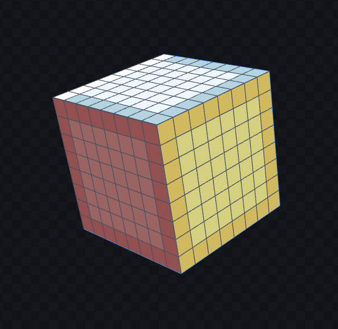

对齐 Snapping 非常重要，它可以更容易地创建一致大小的模型。不用像 Blender 那样通过 Vertex、Edge、Face Align 这样的高级功能，只通过在场景中移动就可以完美对齐。在 Blender/Unity 中也可以设置这样的 Snap 步长，而且也应该这样做，才能创建出干净、一致的模型和场景。

Blockbench 导出 FBX 相比 Blender 有一个优势就是与 Unity 单位大小自动统一，Blockbench 中的 1m 就是 Unity 中的 1m。不用像 Blender 那样，导出时先将 scale 设置为 0.01，然后在 Unity 中还要设置导入选项 Convert Units(1cm to 1m)。

# Grid Resolution

Blockbench 的对齐精度（颗粒度）成为 Resolution，很多地方都是基于这个 Resolution 来确定 Mesh 大小的。它表示将一个 Unit（也就是 1m）划分为多少份，每一份作为最小单位，移动、缩放移动的 Vertex 都是这个最小单位的整数倍。

而且这个 Snapping 应该也是 Blockbench 能生成一致像素大小纹理的重要原因之一。因为所有的 Vertex 都在最小步长的整数的位置上，size 很好计算。

下面是 Setting 中对 Snapping 的设置：

- Grid Resolution：

  当没有按下任何修饰键（Ctrl 或 Shift），仅通过鼠标移动、缩放时，vertex 移动的最小单位。

  默认是 16，即将一个单位（1m）划分为 16 份，最小单位为 1/16 m，每次 vertex 移动的距离都是这个最小单位的整数倍。

  如下图所示，设置 Show Grid 时，Blockbench 会在场景中现实 1x1 m 的网格，但是在模型所在的位置，还显示这个 Grid Resolution。例如图中，将一个 Grid 水平、垂直都划分为了 16 个单位。

  上面的 N 表示 North，指示模型空间的方向，上北下南，左西右东。N 方向 Z 轴正方向，水平向右就是 X 轴的正方向，垂直向上是 Y 轴正方向。

  

  图中 Cube 是以 8x8 的规格创建的。这里 8x8 就是指 Grid Resolution 的最小单位，这里就是 1/6，因此这个 Cube 的实际大小就是 0.5m x 0.5m：

  

  导入到 Unity 中，与 Unity 的标准 Cube 比较可见，它就是标准 Cube 的 1/4：

  

- Shift Resolution

  这是按住 Shift 时 Grid 的 Resolution，默认 64，即 1/64 m，是 Grid Resolution 的 1/4。此时移动和缩放，vertex 将以 1/64m 为单位移动。

- Ctrl Resolution 和 Ctrl+Shift Resolution

  这两个是在上面两个 Resolution 基础上按 Ctrl 键，将每个分辨率再各自放大十倍，分别是 160 和 640. 这样的分辨率已经太细了，几乎可以说是 seamless 的了。

Snapping 是 Blockbench 中非常重要的概念。

Snapping 设置可以保存为预设。

# 导出选项

Model Export Scale 指定导出模型的缩放倍数。它的单位就是 Grid Resolution。例如默认 Grid Resolution 为 16（1 unit 划分为 16 份，每份为最小单位），Model Export Scale 也为 16，那么模型就没有缩放，Blockbench 中是多大，Unity 中就是多大。

- Model Export Scale = 16：

  

  注意白色 Cube 在 Blockbench 中创建时就是按照 8x8 size 创建的，因此它们正常大小就是 Unity 标准 Cube 的 1/4。

- Model Export Scale = 32：

  

  Scale = 32 时，可见导出到 Unity 的 Cube 缩小了一半，变成变成了标准 cube 的 1/4.

  可以这样理解 Model Export Scale 指定了导出时一个单位（m）包含多少份最小的 Unit。

  编辑模型的时候，每个坐标，尺寸的数值就是它包含了多少个最小单位。例如这里 cube 每个 Unit（m）编辑时包含 8 个最小单位。导出时一个 Unit 包含 32 个最小单位，那 Cube 的边长就变成了标准 cube 的 1/4 了。

- Model Export Scale = 8：

  

  类似的，Cube 创建时指定为 8x8 个最小单位，Grid Resolution 指定 Blockbench 编辑器中一个单位包含 16 个最小单位，因此在 BB 中 Cube 的边长只是标准单位的一半，但是导出时指定一个标准单位包含 8 份最小单位，这样导出后，Cube 边长就变成了一个标准单位，因此和 Unity 的标准 Cube 大小相同。

Model Export Scale 只影响导出的模型在 Unity 中的大小，并不影响纹理 Resolution。因为纹理都写入 texture 文件了。Cube 无论多大，只会显示 uv 中指定的纹理大小。因此如果模型导出时被放大，那纹理像素大小也会被相应放大，反之亦然。但是即使导出时模型被放大，在 Unity 导入时和运行时都可以缩放模型，把它缩放到任意大小。

现在 Unity 还没有能自动导入 Blockbench 工程文件的插件，就像 Blender 的 .blend 文件那样。现在只能通过导出导入 FBX 模型文件来交互。

# 纹理

每个模型是逐个绘制纹理的，因此每个模型都单独指定使用的纹理，即使它们可以是相同的（同一个纹理）。

模型导出为 FBX 时，默认会把它使用的纹理导出的输出目录中。FBX 中材质引用的纹理，就在当前目录中寻找，Material 中会记录使用的 texture 的名字。

如果纹理没有导出，可以点击纹理，右键菜单中 Save As 手动保存纹理。

纹理创建时也会提示选择 Pixel Density：

它与 Grid Resolution 类似也是定义一个标准单位（m）应该划分为多少份。例如 默认 16x，就是 1m 的 cube 每个方向最多渲染 16 个像素块。

这个功能可以用来控制所有模型能显示一致大小的纹理像素块。

在 Paint Mode 打开 Painting Grid，就可以看见一个 cube 面上能绘制多少个像素块。这里 Cube 按照 8x8 建立，即每个边长拥有 8 个最小单位，因此只有一半边长，然后纹理是按照跟 Grid Resolution 一样的 16 创建的，即一个标准单位应该绘制 16 个像素块，因此作为一半大小的 Cube，每个边长可以绘制 8 个像素块

还可以在 Edit Mode 之下可以打开 Pixel Grid，它也会显示模型表面上能绘制多少个像素块，例如下面为模型创建了一个 32x 的纹理，打开 Pixel Grid 可以看见，这个 cube 每个边可以绘制 16 个像素块了，但是像素块的大小变成了原来的一半。

之所以选择 16、32、64 这样的划分数量，是因为 Unity 中希望纹理的 size 都是 2 的幂。

纹理导入到 Unity 中，要正确显示，需要将纹理的 Filter Mode 设置为 Point（no filter），还要将 Compression 设置为 None（不压缩）。这样才能让 Unity 按原本的像素采样纹理。Bilinear/Trilinear 和压缩纹理都会导致采样到错误的颜色。纹理不需要压缩，因为它们非常小，即使 64x64 的纹理也只有 4k，通常 32x32（1k）已经足够了。

# 纹理绘制

模型纹理不仅可以绘制，还可以导入现有纹理。

绘制支持图层 Layer 和图层间的混合模式 Blend Mode。

因此可以将一些图标、图像像素化（马赛克化），然后作为图层添加到模型的纹理上，这样就不用自己绘制它们了。还可以将图片像素化，然后临摹来学习如何绘制像素化纹理。

常用的调色板可以作为预设保存和导入。

注意，Blockbench 可以同时编辑多个纹理，它们在 Images 列表中显示。每个纹理都可以有多个 Layer。因此创建 Layer 时必须选择是为哪个纹理创建的，否则没有选中的纹理，它不会创建 Layer：

