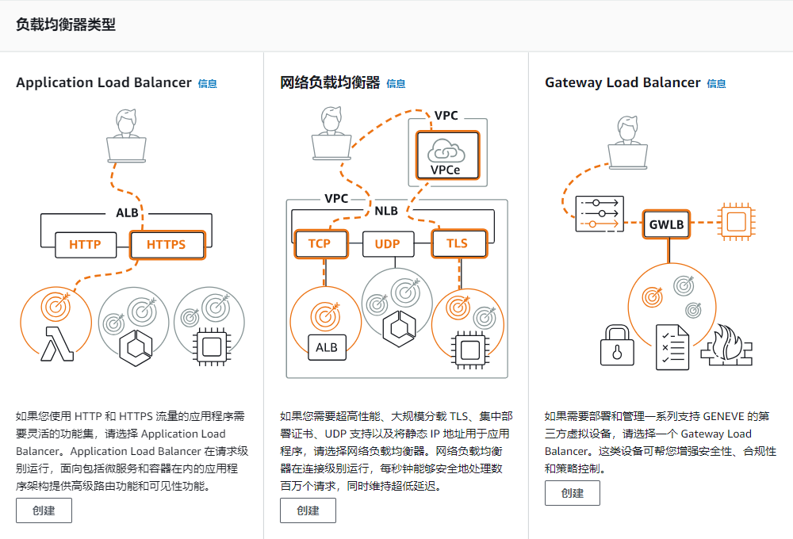

# ELB

## 负载均衡器类型

- Application Load Balancer

  7 层负载均衡，基于 HTTP/HTTPS url。基于每次请求，将其路由到一台服务器。同一个客户端的两次请求可能路由到不同的服务器。

- Netword Load Balancer

  4 层负载均衡，基于 TCP/TLS/UDP + 端口。基于每个连接，将每次连接的流量路由到一台服务器。因为 TCP/TLS 是长连接的，一次连接保持很长时间，因此同一个连接的所有请求都路由到同一台服务器。但是两次连接（断线重连），可能会连接到不同的服务器。同时两个客户端的连接可能会路由到同一台服务器，也可能路由到不同的服务器。

- Gateway Load Balancer

## 创建 Application Load Balancer

原理：

- 客户向您的应用程序提出请求。
- 负载均衡器中的侦听器接收与您配置的协议和端口匹配的请求。
- 接收侦听器根据您指定的规则评估传入的请求，如果适用，请求将路由到相应的目标组。您可以使用 HTTPS 侦听器将 TLS 加密和解密的工作卸载到负载均衡器。
- 一个或多个目标组中健康的目标将根据负载均衡算法和您在侦听器中指定的路由规则接收流量。

### 基本配置

- LB 名字

- 模式

  - 面向互联网：将公网客户端的请求路由到目标，需要一个公共子网
  - 面向内部：内部负载均衡器使用私有 IP 将客户端（内网的客户端）路由到目标

- IP 地址类型：

  - IP v4
  - 双堆栈（IPv4 + IPv6）

  不需要指定 IP 地址，LB 是一个 VIP，后面有一个组具有真实 IP 的实例。

### 网络映射

设置 ELB 所在的 VPC 和 subnet。VPC 只能有一个，subnet 可以有多个，用来将流量路由到不同的 AZ，这要与 ECS 集群服务运行的 AZ 一致，这用来配置 ELB 的路由表。

### 安全组

安全组配置 ELB 的防火墙规则。注意默认的安全组 default 允许全部流量，全部协议，和全部端口，但是源地址只是初始 default 子网内的 ip 地址，而不是公网的 ip 地址，如果选择这个安全组，没法在公网上访问 ELB。要么创建新的安全组，要么修噶 default 的入站规则。

### 侦听器和路由

ELB 可以添加多个侦听器，每个侦听器侦听一个（协议，端口）的组合。例如一个侦听器侦听 HTTP:80，另一个侦听器侦听 HTTPS:443。

转发不直接指定 ECS 集群的 service，中间还有一个中间层：目标组，这创建了额外的一层灵活性。目标组映射到 ECS 集群 service，ELB 侦听器指定转发的目标组。

侦听器和负载均衡器都可以指定标签 tag。

### 证书

在负载均衡器控制面板的 “侦听器和规则” 中，如果侦听器侦听 HTTPS 协议，可以配置 SSL 证书，就是 ACM 中请求的证书。

## 监控

ELB 控制面板的 “监控” 中可以查看 ELB 的运行情况，包括目标响应时间，请求数量，HTTP 错误请求数量，TLS 协商错误，已拒绝连接总数等等。和其他 Metrics 一样，这只是一个简要监控面板，详细的点进 CloudWatch 中查看。

## 目标组

目标组在 ELB 和目标集群中间创建了一个中间层。

### 创建目标组

- 目标类型

  - 实例：将流量路由到 VPC 中指定的 EC2 实例
  - IP 地址
    - 路由到 VPC 和本地资源
    - 路由到 ECS 集群
  - Lambda 函数
  - Application Load Balancer

- 目标组名字

- 协议端口

  这是挂载这个目标组的 ELB 要侦听的端点。

- 健康情况检查

  health check path

目标组的转发的目的地 IP 和 health check path 可以在目标组配置，但是对于 ECS 应该在创建 Service 时，在 “负载均衡” section 中配置：

- 要使用的负载均衡器类型

- 要使用的负载均衡器

- service 中用作目的地的容器

  容器中可以暴露多个端点（例如 HTTP:80 和 HTTPS:443）。选择一个作为负载均衡的目标。

- 要使用的目标组

- 健康检查路径

在这里，ECS 会将目标 IP 地址和健康检查的路径自动配置到目标组，不需要在目标组中配置。目标组中用于配置目标 IP 和健康检查用于 EC2 实例这样的场景，因为 ELB 的流量不仅仅路由到 ECS 集群，还可以路由到 EC2 实例或 Lambda 函数等。这就是为什么 ELB 和 ECS 集群中间有一个目标组这个中间层，它用来抽象 ELB 的流量路由目的地。
