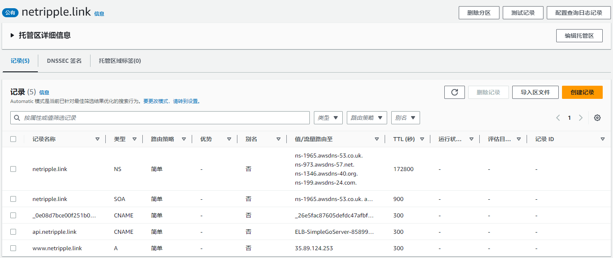

# Route53

在 Route53 托管区域中为 AWS 托管的域名配置 DNS 记录：

尤其注意这里，将 api.netripple.link 设置为 CNAME 类型，并将流量路由到 ELB-SimpleGoServer-858991755.us-east-1.elb.amazonaws.com，这是弹性负载均衡器的地址，因此访问这个域名，就将请求发送到了 ELB。负载均衡器只有一个 DNS 地址，没有显示 public ip，因为它是个 VIP，后面是一个集群，提供一组具有 public ip 的实例，而且可以随着流量自动扩展，不需要担心负载均衡器成为瓶颈，不需要设置多 LB 入口。

ELB 在 EC2 控制面板中配置。
