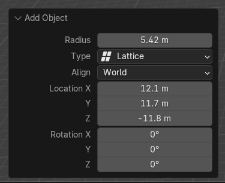

# Lattice

Lattice 必须在创建后，在选项对话框中设置好它的大小 Raius，

这将成为它的 Rest 大小。一旦之后添加为某个 Mesh 的 Lattice Deform Modifier，只会相对于这个 Rest 大小进行缩放。即使在添加到 Mesh 之前，对它进行 Object 缩放，或者 Edit Mode 对所有的 Lattice Vertex 缩放，添加到 Mesh 之后都会导致 Mesh 直接缩放。

因此要创建一个包围 Mesh 的 Lattice，必须在创建时就设置好大位置和大小，位置通过 3D Cursor 设置，可以先设置好 3D Cursor，然后再创建时还可以在选项对话框中设置其位置和旋转。不能创建好之后在缩放。

