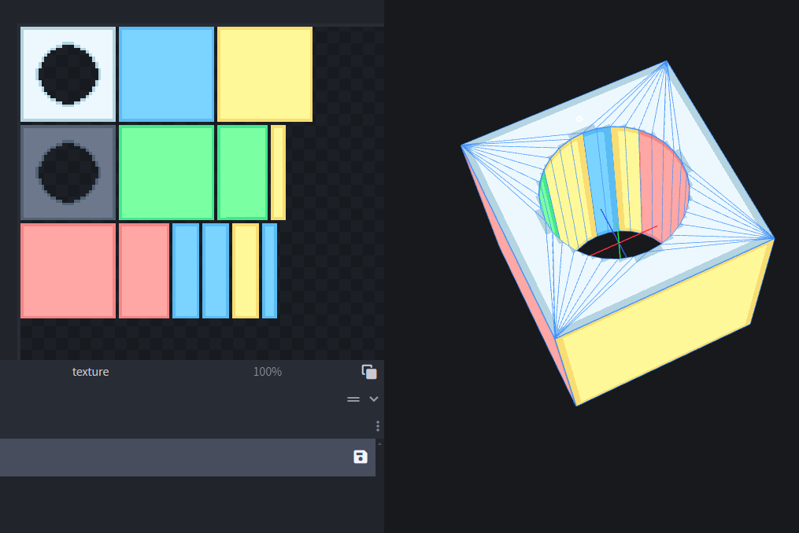
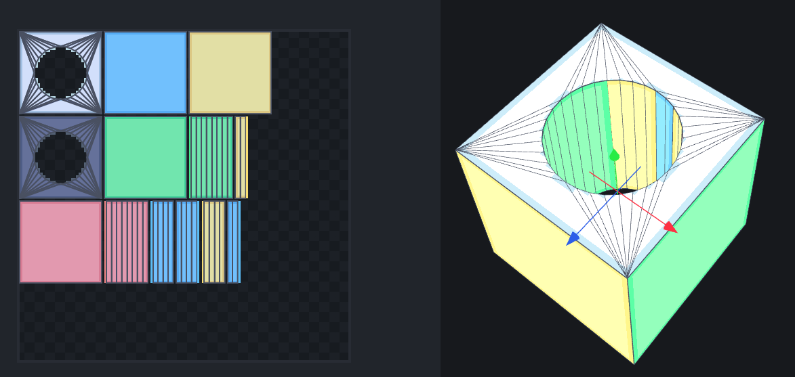
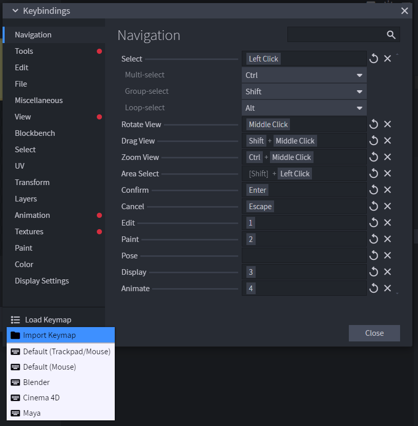
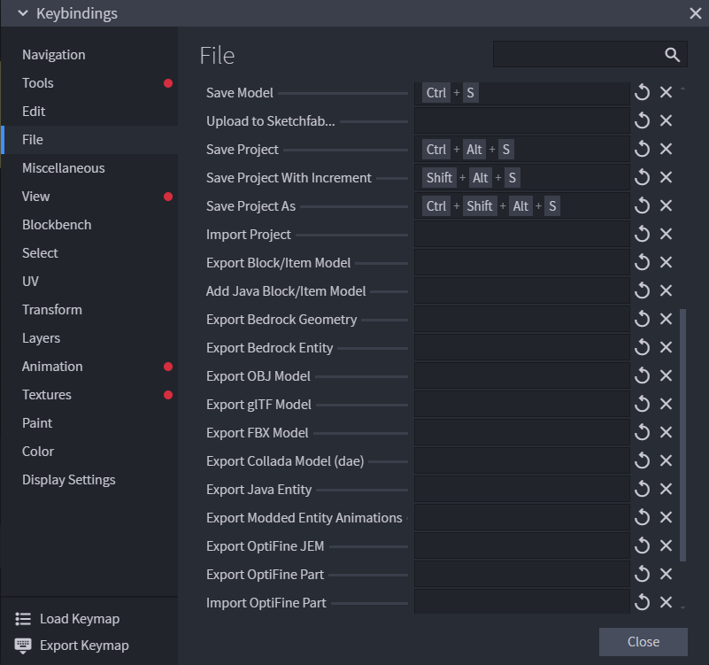
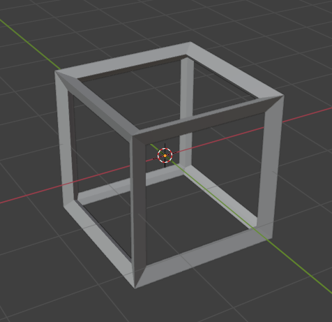

Blockbench Edit 和 Paint 模式下，模型上不同颜色的部分不是随机渲染的，每个相同颜色的区域块是一个 uv island，通过颜色可以在 uv 和 face 进行对应。

将 Blockbench 的 key_binding 设置为 blender，就可以让 blockbench 的编辑基本与 blender 一致。还可以通过 alt + 左键 选择循环的 face 或 edge。

此外 Blockbench 为所有功能都提供了快捷键绑定，包括诸如文件导出这样的功能，这可以加快与 Unity 交互迭代的速度。

工具技术限制在 Blockbench + Gimp + Blender + Unity，不再扩展，专注精通它们的细节功能。例如 blender gimp 还有很多基础功能还没有熟悉甚至知道，而它们对提供工作效率有很大辅助。例如 gimp 的选区、滤镜、图层蒙版等功能，blender 菜单中的基本功能还没有全部尝试一遍，各种 modifier 还没有熟悉。Unity NavMesh 的 OffMeshLink 还没有尝试。

例如，Blender 可以根据选中的 mesh 生成 wireframe 模型，这些都是在菜单中的基础功能，在某些情况下非常方便。

Blender 和 Unity 支持非共面的 quad（Unity 应该是在导入的时候自动进行三角化），即四边形的点不共面。但是 Blockbench 和 Godot 都不支持。将存在非共面 quad 的模型导入到 Blockbench 和 Godot 是模型出现破缺的原因。解决办法是在 Blender 中选择所有的面，然后在 Face 菜单中选择 Triangulate Faces，将所有面三角化，这样再导入到 Blockbench 和 Godot 中就不会出现破损了。还可以再选择 Tris to Quads，将共面的三角面合并为 Quad，这样会生成更美观更合理的 wireframe，导入到 BB 和 GD 中仍然不会有问题。

Blockbench 还在更新，值得投资。Blockbench 作为主力，Blender 和 Gimp 作为辅助。Gimp 可以为纹理绘制和处理提供更高级的功能。Blender 可以处理在 Blockbench 不方便建模的模型。另外还可以在 Blender 中完全创建模型，只将 Blockbench 作为 uv 展开和绘制的工具。这样的好处包括：

- Blender 包含更强大更流畅的建模功能
- Blender 文件可以直接保存到 Unity 中，不需要额外导出为 Obj 或 Fbx，作为中间产物
- Blender 中可以进行骨骼蒙皮和 IK 动画

Blockbench 和 Godot 应该支持支 triangle 和 quad，而 Blender 和 Unity 支持任意多边形，这就导致很多模型在 Blender/Unity 中显示正常，但是到 Blockbench 和 Godot 就出现破损。这也是为什么在 Blender 中将 mesh 三角化或者三角化再quads化之后，模型就能再 Blockbench 和 Godot 中显示正确了。

Blockbench 可以导出 obj 或 fbx。但是 obj 会将所有 mesh 合并为一个mesh，除非显示控制导出哪些 mesh，这导致只能一个一个导出 mesh，非常麻烦。但是 fbx 不会合并 mesh，导入 Unity 后，所有的部件仍然保持独立，因此尽量使用 fbx。另外 fbx 还支持动画。obj 基本是保持向后兼容用的，应该只使用 fbx。

Blender 创建的模型导入到 BB 绘制纹理，再导出为 fbx，这就是和之前不同的模型了。因为 BB 会重新布局 uv，而 uv 本身就是模型数据。

Blender 选中所有物体，进入编辑模式，然后选择所有 faces，选择 smart unwarp uv，会产生跟 BB 类似的展开 uv 的效果，即每个 island 的大小比例也会被保持，这样也可以一定程度达成 BB 自动 uv 的效果。可以导入一张 checkboard 图片，然后缩放全部 uv island，让模型的 pixel block 和世界中其他模型尽量保持一致。pixel 纹理的 block 大小大致保持一致即可，没有人会去检查或注意模型的 pixel block 大小是否完全一样，只有不引起注意即可。这样也可以再 Blender 绘制 pixel art。但是 Blender 在 Texture Paint 模式下切换模型非常麻烦，需要先回到 Object 模式，选择要绘制的物体，再回到 Texture Paint 模式。更重要的是，blender 的绘制功能比较受限。它的笔刷总是圆形，即使设置半径为最小的 1 px，仍然会绘制两个像素。它只能手绘，没有绘制直线、矩形、圆形、渐变等高级的功能，而且没有图层功能。如果用 Gimp 作为纹理编辑器，则失去了直接再模型绘制的方便，必须来回对应 uv 和模型的 face。

总而言之，Blockbench 是为 Lowpoly + Pixel Art 设计的完美软件，它的每个方面都是为这个目标设计的。因此应该将 BB 作为主力。只有再一些相对复杂的模型用 BB 创建不方便时，才用 Blender 接手。但是要绘制纹理，仍然要将模型从 Blender 中导入到 BB 中。

创建模型要组件化，每个部分作为一个单独部分创建，最后组装再一起，不要作为一个 mesh 创建：

- 很多时候模型包含很多重复的组件。这些组件通常也会经常改变的。将它作为单独的模型构建，不仅可以统一变化，而且编辑时可以创建一个独立的上下文，不会与其他模型产生干扰。
- 组件化会简化 mesh 的数据，使得 mesh 不会包含重复的数据，还有这可以大大节省 uv 空间，不必每个重复的部件都占用一个 uv island。
- 组件化还可以使得组装模型变得多样化，即少数几个组件就可以用不同的组合组装出各种不同的模型
- 很多游戏机制需要模型组件可替换，例如角色升级，或者模型差异化

在 BB 中可以将组件 duplicate 然后组装，查看组装效果。但是当导出为 FBX 时，应该每个部件只导出一个，不要导出重复的组件。在 Unity 中将组件再次组装为最终模型。Asset Store 上很多模型资源，都是组件化的，每个组件是一个 Mesh 或者 Preab。
它们都是在建模软件（Blender 或 BB）测试好后，每个组件单独导出的。

BB 中模型要对称绘制纹理，需要模型 reset 时沿着 X 轴时对称，不可以是旋转的。

不再需要 UModeler：

- 相比于创建模型，节省的导入导出时间不值一提
- 无论如何需要将模型导入到 BB 中绘制纹理的，这就和 Blender 一样了，也失去了免于导入导出的优势
- Blender 的建模工具更为强大更为流畅
- Unity 迭代速度至关重要，能使用外部软件的就不要用 Unity 插件，能自己实现的就不要安装第三方包

无论是在 Blockbench 还是在 Blender 中创建部件，都需要先创建标准，例如标准立方体，确定游戏世界的 unit 和 pixel block size 的标准，然后一切根据这些标准来创建。

Lowpoly 模型应该尽可能简单，能突出关键特征即可，因此很少需要 Blender 的强大编辑能力。如果开始使用 Blender 了，和可能是一个危险信号，开始滑向写实方向了。因此使用 Blockbench 可以强制约束，避免滑向写实风格。

Blender 只作为最终保障，即使用 BB 确实很不方便构建，例如一些 bool 操作，或者晶格操作。但是 Lowpoly 模型都是很简单的，需要用到 Blender 的机会应该非常罕见。

另外 BB 的纹理绘制和图像处理工具也足够丰富，甚至支持图层和图层 Blend Mode。对于 Pixel Art 几乎覆盖了一切，甚至可以取代 2d 像素艺术工具。几乎不需要 GIMP。只有一点没有办法处理，就是噪声。但是这很好解决，可以在 GIMP 或者网络下载一些噪声图像。
尽管这些噪声不能变化，但是对于绘制自然纹理已经足够用了。创建一些噪声纹理，作为预制纹理使用即可。

最终就是，Blockbench 作为绝对的主力，Blender 和 Gimp 作为最终保障（能不用就不用）。

学会 Blockbench 非常容易，它的功能足够精炼又足够丰富，剩下的只需要精通它，将它作为画家的画笔，音乐家的小提琴，创作更多的作品而已。

建模除了熟悉工具，最关键的一点就是一定要有参考图，只能依据参考图。那些建模高手看似可以不依赖参考图建模，是因为经过长期训练，他们的大脑中已经自动有参考图了，而不是他们不需要。

人的大脑的能力是有限制的，尽管人擅长创造性思维，但是只能基于既有事物的基础，然后向外扩展一点。纵观科技史，所有的理论技术都是一点一点基于已有的事物发展的，从没有哪个是横空出世的，包括相对论和量子力学。

建模也一样，人是没办法凭空创建一个模型，只能依赖参考图。即使创建一些有趣夸张风格的模型，或者创建现实中不存在的模型，也需要基于显示存在事物的参考图，然后确定在哪些部分适度夸张一下，哪些部分可以创造性的改变。就像画家或雕刻师绘制雕刻诸神的形象，也是要基于现实世界的模特的。

因此建模第一件事情就是寻找参考图（最好 X Y Z 方向都有）。没有参考图就不可能开始。

事实上，只突出关键特征，然后不严格遵循比例，甚至任意选择甚至夸张比例，反而创建一种非常有趣动漫的风格。因为这本质就是动漫的特点：突出关键特征，忽略细节，夸张比例。

vscode 中文输入标点符合，会产生两个重复的标点。在 settings 中关闭 editor.experimentalEditContextEnabled。
