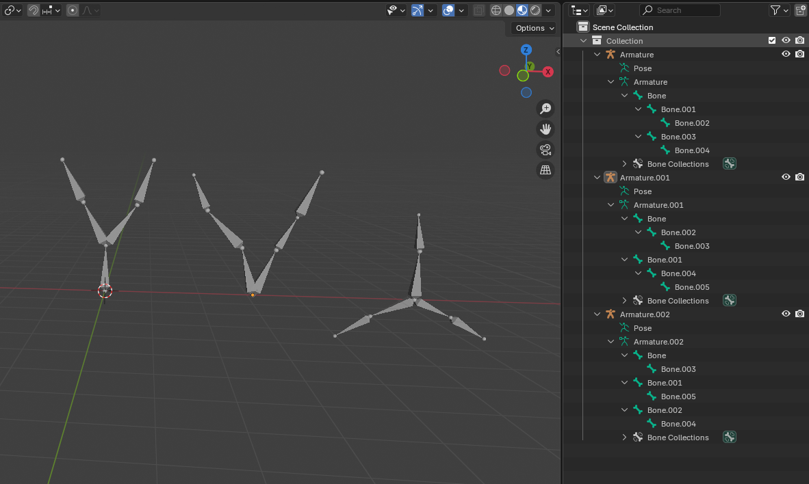
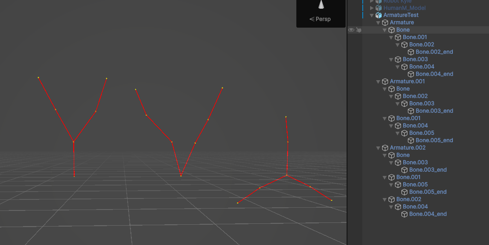
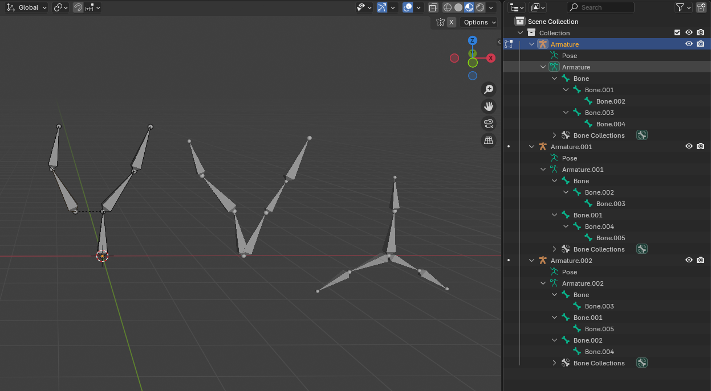
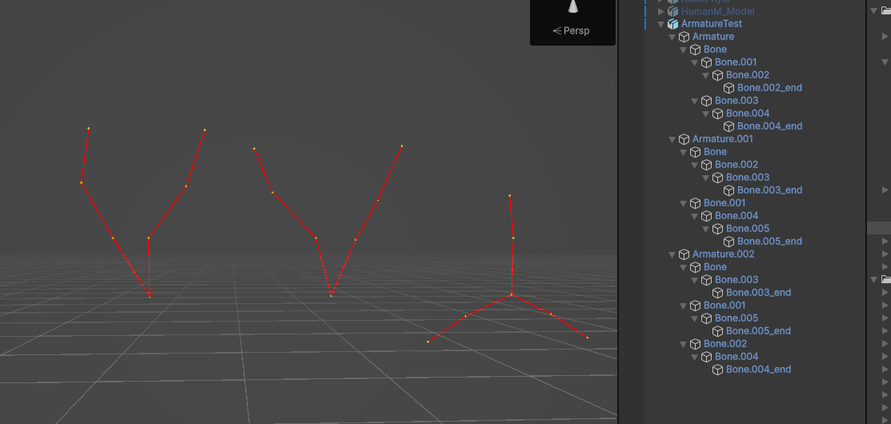
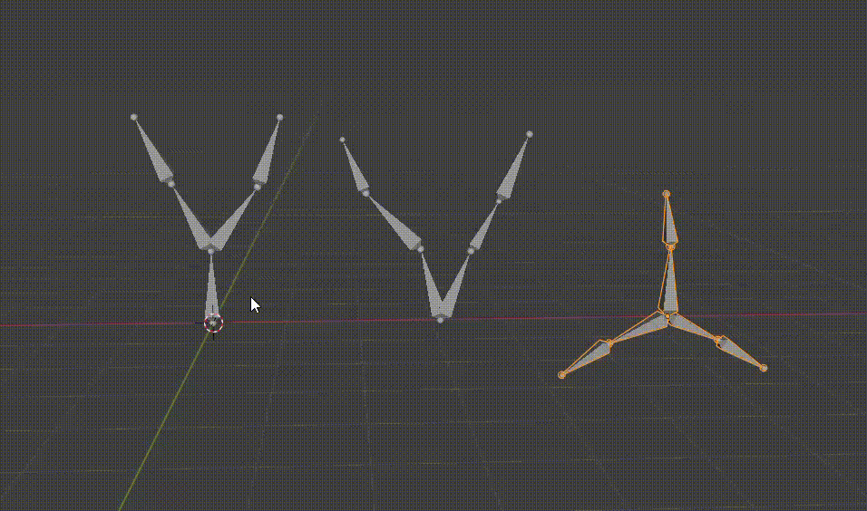
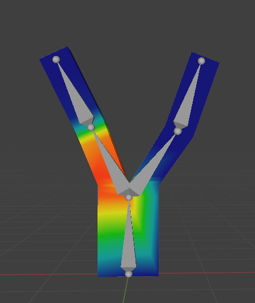
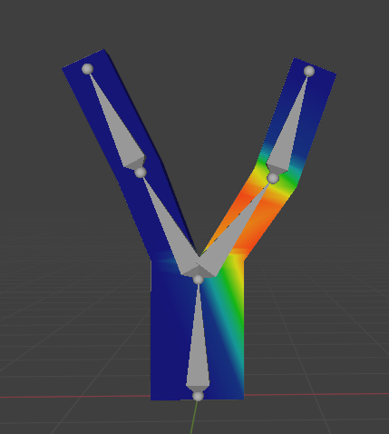

Blender 的骨骼约定与 Unity 并不一致。从此可以看出 Blender 是完全独立 3D 内容创作工具，并不考虑与特定游戏引擎兼容，是游戏引擎尝试使用 Blender 来创作游戏资产。

Blender 所有的概念和方法，都是设计用在 Blender 环境中的，并且在 Blender 环境中，它们也确实清晰好用。但是 Unity 有不同的概念和方法，有一些并不与 Blender 兼容。因此将 Blender 资源导入到 Unity 会有很多“间隙”，理解这些“间隙”才能更好地使用 Blender 为 Unity 游戏创建资源。

Blender 中，每个 Bone 是由两个 Joint（相当于 Unity Transform）定义的，一个 Head，一个 Tail。Head 作为 Bone 的 Pivot，移动、旋转都基于它操作。Tail 为 Bone 提供了一个长度，并为 Child Bone 提供了一个从 Head 的偏移，如果 Child Bone 是 Disconnected，Child Bone 还能为 Head 再指定一个到 Parent Tail 的偏移。

但是 Unity 没有有长度骨骼的概念，只有简单地 Transform。将 Blender 骨骼导入到 Unity 中，Unity 只会为每个 Bone 的 Head 创建一个 Transform，以及对每个末端骨骼的 Tail 创建一个 _end Transform。然后这些 Transform 的 Hierarchy 和 Blender 的 Bone Hierarchy 完全一样。

如下图所示，在 Blender 中创建的 3 个 Armature：

注意：从 Root Bone 的 Head 也可以 Extrude Bone. 通常只会在 Bone 的 Tail 上 Extrude Bone，这样新创建的 Bone 将是 Bone 的 Child Bone（Connected）。但是 Root Bone 没有 Parent，从其 Head Extrude Bone，会创建一个新的 Root Bone，放在 Armature 下面，其 Head 位置与前面的 Root Bone 的 Head 相同。例如上图中间、右边的 Armature 就是从 Root Bone 的 Head Extrude 出单独的骨骼链，它们在 Armature 下是独立的。

它们导入到 Unity 后对应的 Transform Hierarchy：

可见 Blender 中的（Head-Tail）Bone “退化” 为一个 Transform，只剩下 Head Transform。

如果将 Blender 中的骨骼变成 Disconnected 的：

导入到 Unity 中可见，Transform Hierarchy 仍然不变。

这里面就有一个问题。如果将 Bone 视为一个 Head-Tail，在 Blender 中有一个明确的 Bone，但是在 Unity 中就有两个选择，Bone-Bone.001 或 Bone-Bone.003，无论 Connected 版本的还是 Disconnected 版本的。这说明在 Unity 中是没法区分或者说根本没有 Connected 和 Disconnected。

如下图所示，即使 Blender 中的 Connected Bones，在 Unity 中，跟 Disconnected 没有区别，Bone.001 和 Bone.003 完全可以独立的移动，而在 Blender 中，Connected 的 Bone.001 和 Bone.003，Bone.001 和 Bone.003 是锁定在一起的，总是一起移动的。并且在 Pose 中，骨骼长度不能改变，Connected 的 Child Bone 不能脱离 Parent Bone 移动，只能旋转。Blender 的骨骼定义和操作只服务于它自己的创作环境。

对于 Disconnected Bones，Blender 中的 Bone 从 head 指向 Bone.003 的 Head，但是在 Unity 中，无法区分是 Bone-Bone.001 还是 Bone-Bone.003，或者 Unity 中根本不区分（不想区分）。

相比而言，Unity 的定义是最灵活的，它能兼容 Blender 的骨骼的各种情况，反过来就不一定。因为无论 Bone 的位移、旋转 Unity 都能表示。在编辑 Pose 动画时，骨骼只需要绕着 Head 移动、旋转。即使 Bone 和 Parent Bone 绑定，在 Unity 中，只有不移动、不分离绑定的 Joint（Transform），就能模拟。因此 Unity 是最灵活的。

因此，理解 Unity 的骨骼和 Blender 的区别：

- Unity 的 Transform Hierarchy 和 Blender 的 Bone Hierarchy 完全一样，Blender 每个 Bone 在 Unity 中只是一个 Transform，就是 Bone 的 head。只是对于骨骼链的末端 Bone，创建一个 _end Transform
- Unity 中的 Bone 只是一个 Transform，没有长度，Child Bone Head 可以任意移动、旋转
- Blender 的 Head-Tail 骨骼（尤其是 Tail）在 Unity 没有存在的必要，Unity 的 Transform Hierarchy 定义最灵活，可以完全模拟 Blender 的情况
- 如果想要在 Blender 中想象一个骨骼到 Unity 中会是什么样，就按下面的方法：

  - Bone 退化为一个 Joint，就是 Head，或者说 Bone 就是 Head Joint。所有的数据记录在 Head Joint 上
  - Connect 和 Disconnect 在 Unity 中是没有意义的，怎样都可以
  - 无视骨骼的 Body（锥形 shape）和 Tail Joint，只看 Head Joint。将所有的 Head Joint 和末端骨骼的 Tail Joint 按照层级关系连接起来，就是 Unity 中的 Transform Hierarchy
  - 只有 Head 和末端骨骼的 Tail 在 Unity 中有意义

Blender 中 Connected 的 Bones 锁定移动，在 Unity 中，两个 Child Transform 却可以自由移动。那么如果为这样的骨骼创建一个相应的蒙皮模型，在 Blender 中绑定的 Bone 一起移动，在 Unity 中两个 Child Transform 分离移动会是怎样的情况？

如下所示，在 Unity 中，如果两个在 Blender 中锁定的 Transforms 在 Unity 中分离移动，模型就可以被拉扯。如果两个 Transform 在 Unity 中一起移动、旋转，那么就是 Blender 的情况。

如果在 Blender 中查看两个骨骼的 Weighted 情况，就会看见左边的 Bone 也会一定程度影响右边的 Vertices，右边的 Bone 也会一定程度影响左边的 Vertices。这些影响都记录在 Bone 上，而 Bone 在 Unity 中都退化为 Transform。因此移动 Transform，就会让它在 Blender 中对应的骨骼影响的 vertices 跟着它移动、旋转。如果两个 Transform 不一起移动、旋转，而是分开进行，就会出现 mesh 被拉扯。如果两个 Transform 一起移动，那就和 Blender 的情况一样了。

# Humanoid 骨骼

Unity Avatar 的原理不负责，很简单。它不管模型的骨骼拓扑、结构（只是自动生成 Avatar 时会考虑骨骼的拓扑结构），一旦建立，就是为具体的骨骼到通用标准的 Avatar 骨骼建立一个映射，dict\[real_bone:avatar_bone\]，仅此而已。然后在 Avatar 骨骼和真实骨骼之间传递（同步）位移和旋转。

例如动画重定向时，一个模型播放骨骼动画，动画片段输出真实骨骼的运动数据，重定向系统根据骨骼映射，找到它对应的 Avatar 抽象骨骼，然后再在重定向的模型的 Avatar 中找到后者映射的真实骨骼，然后将动画数据应用到它上面。

所以，简而言之，Avatar 就是将模型的真实骨骼和抽象标准的 Avatar 骨骼一一映射，之后就是简单地在 Avatar 骨骼和具体骨骼之间传递运动数据。因此即使你将 Neck 映射到 Spine，将 Left Shoulder 映射到 RightLowerLeg 也没关系，因为 Avatar 根本关心骨骼拓扑，它只在一一对应的骨骼之间传递运动数据而已，如果按上面的映射，它只是将 Neck 的移动旋转传递到 Spine，将 Left Shoulder 的移动旋转传递到 RightLowerLeg。

动画片段中没有 Avatar 信息，Avatar 信息记录在模型上。动画片段就是普通的 Unity Animation Clip。它只会在当前 GameObject 下面按照动画片段中记录的路径，找到相应的属性，然后应用动画曲线。它对 Avatar 是无知的。

通常，模型的 Root Bone 就是 Hips，然后 Hips 发出三个骨骼链（Spine、LeftUpperLeg，RightUpperLeg，注意 Unity 中没有 Connected 和 Disconnected 的概念）。移动或旋转 Hips，就可以移动或旋转整个模型。但是通常会在 Hips 上面再加上一个 Parent Bone（Transform），它用作 Root Transform。

Hips 主要用于模型的 Local Pose，即不会在世界空间中产生移动、旋转中的姿势，但是包括角色重心的上下起伏。Root Transform 则用于角色整体在世界空间中的移动、旋转。
