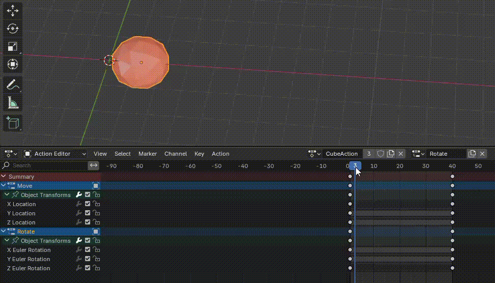
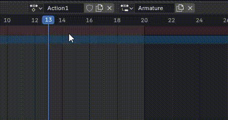

Action 就是 Animation Clip。但是 Blender 中的提供了一个额外的机制：Action Slot.

Slot 是 Action 内的属性分组。一个 Action 内可以创建多个 Slot。要播放一个动画片段，不仅要指定 Action，还要指定 Slot，告诉动画系统，播放这个 Slot（属性组）的动画。相当于一个  Action 包含了多个子 Clip，Slot 名字就是子 Clip 的名字。例如一个 Slot 只包含上身动画，另一个 Slot 只包含下身动画。这两个子 clip 混合在一起就可以组成一个全身动画，混合的方式就是 NLA 编辑器（Nonlinear Action），而且这两个子 clip 可以在 NLA 中重用，例如将一个上身动画和另一个下身动画混合，又创建了一个新的全身动画。

NLA 界面类似 Unity 的 Timeline，将动画片段放在 Track 上，可以可视化地编辑位置（播放时间）、混合方式。功能类似 Unity 的 Animation Layer 和 Avatar Mask，用子片段组合完整的动画。

一个 Object（Mesh、Armature）可以创建多个 Action，每个 Action 又可以创建多个 Slot。使用 Action 播放时，只能播放一个 Slot 的动画。要同时播放多个 Slot 的动画，就需要使用 NLA。

但是 Slot 只是 Blender 中的机制，Unity 中没有这样的对应体。实践证明，如果一个 Object 包含多个 Slot，最后导出到 Unity 中只有一个 Slot（似乎就是最后选择的那个，或 Scene 当前的那个）包含的动画，这个 Object 的所有 Action 中其他的 Slot 动画都不会导出。如果那些 Action 没有定义这个 Slot，那么它们导出后的 Clip 就是空的。

要明白一点，Blender 是完全独立的 3D 内容创作工具和动画创作工具，应用于最广泛的 3D 动画领域（例如动画电影），不是专门为游戏引擎（尤其是 Unity）提供的建模工具。只是游戏开发将它的部分功能用作游戏资源的创建。因此 Blender 有自己专有的概念和方法，不会适配游戏引擎的概念。Blender 拥有 3D 内容创作完全的工具，不仅是建模，还有渲染、动画、粒子、物理，甚至有专门的基于 Blener 的游戏引擎。

因此很多 Blender 的概念、方法、工具并不能用于特定的游戏引擎。如果只将 Blender 用作 Unity 的游戏资源创建，那就应该只关注其中能与 Unity 兼容使用的功能，包括：

- Mesh 的创建（点线面的编辑、Modifier）
- UV 展开
- 纹理绘制
- 骨骼动画

其他的工具在 Unity 中不能使用，就不必关注。

Slot 和 NLA 就是专门用于 Blender 中的动画混合的功能。如果用 Blender 为 Unity 创建动画，一个 Object 应该只使用一个 Slot，但是可以有多个 Action，每个 Action 都使用相同的 Slot，这样就可以在 Unity 中每个 Action 导出为一个 Clip 了。

另一种使用方法是，将 Object 的所有动画都创建在一个 Action 中，只是放在不同的时间区段中。在导出到 Unity 中后，可以手动从这一个 Action Clip 切割出各个动画。

NLA 即支持不同 Slot 的 Action，也支持多个 Action 同一个 Slot，还支持从 Action 切割片段，它是最灵活的。

另外，Blender 中，Action 只能为 Object 创建，因为它是 Object 的 data block。因此 Blender 没法像 Unity 那样在一个 Clip 中为一个 GameObject Hierarchy 创建动画，每个 Action 只能应用到 Object 自身。因此要使用 Blender 为 Unity 创建动画，只能创建骨骼动画，因为 Armature 的 Bone Hierarchy 是它的 data block。

Action 和 Slot 创建时都可以指定一个名字，默认其名字都是 Object 的名字，在 Name 框中可以修改。

当为 Object 插入关键帧时，会自动为其创建一个名字与 Object 名字相同的 Action 和 Slot。后面可以创建更多的 Action，但是不必创建新的 Slot，应该只使用一个 Slot。

同一个 Action，不同的 Slot：

NLA 编辑：

创建新 Action，可以点击 X 将当前 Action unlink，然后点击 New Action，也可以点击它旁边的复制按钮，直接复制一个现有的 Action，然后为新的 Action 起一个新的名字：

每个 Object 首次记录关键帧时，会默认创建一个与 Object 同名的 Action 和 Slot。通常默认情况下，这就够用了。

