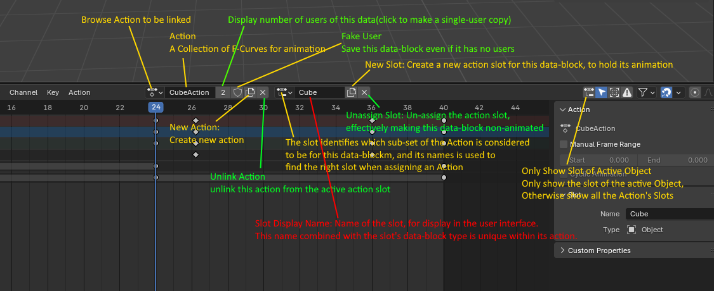

Action Editor 是 Dope Sheet 的一个子模式，主要用于：

- 编辑单个物体（特别是骨骼）对应的动画关键帧数据（Action）。

Blender 的动画系统是基于 Action 数据块 的。

- 每个 Action 存储了一组 F-Curves（动画通道）。
- 每个 F-Curve 又由关键帧组成。
- 动画对象（比如骨架、摄像机、灯光等）可以“拥有”一个当前正在使用的 Action。

简言之：Action = 某个物体的一段完整动画片段。

