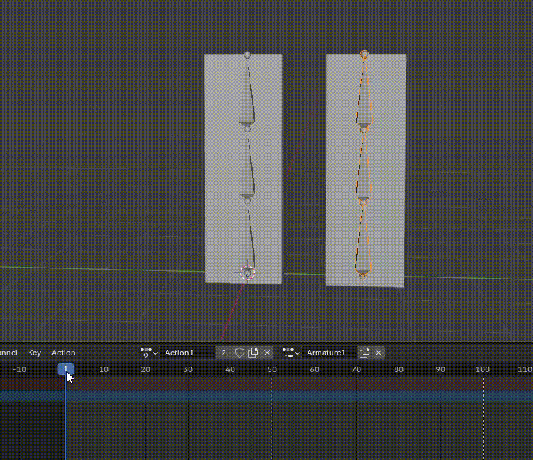
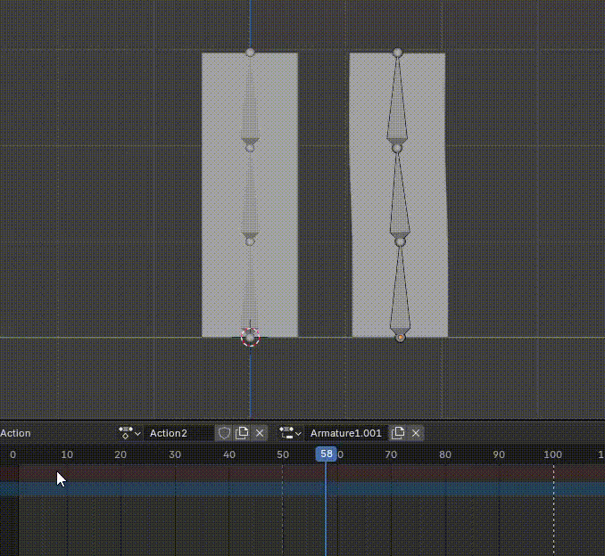
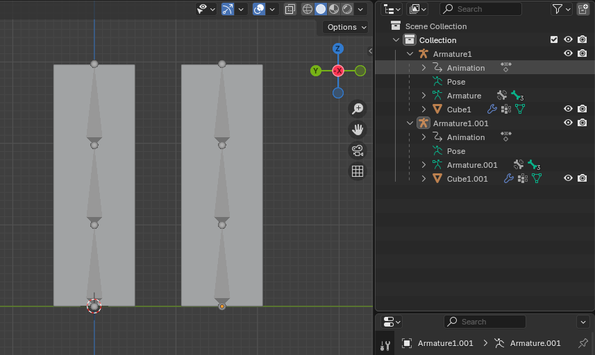
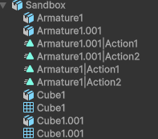
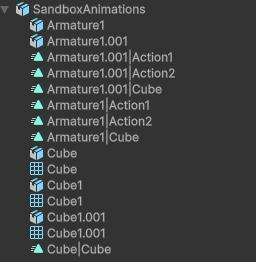
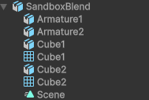
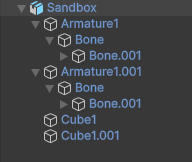

## 🎬 一、Blender 与 Unity 的动画结构差异

| 概念   | Blender                                                    | Unity                                           |
| ---- | ---------------------------------------------------------- | ----------------------------------------------- |
| 动画容器 | **Action**（每个对象都可以有多个 Action）                              | **AnimationClip**（属于一个 Animator 或 Animation 组件） |
| 数据组织 | 动画数据存在于 **Object / Armature / Material / Shape Key** 等数据块中 | AnimationClip 是独立文件，引用对象路径（Transform hierarchy） |
| 层次关系 | 每个对象独立存储动画数据                                               | 所有动画都共享一个场景对象层级（GameObject Hierarchy）           |

👉 **关键点：Blender 的 Action 是绑定到「数据块（Data Block）」上的，而不是场景层级。**

这意味着：

> 每个对象的动画数据是单独存放的，而 Unity 导入时会把它们逐一识别并生成独立的 AnimationClip。

---

## 🧩 二、为什么导出 FBX 时，每个对象的 Action 都变成一个 Clip？

当你用 **FBX 导出器** 时（而不是直接导入 `.blend`），Blender 的 FBX 导出逻辑是这样的：

### 导出逻辑简化版：

```
for each object in the scene:
    for each Action linked to that object:
        export AnimationClip(object_name + "_" + action_name)
```

所以：

* 如果你有 3 个对象（Cube, Sphere, Armature）
* 每个对象有 2 个 Action（Walk, Jump）

导出后 Unity 会生成：

```
Cube_Walk
Cube_Jump
Sphere_Walk
Sphere_Jump
Armature_Walk
Armature_Jump
```

👉 Unity 会把这些都视作独立的 AnimationClip。

---

## ⚙️ 三、为什么直接导入 .blend 文件时，只得到一个 Scene 动画？

当你把 `.blend` 文件直接拖进 Unity 时，
Unity 并没有调用 Blender 的 FBX 导出器，而是使用 **内部的 Blender → FBX 临时转换管道**：

* Unity 只会导出当前场景时间轴的 **Active Action**（即当前播放的那一个）；
* 它不会去收集所有对象上的多 Action；
* 因此结果是：**只有一个 Scene 动画 Clip**（对应整个场景的 Timeline）。

这就是为什么你在直接导入 `.blend` 时只能看到一个动画片段。

---

## 💡 四、总结原因表

| 导入方式          | 动画来源                 | Unity 中结果          | 原因             |
| ------------- | -------------------- | ------------------ | -------------- |
| `.blend` 直接导入 | 当前场景（Scene Timeline） | 一个 Scene 动画 Clip   | 只导出当前播放的动画     |
| `.fbx` 导入     | 每个 Object 的每个 Action | 每个 Action 变一个 Clip | FBX 导出器按对象拆分动画 |

---

## 🧭 五、如何让所有 Action 导出成一个统一的动画组（例如角色动画库）

如果你希望：

* 不要每个 Object 都生成自己的动画；
* 而是希望所有 Action 都变成 **角色整体的多个 Clip**；

可以用以下几种方式：

### ✅ 方法 1：只为一个「主控制骨架」导出动画

> 推荐用于角色动画（Armature-based）

1. 把所有动画都保存在 Armature 的 Actions 里（不要放在 Mesh Object 上）。
2. FBX 导出时只勾选 Armature（取消 Mesh 的动画导出）。
3. Unity 导入后，就会看到：

   ```
   Walk
   Run
   Jump
   ```

   三个独立 AnimationClip，而不会为每个 mesh 再复制一份。

---

### ✅ 方法 2：使用 NLA Tracks 统一动画

> 如果多个对象有协同动画（例如门+门把手）

1. 在 Blender 中打开 **NLA Editor**；
2. 把所有对象的 Actions 推入 NLA；
3. 勾选「**Bake Animation**」导出 FBX；
4. Unity 会收到整合后的一个动画（或多个命名片段）。

---

### ✅ 方法 3：使用插件或脚本导出多 Action

一些插件如：

* **Better FBX Exporter (Blender Market)**
* **Bake Actions Addon**

可以：

* 让每个 Action 作为独立 AnimationClip；
* 并保留统一的骨架层级；
* 避免每个对象都生成冗余 Clip。

---

## 与 Unity 交互

Action 是独立的 data block，不与任何 Object/Armature 绑定，相反是 Object/Armature 选择 link 到某个 Action。

例如这里先为左边的 Cube 创建了一个动画，然后让右边的 Cube link 到这个动画，因为它们的 Armature 结构一样，因此可以正确播放



下面是为右边的 Cube 创建了另一个动画，两个 Cube 就各种播放不同的动画了：



上面说“为 XXX 创建动画”是不对的，Action 与 Object 并无绑定。正确的说法是，“以 XXX 为 Target/模特/属性模板” 创建一个动画，之后只有具有相同属性的 Object/Armature 都可以 link 并播放这个动画。

Blender 中这两个 Armature 的结构是这样：



导入到 Unity 之后，是这样：



可见每个 Action 为每个 Armature 创建了一份。但是只有一份能正常播放（就是以它为 Target 创建的 Action），其他都是空的冗余的。这应该是与 Slot 有关。

如果继续创建一个 Cube 以及一个动画，可见导入后，Cube 的动画也为每个 Armature 创建了一份，但是 Armature 的动画却没有为 Cube 创建 Clip，为什么这样，很难理解，但就是很混乱，但这已经是 Blender 能和 Unity 能正常交互仅有的方式了。



如果将 Blender 工程作为 .blend 文件保存到 Unity 中，可见它只将当前 scene 中播放的动画整体 bake 到一个 Scene 动画中。






Blender 是完全独立强大 3D 创作工具，它的种种功能都是为了自己的目标设计的，并不会考虑与游戏引擎兼容。因此它的很多功能在 Blender 中是非常好用的，但是无法用在游戏引擎中。相反是游戏引擎选择兼容 Blender 的部分功能，以使用它来创建游戏资源。因此只有一部分功能用在游戏引擎中是没有问题的，其他的无法导入。

即使能导入，还有各种问题，例如 Unit 的缩放，动画片段的冗余等等。因此不要把 Blender 能用在 Unity 中的功能视为理所当然，不兼容才是常态。


## ✅ 总结

| 场景          | 结果               | 原因                            | 解决方法            |
| ----------- | ---------------- | ----------------------------- | --------------- |
| `.blend` 导入 | 一个 Scene 动画      | Unity 只识别当前场景                 | 使用 FBX 导出       |
| `.fbx` 导出   | 每对象多 Clip        | Action 绑定到数据块                 | 只导出 Armature 动画 |
| 想要角色动画库     | 每 Action 一个 Clip | 使用 Armature + FBX 多 Action 模式 |                 |

---


