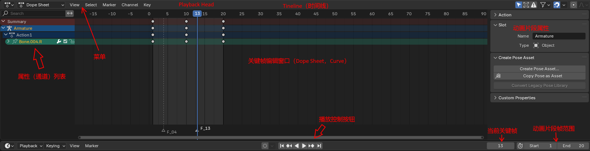
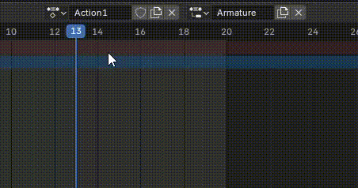

Blender 的 Animation 窗口（Animation Workspace） 是一个专门用于 创建、编辑和管理动画 的综合环境，它整合了多个动画相关编辑器。

# 窗口

## 窗口类型

每个窗口左上角都有一个下拉菜单，可以选中当前窗口的类型。如图所示，窗口类型被分为了 4 组：

- General：基本是建模相关的，包括 3D Viewport、Image Editor、UV Editor、Shader Edior
- Animation：这组是动画相关的窗口，包括

  - Dope Sheet
  - Timeline
  - Graph Editor
  - Drivers
  - Nonlinear Animation

- Scripting：python 脚本相关，包括一个 python 编辑器和控制台
- Data：数据和资源相关

  - Outliner：就是显示 Scene Object Hierarchy 的窗口
  - Properties：就是显示 Object 属性的窗口
  - 其他：File Browser、Asset Browser、Preferences

  

Blender 上面的 Layout | Modeling | Scrulpting | Shading 这些 Tab 其实就是一组 Windows 的组合，专门用于某个功能，称为 Workspace，类似 Unity 的 Layout。你也可以创建自己的 Layout。

如果临时需要某个窗口，例如 File Browser，可以直接将当前 Workspace 的某个窗口改变为想要的类型，操作完之后，再改回来。

### 分割窗口

可以自定义分割、合并窗口，创建满足自己需求的工作空间。右键点击窗口之间的缝隙，会弹出上下文菜单：

- Vertical Split：将当前窗口水平分割为两个窗口
- Horizontal Split：将当前窗口垂直分割为两个窗口
- Joint Left：将当前窗口合并左边的窗口
- Joint Right：将当前窗口合并右边的窗口

因为分割窗口很容易，可以为动画创建多个窗口，来从不同角度观察要动画的角色，以更好地编辑 Pose。尤其是从 X 轴、Y 轴、Z 轴方向的视角观察角色：

## 动画窗口

这是打开 Animation Tab 显示 Animation Window 窗口。

- 播放控制按钮

  - Goto Clip 开始
  - Goto Clip 结尾
  - Goto 上一个关键帧（相对 Playback Head）
  - Goto 下一个关键帧
  - 正向播放
  - 反向播放

Layout Workspace 下也默认包含一个 Animation 窗口，但是它略有不同，没有显示播放控制控件，只有 Dope Sheet，要显示播放控制控件，需要将窗口切换到 Timeline。Timeline 窗口和上面略有不同，播放控制放在了上面菜单栏一行。

## DopeSheet 子窗口

Dope Sheet 窗口中还可有一组子窗口，包括：

- Dope Sheet
- Action Editor
- Shape Key Editor
- Grease Pencil
- Mask
- Cache File

其中 Action Editor 专门用于创建管理动画片段（Animation Clip）。

要创建新的动画片段，点击叉号，关闭当前 Action，然后点击 New 按钮，就会创建一个新的 Action（clip），名字默认是 Action，可以为它重命名一个有意义的名字。