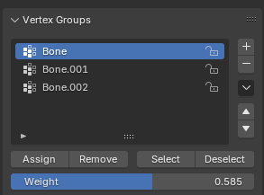
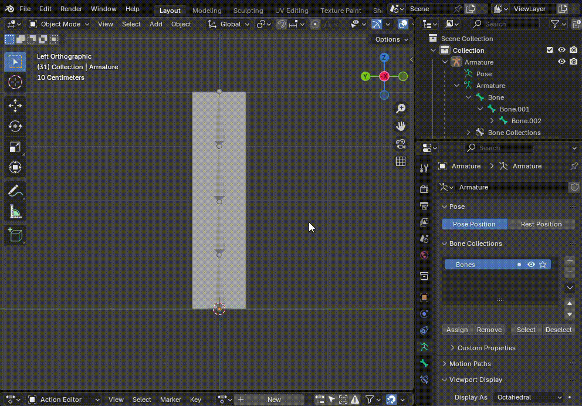
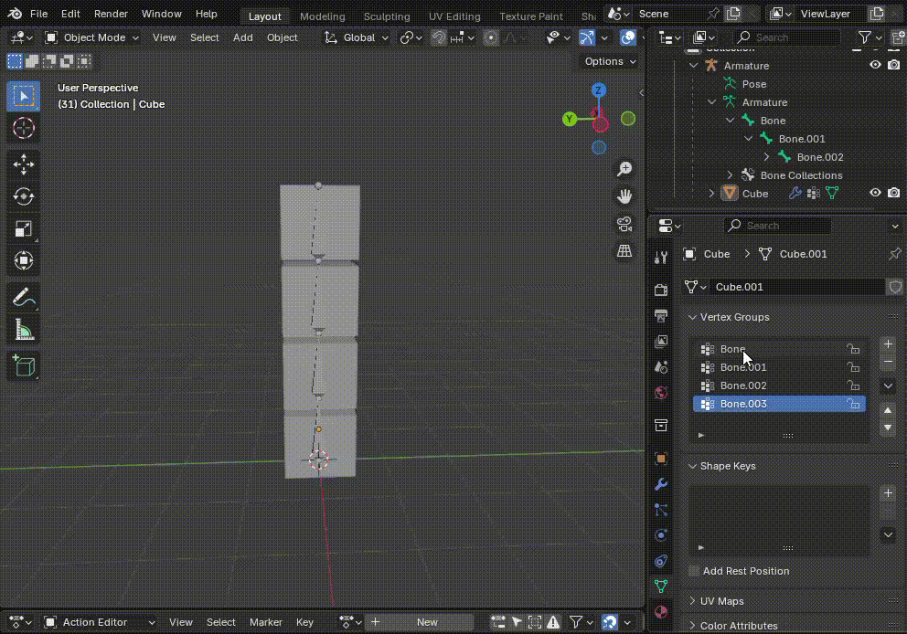

骨骼蒙皮的一个重要概念是 Vertex Group。

Vertex Group 本质就是一组 Vertex 的集合，外加一个权重。它是 Mesh 为外界提供的通用功能。如何使用就是其他系统如何使用 Vertex Group，尤其时 Python 脚本。

一个常见的用途就是选择 Vertex，将一组经常一起操作的 Vertex（Face、Edge）放到一个 Vertex Group，这样以后想要同时选择这组 Vertex，直接选择这个 Vertex Group 就可以了，不必每次手动选择。

另一个重要应用就是骨骼蒙皮。每个 Bone 以一定权重控制一组 Vertex，这组 Vertex 就按照权重跟随这个 Bone 移动、选择、缩放。注意 Vertex Group 没有互斥关系。一个 Vertex 可以同时属于多个 Vertex Group。例如它以 50% 权重被 Bone1 控制，以 50% 的权重被 Bone2 控制。

每个骨骼控制和它同名的 Vertex Group。可以手动创建和 Bones 同名的 Vertex Group，也可以自动为每个 Bone 创建一个同名的 Vertex Group。

注意 Vertex Group 可以有任意多个，为骨骼蒙皮创建的 Bone 同名 Vertex Group 和其他用途的 Vertex Group 可以同时存在。

创建骨骼蒙皮有三种方法：手动分配权重、自动分配权重、绘制权重模式。

# 手动分配权重

- 先后选择 Mesh 和 Armature
- 选择 Parent > Armature Deform > with Empty Groups，这样就为每个 Bone 创建一个同名的空 Vertex Group
- 选择每个 Vertex Group，然后选择要为这个 Group 分配的 Vertex，调整要给 weighted，最后点击 Assign，就把选择的 Vertices 以指定的权重放到了这个 Vertex Group 中
- 按上面的步骤，将每个 Vertex 放到一个或多个 Vertex Group 中，最后进入 Pose Mode，设置骨骼姿势，就可以看到 Mesh 随着 Bone 而变形了

注意这里，简单地将每个 Cube 的 Vertices 以权重=1分配的对应的 Bone 的 Vertex Group 中，这样 Cube 就完整的随着 Bone 变换了，就像 GameObject Hierarchy 那样。

1. 对于 Minicraft 或 Voxel 风格 3D 游戏最适合这种蒙皮
2. Blender 没办法像 Unity 那样在一个 Clip 为 GameObject Hierarchy 创建动画。如果需要类似的刚体 Hierarchy 动画，在 Blender 中，这是唯一创建这种动画的方式

此外，对于自动权重、或绘制权重的结果，这种方法可以手动调整 vertex 在某个 Vertex Group 的权重。例如如果有某个或某些 vertices 被某个 Bone 过渡影响（过渡动画）或跟随某个 Bone 不足，就用将它在那个 Bone 的 Vertex Group 中手动放大或缩小。这被手动绘制更精确，更好用。因为绘制的话，很难保证画刷不会影响其他不想调整的 Vertex 的权重。

# 自动分配权重

Parent > Armature Deform > with Automatic Weights 可以为 Bones 自动计算权重。

很多时候，这种方法计算的权重已经足够好了，尤其是对 Lowpoly 等对蒙皮质量要求不高的情况。手动绘制的权重不一定比这种方法计算的权重更好。

在 Weight Paint 模式下，点击每个 Vertex Group，可以看见它在 Mesh 上的权重热度图：

- 红色：权重为 1，完全影响对应的 Vertex
- 蓝色：权重为 0，完全不影响对应的 Vertex
- 中间的黄绿：权重在 0-1 之间，部分影响对应的 Vertex

# 自动绘制权重

手动权重，先选择要影响的 Vertex Group，后续所有绘制的 Vertex 都会分配到这个 Vertex Group 中。然后就可以用画刷绘制 weights 了。注意，没有擦除工具，无论是想增加权重，还是减少权重，都直接调整上面的 Weight 数值条，然后用不同的数值重新绘制就可以了。

# Misc

注意：Pose Mode 是选中一个 Armature 才出现并能进去的。因此 Pose Mode 跟一个 Armature 绑定，在这个模式下面，只能编辑这个 Armature 的 Bone 的 Pose。如果想操作其他 Object，例如 Mesh 或 Spline，必须先回到 Object Mode 才能选择其他 Object 操作。
