DopeSheet 是一个历史遗留的术语，来源于传统手绘动画时代。

一、起源：传统动画时代的“Dope Sheet”

在 20 世纪早期的手绘动画工作流程中，动画是逐帧绘制在赛璐珞片（cel）上的。
为了组织这些成千上万张图，动画师需要一种“表格”来记录：

- 每一帧里出现了哪些角色或物体
- 哪张背景要使用
- 哪些台词或音效在哪一帧播放
- 每个动作的时间（例如关键帧在第几格）

这种表格在不同工作室有不同叫法：
- 在 Disney、Warner Bros. 等工作室中，它被称为 “Dope Sheet”。
- 在英国动画行业中，它常叫 “Exposure Sheet (X-Sheet)”（曝光表）。

后来，计算机动画（如 Blender、Maya、Toon Boom 等）延续了传统动画的概念：

- Dope Sheet 成为用于查看和编辑关键帧时间分布的窗口。
- 它直观地展示“每个对象、每个通道在时间轴上的动作安排”，就像老式动画师用表格记录每一帧的“信息”一样。

所以今天的 “Dope Sheet” 就是：```一个数字化的关键帧时间表，用于协调动画中各种元素的节奏与同步。```

Dope Sheet 用于管理动画关键帧，是动画师的主力工具。

主要功能包括：

- 查看与编辑关键帧的整体分布（按对象、骨骼、材质、形状键等分类）
- 批量移动、缩放或复制关键帧
- 过滤显示（仅显示选中对象、选中通道、仅动画通道等）
- 创建和管理 Actions（即一段完整的动画片段）
- 切换子编辑器(子模式)：
  - Dope Sheet（通用关键帧）
  - Action Editor：针对单个动作（Action）编辑关键帧
  - Shape Key Editor：编辑形状键 Shape Key 动画
  - Grease Pencil：编辑 2D 绘制动画
  - Mask Editor：控制遮罩关键帧

可以把它看作是比 Timeline 更专业、更全面的动画关键帧编辑器。

Dope Sheet 是动画“剪辑台”，可以快速编辑时间结构。

# 常用操作

动画编辑器的根本工作是记录关键帧，和在时间线上对关键帧进行操作（移动、缩放、赋值、镜像、对齐、删除）。

Dope Sheet 窗口注意工作就是操作关键帧（移动、缩放、赋值、镜像、对齐、删除）。

## 1. 选择关键帧

- 左键单击：选中单个关键帧。
- B 框选，C 圆选，A 全选/取消全选。
- 右键菜单（RMB） 可快速删除或复制。

Armature 动画的 DopeSheet 只在 Pose Mode 下显示关键帧。

## 2. 移动关键帧

- G：移动关键帧（左右拖动改变时间）。
- Shift + D：复制关键帧。
- X / Delete：删除关键帧。

## 3. 缩放与对齐

- S：缩放关键帧时间间隔（加快/放慢动画节奏），缩放的 Pivot（中心）是 Playback Head
- Shift + S → 选择 “Snap” 可对齐关键帧到整帧、播放头、或时间标记。

### 关键帧对齐

关键帧对齐既可以通过 Shift+S 弹出快捷菜单访问：

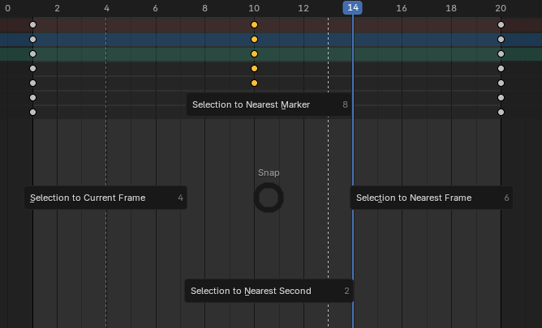

也可以通过右键菜单访问：

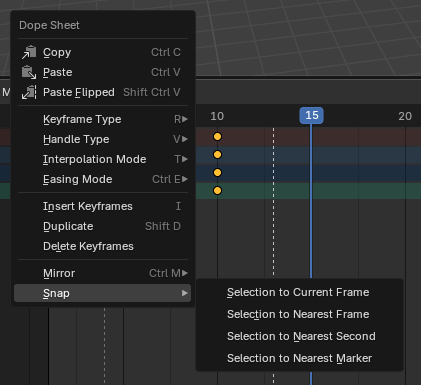

- Selection to Current Frame

  将选择的 keyframe 移动到 Playback Head 处。

- Selection to Nearest Marker

  将选择的 keyframe 移动到最近的 Marker。

- Selection to Nearest Second

  将选择的 keyframe 移动到整数秒处。

  默认 Output Frame Rate = 24，即一秒24帧，因此这个对齐就将选择的帧对齐到 24 帧的整数处。

- Selection to Nearest Frame

  Blender 的关键帧一般情况下应该落在整数帧上（比如第 1、10、25 帧），但在某些情况下，它们会意外变成小数帧（如 24.5、13.97 帧）。
  
  这类小数帧是 Blender 动画中最常见的“隐性问题”之一，会造成插值异常或导出错误。

  有可能导致关键帧变成小数帧的情况：

  - 非整数缩放（Scale）或时间变换造成的小数帧，用 S 键缩放关键帧时比例不是整数倍。
  - 场景帧率（FPS）变化后插值重算
  - 从其他软件或动作数据导入（FBX、BVH、Mixamo、MoCap）

  但是没能在 Blender 中操作出位于非整数位置的帧，帧总是以整数移动的。如果有，就用这个功能将帧移动到最近的整数帧位置。

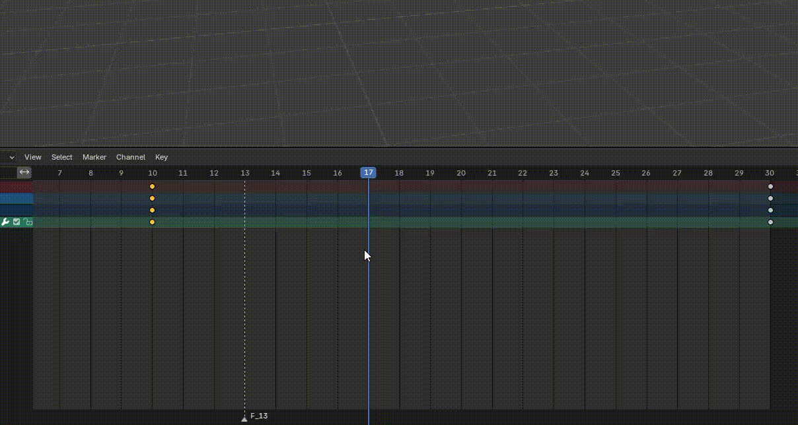

## 4. 插入关键帧

在 3D 视图中对对象按 I（Insert Keyframe），或者 K（Insert Keyframe with Keying Set）

也可以在右键菜单中选择：

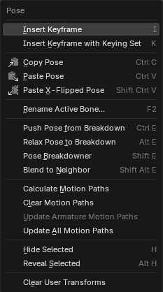

Dope Sheet 中有的属性 channel 两个 key 之间会有白色的连线，有的没有。白色的连线的意思是这个 channel 在这白色连线的 key 之间没有变换，两个 key 是相等的。如果两个 key 之间没有白色连线，说明这个属性在这两个 key 之间有变化，有插值发生。 

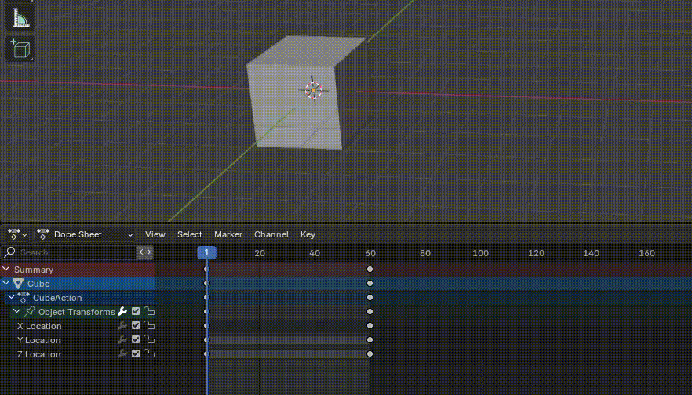

当直接为 Object 记录动画，Blender 会为 Object 创建一个默认的 Action，例如为一个 Cube 创建的默认 Action：

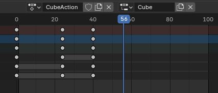

## Keying set

Keying set 管理插入关键帧是，都为哪些属性记录关键帧。

Unity 选择记录动画的关键帧时，是通过选择 Property 并添加，或者在 Record mode 下直接记录发生改变的属性。

Blender 是通过 Keying Set 管理要动画的属性集合。然后有一个当前 Active 的 keying set 作为默认的属性集合。

手动插入关键中有两种方法：

- Insert Keyframe（I）

  每次按 I，不需要询问，直接为 Active Keying Set 中的属性添加关键帧。如果没有指定 keying set，则为全部可动画的属性添加关键帧。

- Insert Keyframe with Keying Set（K）

  每次按 K，弹出选择菜单，手段选择 keying set，为哪些属性添加关键帧。

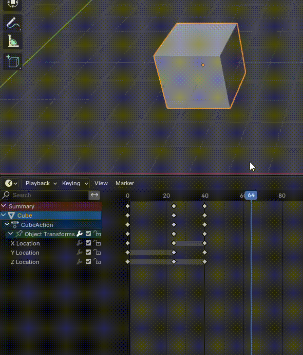

从弹出的 Keying Set 菜单中可见，动画全部是 Transform 相关的（Position、Rotation、Scale），没有添加其他属性例如材质颜色的 key。这是因为 Blender 在不同的模式下，只能添加那个模式的属性。例如 Object Mode 和 Pose Mode 只能添加 transform 相关的属性。要想添加颜色属性的动画，直接对那个属性添加 Key：

- 将光标移动到那个属性上，按 I（Insert Keyframe） 添加关键帧
- 直接右键菜单 Insert Keyframe 添加关键帧

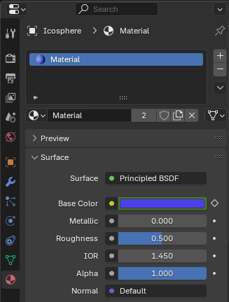

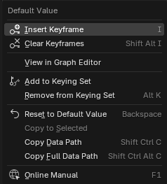

注意，没有 K 快捷键（Insert Keyframe with Keying Set），但是可以通过菜单中的 Add to Keying Set 把这个属性添加到一个 keying set 中。

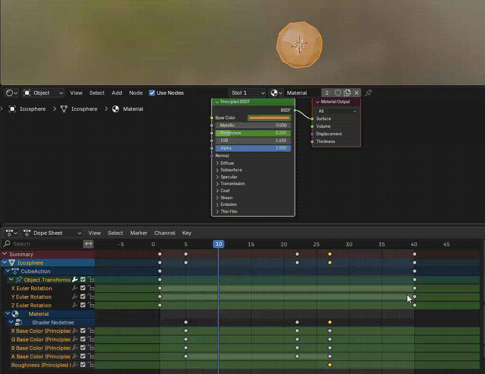

Animation 窗口设置 Keying Set 只在 Timeline 窗口可见。但是还可以通过 F3 快捷方式设置，而且从中可以看出，Object > Animation > Change Keying Set 菜单也可以改变 Active Keying Set。

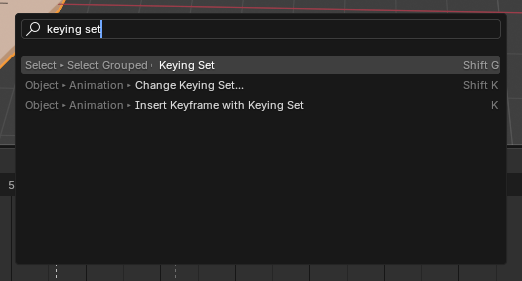

如果只在 Blender 中创作视觉效果，为任何属性添加动画都没问题。但是如果将 Blender 作为 Unity 的数字内容创作工具，因为 Blender 和 Unity 的渲染系统不同（以及音频、粒子等系统），这些没有办法导入到 Unity 中，这些属性也只能在 Unity 中创建。因此如果仅把 Blender 作为游戏资产的建模工具，只需要为 Transform 属性创建动画就够了。

## Record Mode

Blender 也提供了类似 Unity 的 Record 模式。默认会记录任何变化的 Transform 属性。但是可以选择 Only Active Keying Set。但是即使选择了 Only Active Keying Set，也要设置 Active Keying Set。否则仍然会记录任何变化的属性。如果设置了 Active Keying Set，就只会记录其中的属性了，如果改变其他的属性，是不会自动记录的。

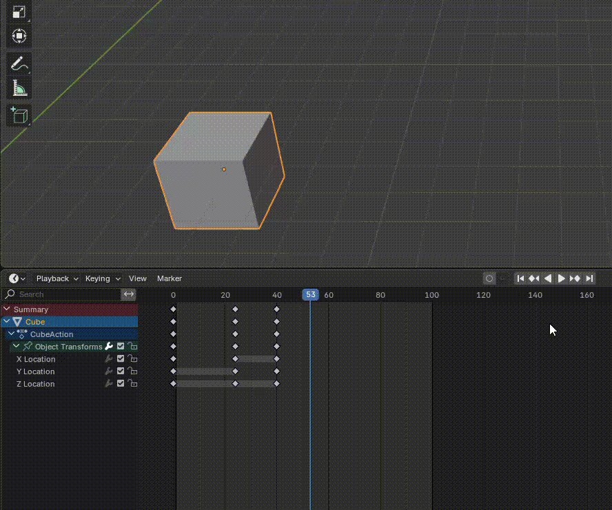

## 5. 复制/粘贴动作

选中关键帧 → Ctrl + C / Ctrl + V；

赋值关键帧：Shift + D

支持跨对象复制（如果属性兼容）。

## 属性（通道）

默认 Dope Sheet 只会显示选中的 Mesh 或 Bone 的属性（通道）。取消 Show Only Select，可以始终显示 Action 中记录的全部属性。

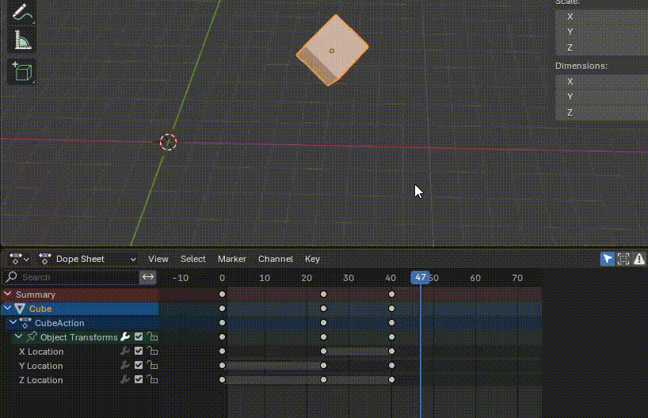

## Marker

可以在 Timeline 上添加 Marker，用于添加一些时间点标记，可以方便对齐关键帧。

Marker 的添加可以从 Marker 菜单中访问，也可以按 M 键，在当前 Playback Head 处创建一个 Marker。

## 通道管理


动画窗口坐标的通道 Summary 列表，提供了通道管理功能：

- 通道分组（group）

  将一组属性（通道）放到一个 Group 中，一起管理（mute，protect，toggle visibility）

- 通道 mute

  将通道静默，不再播放这个通道的动画。

- 通道锁定（Protect）：不可编辑

  锁定通道，不允许编辑。

- 通道可见性

  在 Graph Editor 窗口中，可以关闭这个通道曲线显示，让窗口更干净。

这些操作既可以单个属性操作，也可以整组操作，既可以通过 Channel 菜单访问，也可以通过右键菜单访问。

## 关键帧镜像

可以将选择的关键帧，以 Playback Head 或 Marker 镜像翻转到另一侧：

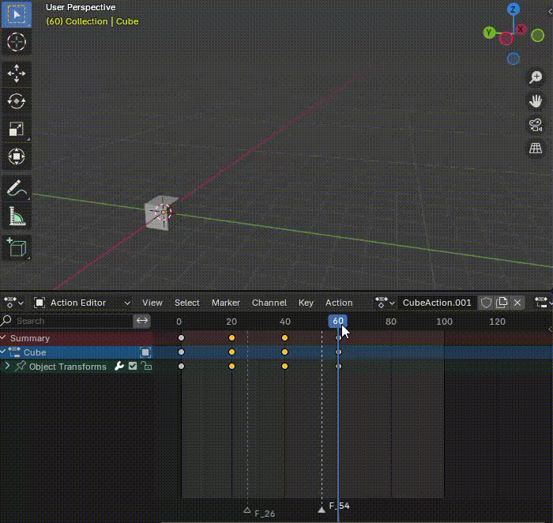

也可以将关键帧的 value 以 y=0 为轴翻转（正值变负值，负值变正值）。例如下面的动画，cube 在 x 轴上向右移动，在 y 轴上向上移动，整体向右上移动。选择关键帧，选择 Mirror By Values Over Zero Value，Cube 将向左下移动。切换到 Graph Editor 更直观，Y 属性曲线和 Z 属性曲线都绕着 0 值上下翻转：


## Action Editor

用于单独管理一个对象（或骨骼）的动画 Action。
可：

- 创建多个动作；
- 命名、保存、切换不同动作；
- 配合 NLA Editor 混合动画。

Action Editor 是 Dope Sheet 的一个子模式，主要用于：

- 编辑单个物体（特别是骨骼）对应的动画关键帧数据（Action）。

Blender 的动画系统是基于 Action 数据块 的。

- 每个 Action 存储了一组 F-Curves（动画通道）。
- 每个 F-Curve 又由关键帧组成。
- 动画对象（比如骨架、摄像机、灯光等）可以“拥有”一个当前正在使用的 Action。

简言之：Action = 某个物体的一段完整动画片段。

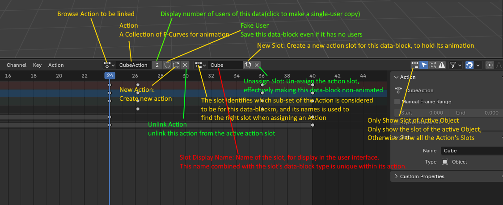

# 与其他窗口结合使用

一般流程是：先在 Dope Sheet 中组织节奏，再在 Graph Editor 中微调动画曲线。

- 与 Timeline：用于播放控制与预览；
- 与 Graph Editor：细调动画插值；
- 与 NLA Editor：组织多个动作；
- 与 Pose Library / Action Library：快速切换角色动作。

# 动画属性

属性面板中的 Output 属性，可以指定 FrameRate 和 Frame Range。

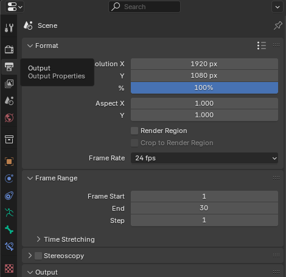
