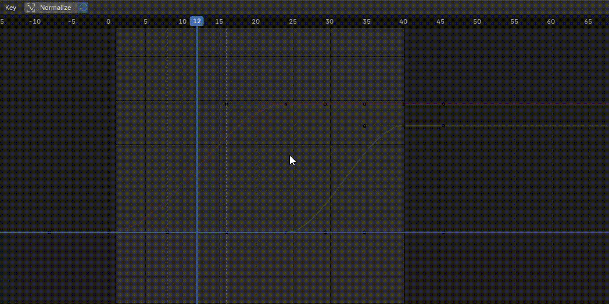
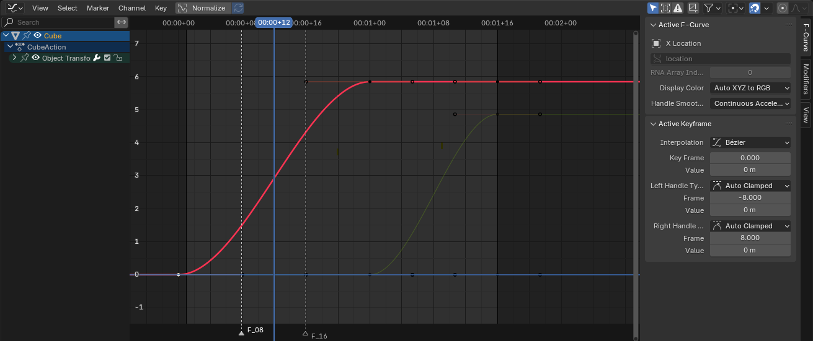
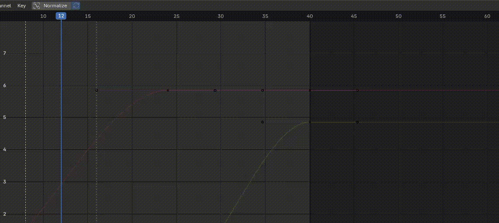
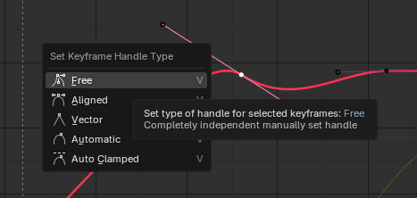
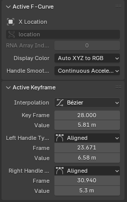
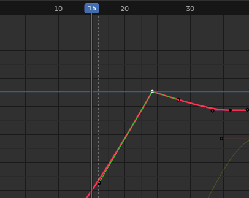
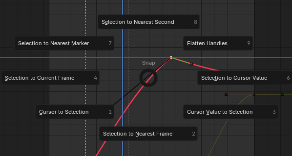

Graph Editor（图形编辑器） 是动画工作流程中最核心的工具之一，用于精确控制动画曲线（F-Curves），让你能对物体或骨骼的关键帧进行平滑过渡、缓动调整、循环控制等操作。

Graph Editor 显示每个动画属性（位置、旋转、缩放、形状键、材质参数等）的 F-Curve（Function Curve）。

每一条曲线表示该属性随时间（X轴 = 帧数）变化的数值（Y轴 = 属性值）。

Graph Editor 可以通过 Ctrl+鼠标中间拖拽缩放：水平方向移动鼠标，水平缩放；垂直方向移动鼠标，垂直缩放；斜向移动鼠标，水平、垂直同时缩放。



Dope Sheet 窗口也可以这样缩放，但是只有水平方向的缩放。

通过它你可以：

- 精细调整关键帧插值与动画曲线形状
- **创建循环动画**（动画曲线首尾 in/out 曲率一致）
- 添加噪声或延迟效果
- 编辑多个对象的动画
- 可视化时间上的动画节奏

# 窗口结构



| 区域         | 功能                                    |
| ---------- | ------------------------------------- |
| 左侧通道列表     | 列出当前对象的动画数据（Location、Rotation、Scale…） |
| 右侧曲线区      | 显示 F-Curves，允许直接编辑关键帧点与曲线形状           |
| 工具栏 | 控制视图模式、插值类型、键类型、快照、自动平滑等              |

坐标轴含义：

- 横轴（X）：时间轴（Frame Number）
- 纵轴（Y）：属性值（Value）

# 基本操作

GraphEditor 操作注意有两种：调整关键帧的位置，调整关键帧的形状。

## 查看 F-Curves

- 选中有动画的对象（如移动过的立方体）。
- 你会看到 Location X/Y/Z 等曲线。
- 如果看不到，按 Home（或小键盘 .） 自动缩放到可视范围。

## 编辑关键帧

- 选择关键帧点：左键点击（或框选 B）。
- 移动关键帧：G（Grab）→ X 轴上移动即改变时间（帧位置），Y 轴移动即改变数值。
- 旋转曲线段：R。
- 缩放关键帧：S（Scale）→ 可加快或减慢节奏。
- 删除关键帧：X 或 Delete。



## 调整曲线形状

选中关键帧后可调节其 Handle（控制柄）：

- Auto Clamped（自动平滑，防止超出范围），类似 Clamped Auto
- Aligned（对称平滑）
- Vector（线性拐角）
- Free（自由调整）

V → 改变 Handle 类型:



Handle 类型也可以在右侧的工具栏中设置：



GraphEditor 就是 Unity 的 Animation Curve Editor，两者类比参考。


- V 同时改变两边 handle 的类型，右侧面板可以单独改变一边的 handle 类型
- Interpolation

  设置当 key 到下一个 key 的插值类型，即曲线如何从当前位置到达下一个位置：

  - Constant：到达下一个 Key 之间，保持当前 key 的 Y 值（step）
  - Linear：直线到达下一个 Key，Y 线性插值
  - Bezier：以贝塞尔曲线的方式到达下一个 Key，这是两个 Handle 发挥作用的地方

- 右键菜单 Snap > Flatten Handles，将两个 handle 重置为水平

## Cursor



它表示：

一个在时间轴（X轴 = 帧数）与数值轴（Y轴 = 属性值）上可自由放置的点。
即：Cursor = (Frame, Value)。

其中 X 轴就是 Playback Head。

它不会出现在渲染或动画中，仅用于辅助编辑。

### 用途

| 功能                  | 说明                                |
| ------------------- | --------------------------------- |
| 🎯 **插入关键帧时作为参考位置** | 可以在 Cursor 所在的帧和值上插入新关键帧          |
| 📏 **关键帧对齐基准**      | 可将选中关键帧对齐到 Cursor 的位置             |
| ⚖️ **数值参考点**        | 可用作复制、偏移或平移关键帧的目标值                |
| 🧮 **测量或观察值**       | 可查看某帧对应的数值变化趋势                    |
| 🎨 **辅助修改器或驱动编辑**   | 某些 F-Curve 操作可参考 Cursor 位置进行偏移或校准 |

### 操作

1. 移动 Cursor

Shift + RMB：在点击位置放置 Cursor
（即把游标移动到该帧和值的位置）

2. 查看 Cursor 坐标

打开右侧面板（快捷键 N）切换到 View → Cursor 面板可以看到：

```
  X: <Frame number>
  Y: <Value>
```

3. 手动设置 Cursor 位置

在上面 “Cursor” 面板中可以手动输入数值：

例如 Frame = 24，Value = 1.0，则 Cursor 定位到帧 24、值 1.0。

### 与关键帧交互

1. 插入关键帧到 Cursor

   在 Graph Editor Header 中：
   
   菜单栏 → Key → Insert → Selected Channels at Cursor。

   这会在 Cursor 的位置（而不是当前帧）插入新的关键帧。

2. 将选中关键帧对齐到 Cursor

   

   - “Cursor Frame” → 对齐时间（X轴）
   - “Cursor Value” → 对齐数值（Y轴）

### 应用场景

| 场景                     | 使用方法                                        |
| ---------------------- | ------------------------------------------- |
| 想让多个属性、多个 key 在同一时间变为相同的值        | 将 Cursor 放在目标帧和值处 → Snap → Cursor Value          |
| 精确插入关键帧（例如在帧 12 值 0.5） | 手动设定 Cursor → Insert Keyframe at Cursor     |
| 对齐曲线峰值                 | 将 Cursor 定位到想要的最大值 → Snap 关键帧到 Cursor Value |
| 辅助观察曲线变化               | 把 Cursor 放在特定帧 → 看各条曲线在该帧的值                 |

# Modifier

Channel > Modifer 菜单可以为 Curve 添加 Modifier


- Cycles	让动画循环（Repeat Before/After）
- Noise	添加随机抖动
- Envelope	限制曲线上下界
- Generator	拟合直线或多项式（例如匀速移动）

# 使用场景

1. 缓入缓出动画（Ease In/Out）

   选中起始和结束关键帧 → 设置为 Bezier → 手动拉动 Handle 平滑头尾。

2. 循环动画

   在曲线上添加 Cycles Modifier → 设置 Repeat After = 10。

3. 手动对齐节奏

   按住 Ctrl 拖动关键帧，可吸附到整数帧。

4. 多曲线同步

   选中多个通道 → Ctrl + L → Link to Active → 同步曲线。
