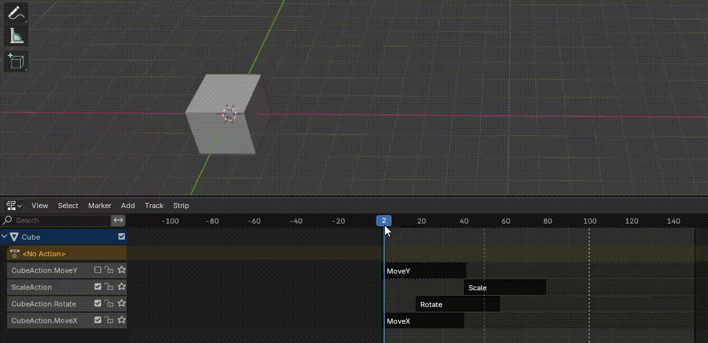

每个 Object 可以有多个 Action
每个 Action 可以有多个 Slot
每次仅导出 Actions（不导出 NLA Clips）时，每个 Action 都导出，但是仅导出最近选择的 Slot 对应的属性动画，不管选择的是哪个 Action 的 Slot
Slot 以名字指定，每个 Action 如果包含这个同名的 Slot，就会导出它包含的属性的动画，不会导出这个 Action 的其他 Slot 动画。
没有导出任何 Slot 的 Action 仍然导出为 clip，但是其中为空
Action 是独立的 Data Block，不会因为 Object link 或没 link Action 来决定是否导出

因为 Unity（以及其他的游戏引擎）没有 Slot 机制，因此 Blender 只能导出一个 Slot 的动画（这个 Slot 就是哪个？）

当开启 NLA，即使没有选择导出 NLA Clips，NLA 的动画也会影响导出 Action Clip，似乎 NLA 与独立的 Action 混合后导出了，总之不是原来独立的 Action。因此不要将 NLA 和 Actions 混合使用。要么仅导出 NLA Clips，要么仅导出 Actions.

NLA Editor 中，每个具有动画的 Object 都会自动创建一个 NLA 编辑区域。
NLA 类似 Unity 的 Animation Layer，Slot 类似 Unity 的 Avatar Mask。Slot 只记录部分骨骼的动画，然后在 NLA 中将不同的 Actions 放在 NLA 中混合播放，可以产生叠加动画。

如果要导出，就只导出 NLA Clips，NLA Clips 是不管 Slot 的，每个 Clip 包含什么动画，就导出什么动画。

但是看起来 NLA 中同一个只能使用 Action + Slot 的一个实例，不管是否设置了不同 Start 和 End 来创建不同 Clip。如果使用了 Action + Slot 的两个实例，只有最近添加的 Clip 生效，前面会被 disable。

总之 NLA + Slot 是为了在 Blender 中实现类似 Unity AnimationLayer 和 Avatar Mask 这样的动画混合功能。但是它只能在 Blender 中流畅使用，例如创建 Blender 动画电影。要导出到 Unity，用于游戏开发，就很混乱，各种问题。因此如果使用 Blender 为 Unity 创建动画片段，就不要使用 Slot 和 NLA，使用只有一个 Slot 的 Action。
