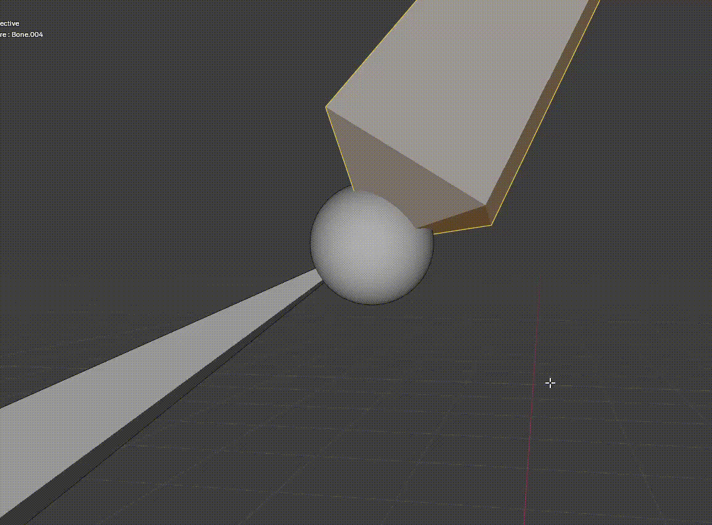
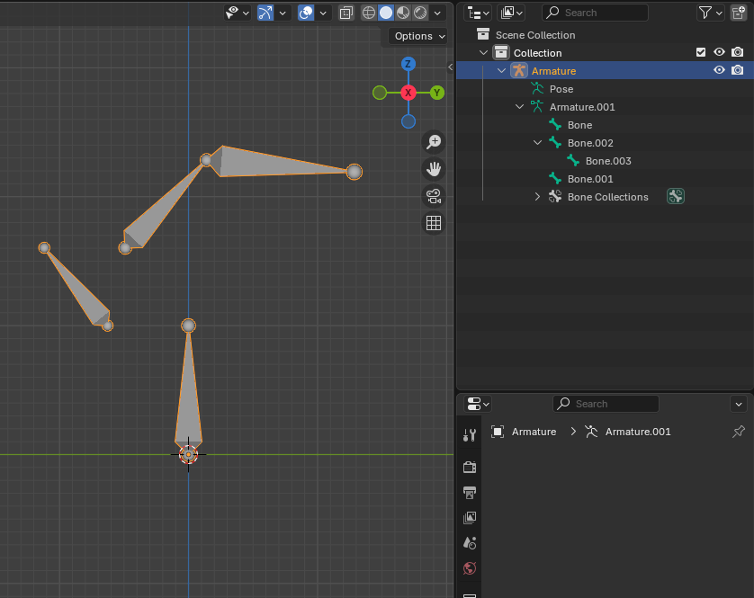
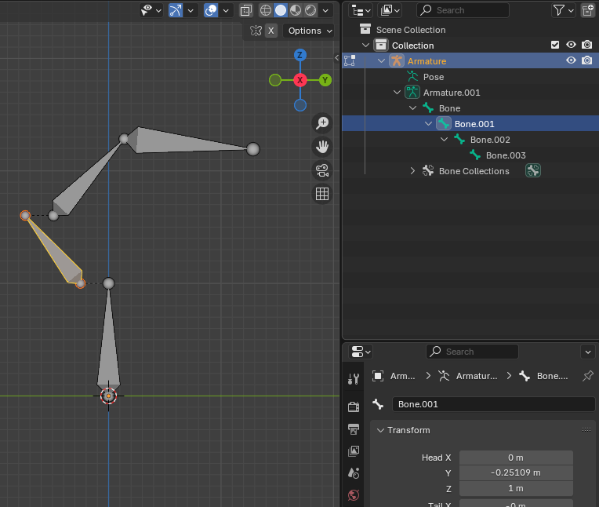

# 骨骼定义

骨骼有两个 Joint 构成，一个 Head，一个 Tail。Head 是骨骼的 Pivot。骨骼的移动旋转都以 Head 进行。

一个骨骼链由一组 Bone 首尾串联构成。Child Bone 的 Head 锁定再 Parent Bone 的 Tail。看起来 Child 和 Parent 连接处只有一个 Joint，但实际是有两个，只是它们默认总是锁定在一起。

Unity 中对于首尾连接在一起的 Bones 只使用一个 Transform 表示，只对骨骼链末端骨骼（以及单个骨骼）提供一个额外的 Joint（Transform）。但这只是优化，不是真实情况。真实情况就是每个骨骼由两个 Joint（Transform）构成。这对理解骨骼编辑（复制骨骼，删除骨骼，断开连接等操作）非常重要。

一个 Parent Bone 可以不止有一个 Child Bone Chain。

一个 Armature 可以有多个 Root Bone 以及其下面的 Bone Tree：


如图，Bone 和 NewBone 都是 Root Bone。

# 添加骨骼

骨骼操作必须在 Edit 模式下。

以下操作都以这个示例 Armature 为例：


## 通过 Add 菜单添加新的 Root Bone

快捷键 Shift-A


可以在选项对话框中为新骨骼命名。


新添加的骨骼总是 Root 的。

## Extrude 新的 Bone

要从当前选择的骨骼创建一个 Connected 的 Child Bone，选择 Parent Tail Joint，然后按 E 或 Armature 菜单中的 Extrude，挤出一个新的骨骼。新的骨骼作为选择的 Bone 的 Child Bone，并且 Head Joint 绑定在当前骨骼的 Tail Joint。

要创建一个新的 Disconnected 骨骼，或者先创建一个 Root Bone，然后将它 Parent 到想要的骨骼上，或者从想要的骨骼上 Extrude 一个 Bone，然后 Disconnect 它。

## Shift+D 复制 Bone

Shift+D 复制的 Bone 与原来的 Bone 具有一样的属性：

- 都在同一个 Parent 下面
- 具有相同的 Connected 或 Disconnected 状态
- 具有相同的 Position 和 Rotation

唯一不同的是源 Bone 的子链仍然连接在 源 Bone 上，复制的只是 Bone 单独自身。

## 分割 Bone

分割 Bone 是添加新骨骼的另一种方法：


它将选择 Bone 分割为两个并首尾连接。

注意除了 Add New Bone 添加的骨骼，无论时 Extrude 的 Bone 还是 Subdivide 的 Bone，骨骼名字都是按照 Bone001 Bone002 这样的顺序递增的，也不管它的骨骼结构。例如整理 Subdivide 新创建了一个 Bone004，它成为原来的 Bone003 的 Parent Bone。

# 编辑骨骼的位置和旋转

- G：移动
- R：旋转

Edit 模式下操作骨骼，只能操作这个骨骼本身的 Joints。选择骨骼本身就会操作（移动、旋转）两个 Joints，旋转 Joint 就操作这个 Joint 本身。其他的骨骼的 Joint 不会改变，除非其 Head 或 Tail 和操作的 Joint 锁定在一起。

记住之前说到的每个骨骼是两个 Joints，即使首尾串联，也只是 Tail 和 Head 锁定在一起。

Edit 模式下，操作骨骼就是改变这个骨骼的两个 Joint（Head，Tail），无论是移动还是旋转（旋转的 Pivot 由 Transform Pivot Point 指定


只有在 Pose 模式下，Child Bones 才会随着 Parent 的一起移动、旋转。

首尾连接的 Child-Parent Bones，称为 Connected Bone。在 Pose 模式下，Child Bone 只能绕着 Head Joint（也是 Parent 的 Tail Joint）旋转。只有 Disconnected 的 Child Bone 才可以离开 Parent Bone 移动。此时 Child Bone 的 Head Joint 可以自由移动。无论是 Connected 还是 Disconnected 的，Child Bone 总是绕着自己的 Head Joint 旋转，只是 Connected 时，它的 Head 与 Parent 的 Tail 锁定在一起，看起来像是绕着 Parent Tail 旋转一样。

骨骼编辑（无论时 Edit 模式还是 Pose 模式）时一定要注意 Transform Pivot Point 选择 Active Element，Individual Object，如果选择 3D Cursor，旋转将基于世界空间中的 3D Cursor，而不是骨骼的 Head Joint，这通常不是想要的效果。

# 改变骨骼层级关系

改变 Bones 的关系以及删除 Bone 这些针对一个特定 Bone 的操作，都可以选中 Bone 后从右键菜单中访问，也可以从右键菜单中查看某个操作的快捷键。其实操作 Mesh 等对象也是一样，选中元素后，可以从右键菜单中使用大部分功能，并查看快捷键。


## Split

Split 将骨骼链从选中的 Bone 处分开，选中的 Bone 和它原来的 Child 都变成 Root Bone，不论这个 Bone 在骨骼链的那个层级。


# Clear Parent

Clear Parent 可以从右键菜单 Parent -> Clear -> Clear Parent 访问，也可以按 Alt+P -> Clear Parent 访问。


它将骨骼链从 Bone 处彻底断开，Bone 及它以上的子链成为 Armature 新的 Root 骨骼链：


# Disconnect Bone

Disconnect 与 Clear Parent 在一个菜单中访问。但是它只是将 Bone 和它的 Parent 变成 Disconnected 的，即它们的 Head 和 Tail 不再 Lock 在一起，Bone 可以脱离 Parent 自由移动（旋转总是绕着 Head），在骨骼链上，它们也不再是连续串联的骨骼链，但是在组织层级 Hierarchy 上，Bone 仍然是 Parent 的子骨骼，在编辑 Pose 时，Bone 仍然会随着 Parent 移动和旋转，只是 Bone 的 Head 不再绑定在 Parent 的 Tail，可以有不为 0 的偏移。

Disconnected 的 Bone 会在窗口中显示从其 Head 到 Parent Tail 的黑色虚线，指示这两个骨骼是 Disconnect 且 Parent 的，不是 Unparent 的。如果两个 Bone 不是 Disconnected 的，不会有黑色虚线。


如下面所示，即使两个骨骼的 Head 和 Tail 绑定在一起，每个骨骼仍然渲染了两个 Joint（球体），只不过 Parent 的 Tail Joint 球体比 Child 的 Head Joint 球体更大，将它包裹在里面了，拉近相机透过 Parent 的 Tail Joint 的球体外壳，就可以看见里面的 Child Tail Joint 球体了。这说明 Bone 总能是由两个 Joint 定义的。



当 Bone 被选中时，会以橙色高亮显示两个 Joint。但是如果 Bone 和 Parent 是 Disconnected 的时候，尤其是它刚与 Parent 断开连接，它的 Head 的 Joint Sphere 还包含在 Parent 的 Tail Joint Sphere 里面，因此看不到 Head Joint 被高亮，如下图所示：


如果 Bone 与 Parent 是 Connected 的，选择 Bone 时，还会高亮 Parent 的 Tail Joint Sphere，这样看起来 Bone 的两端都高亮了，实际是高亮了 Parent 的 Tail Joint Sphere。因此通过观察选中的 Bone 的两端是否都高亮，可以判断 Bone 是否与 Parent Connect。如果 Bone 的 Head 与另一个 Bone 的 Tail 有黑色虚线，说明后者是前者的 Parent，且两者 Disconnect。

## Connect Bone

Connect Bone 可以重新连接 Disconnected Bones。注意此时会将 Child Bone 以上的子链整体偏移，而不是仅移动 Child Bone 自身。


还可以连接两个相互独立的 Bones。如图，Split 既可以分离单个 Bone，也可以分离一个骨骼链。以骨骼链的形式分离，会保持选择的骨骼链的整体，然后断开与原来的骨骼链的连接。断开后就是两个独立的骨骼链了。选择要连接的 Bone，先 Child，后 Parent，右键菜单 Parent->Make 或 Ctrl+P 弹出右键 Connect Bone 的右键菜单。此时会有两个选项：

- Keep Offset：不移动 Bone，只建立 Parent-Child 关系，保持 Bones 位置偏移，这样就形成了 Disconnect Bones
- Connected：移动 Bone，建立 Connect 的 Parent0-Child 关系，Bones 首尾绑定


## Separate bones

Separate 是分离程度最大的操作。它将选中的 Bones 链完全分离到一个新的 Armature 中。


## Join Armature

Separate Bones 反向操作，将两个 Armature 合并在一起（到最后一个中）。前一个 Armature 的所有 Root Bones 移动到后一个 Armature 也是 Root Bones。



# 删除骨骼

删除骨骼时，会提示 Delete 还是 Dissolve

## Delete

直接删掉 Bone 本身，它的 Child 变成它的 Parent 的 Disconnected Child Bone。


## Dissolve

Dissolve 用于移除首尾串联的骨骼链上的一个骨骼，并保持骨骼链的连续。理解它的操作最好按照 Unity 的骨骼组织方式，即 Lock 的 Joints 视为一个 Transform，移除一个 Bone 就是从骨骼链移除这个 Bone 的两个 Joints（Transforms），然后将中间断开的部分的连接起来成为一个新的 Bone。但是整个骨骼链的首尾 Joints 会保持，不会移除。例如：

```(Ah) - (At Bh) - (Bt Ch) - (Ct Dh) - (Dt Eh) - (Et)```

移除 B 骨骼，会移除 (At Bh) 和 (Bt Ch) 两个 Joint，这样 C 骨骼也是被移除，然后连接 (Ah) - (Ct Dh) 这段形成 Dissolve 后的新骨骼：

```(Ah) - (At Dh) - (Dt Eh) - (Et)```

但是 Disslove A 或者 E，只会移除 (At Bh) 或 (Dt Eh) 一个 Joint，(Ah) 和 (Et) 不会移除。


Dissolve 只用于骨骼链上连续的部分中的 Bone。例如下面这个对单个 Disconnected Bone（两端都 Disconnected）进行 Dissolve 是没有任何效果的：



下面这个对从 Parent Disconnect，但是与 Child Connect 的 Bone Dissolve，就只对它所在连续的骨骼链上 Dissolve：


# Armature

Armature 相关的功能可以在 Armature 菜单中访问：


