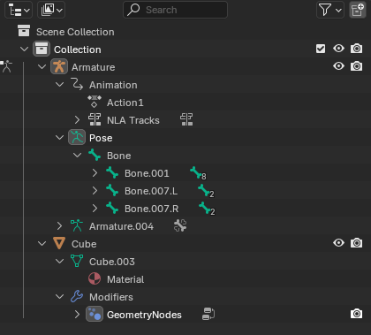

在 Blender 中，Data Block（数据块） 是整个软件的数据组织基础，也就是 Blender 存储和管理一切内容的核心结构。
几乎所有你在 Blender 中创建、编辑、保存的东西（模型、材质、动画、图像、场景等）——都属于某种类型的 data block。

Data Block 就是对象 Object。计算机中的 Object 就是内存中的一段连续数据。将术语 Data Block 改成 Object 就好理解了。

```Data Block = Object```

Blender 中每种资源都是一种 Object（Data Block），Mesh、Material、Armature、Texture、Animation Clip。

每种资源都是独立，但是可以相互引用。例如一个 Mesh Object 可以引用一组 Material，而一个 Material 可以被多个 Mesh Object 引用。Texture 和 Material 的关系也是如此。

# Data Block 是什么

简单说：

Data Block 是 Blender 中一个可独立存在、可共享、可引用的数据单元。

例如：

- 一个 Mesh（网格数据） 是一个 data block；
- 一个 Material（材质） 是一个 data block；
- 一个 Action（动画动作） 是一个 data block；
- 一个 Scene（场景） 本身也是一个 data block；
- 甚至 Text、Image、Camera、World 都是 data block。

每个 data block 都有：

- 一个 名称（Name）
- 一个 类型（Type）
- 一个 用户计数（User Count）
- 一个 Fake User 标志（防止未使用时被清除）
- 一些 属性（properties）

# Data Block 的层次关系（举例）

```
Scene
 ├── Object（对象）
 │    ├── Mesh Data（网格数据）
 │    ├── Material（材质数据）
 │    └── Modifier / Constraint ...
 ├── Camera（相机数据）
 ├── Light（灯光数据）
 └── World（世界数据）
```

- 一个 Object 是一个 data block；
- Object 链接（link）到 一个 Mesh、Material 等其他 data block；
- 同一个 Mesh data block 可以被多个 Object 共享（例如多个实例化的模型）。

Outlinear 窗口可以认为就是现实 Object（Data Block）之间关系的窗口，例如：



- Armature 下面引用一个 Animation Object（Data Block）和一个 Pose
  - Animation 下面引用一个 Action1 和一个 NLA Tracks
  - 一个 Pose Object 下面引用一个 Bone Chain
- Cube 下面引用一个 Cube.003 Mesh Data Block 和一个 Modifiers
  - Cube.003 Mesh Data Block 引用一个 Material Object

这些资源 Data Block（Object）在内存中都是独立保存的，但是可以相互引用。如上面的 Outlinear 中的结构也正是 Object 的内存布局。例如一个 Armature Object 的定义中就包含 Animation 和 Pose 的引用，而一个 Animation Object 的定义就包含一组 Actions。

## 用户计数和 Fake User

每个 data block 都有一个“用户计数”：
- 表示当前有多少对象在使用这个 data block；
- 当 User Count 为 0 时，这个 data block 在 Blender 退出时被自动删除（除非启用 Fake User）。

例如：

- 你创建了一个材质，然后删除了所有用到它的对象；此时它的 User Count 变成 0，下次打开文件它就消失了。
- 如果你勾选了 “Fake User（盾牌图标）”，它即使没有被使用也会被保留。

在一次 Blender 打开的会话期间，所有创建的资源 Data Block 都不会删除。User Count = 0 的 Data Block 会在 Blender 退出时自动删除，下次打开没有了。如果启用了 Fake User 标志，即使 User Count = 0，也不会删除，下次打开 Blender，Data Block 仍然在。

这是因为在编辑过程中，经常切换 Object 应用，偶尔就会 Object 的引用变成 0，但是实际并不想删除它，之后还会再次引用它。User Count = 0 的 DataBlock 也不会立即删除，而 Fake User 的 DataBlock 更是始终保存。

# 常见的 Data Block 类型

| 类型             | 示例           | 说明               |
| -------------- | ------------ | ---------------- |
| **Scene**      | 场景           | 包含世界、物体、动画、渲染设置等 |
| **Object**     | Cube, Camera | 场景中的实例容器，指向各种数据  |
| **Mesh**       | CubeMesh     | 实际的几何数据（顶点、面）    |
| **Material**   | Red_Mat      | 材质节点、纹理          |
| **Action**     | WalkCycle    | 动画关键帧数据          |
| **Armature**   | Rig          | 骨骼数据             |
| **Image**      | texture.png  | 纹理图像             |
| **World**      | Sky          | 环境与灯光设置          |
| **Collection** | Group01      | 场景对象分组           |
| **Text**       | script.py    | 文本脚本或备注          |

# 查看和管理 Data Block

查看和管理 Data Block

你可以在多个地方看到和操作 data block：

1. Outliner（大纲视图） → Blender File 模式

   显示当前 .blend 文件中所有 data block；
   可以展开查看每种类型（Mesh、Material、Action 等）；
   可右键删除未使用的 data block。

2. Properties 面板中的 ID 区域

   - 每当你看到有下拉菜单（例如材质选择框）时，那个就是一个 data block 链接；
   - 旁边的“数字”代表 user count；
   - 盾牌图标是 Fake User。

# Data Block 的特点总结

| 特性        | 说明                                              |
| --------- | ----------------------------------------------- |
| **可共享**   | 多个对象可以引用同一个数据块（如多个物体使用同一个 Mesh）                 |
| **可复制**   | 可以轻松复制（如 Duplicate Linked / Alt+D）共享数据          |
| **可独立编辑** | 可从任意引用中断开链接，变为独立数据                              |
| **可嵌套引用** | 数据块之间可以互相引用（如 Object → Mesh → Material → Image） |

类比理解：

可以把 .blend 文件理解为一个 数据库，而 data blocks 就是数据库中的表或记录。

每个 data block 存储不同类型的信息，并且可以互相引用、共享和组合。

