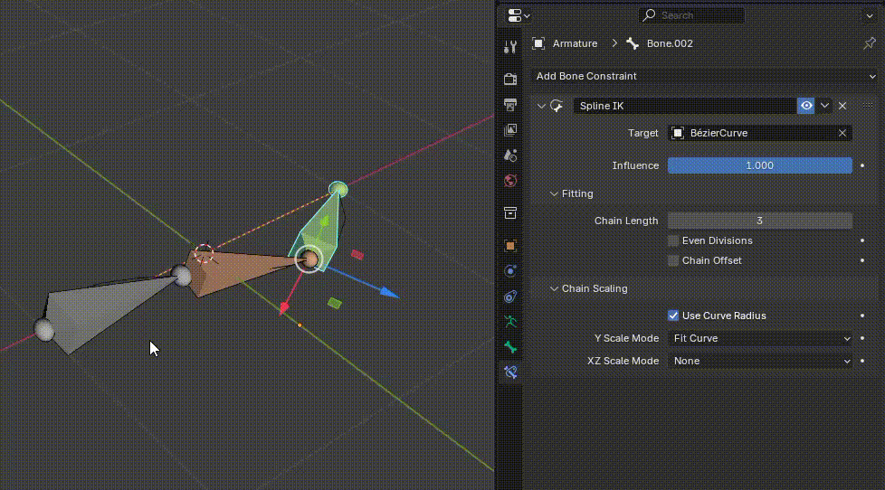
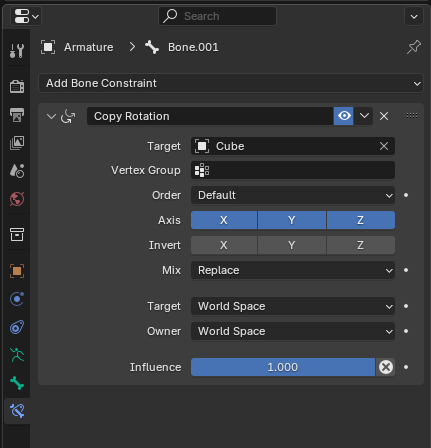
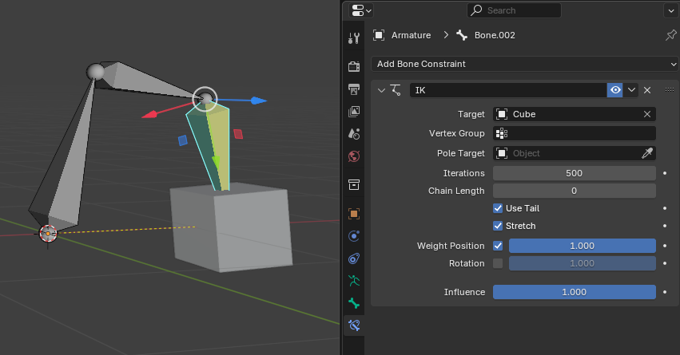
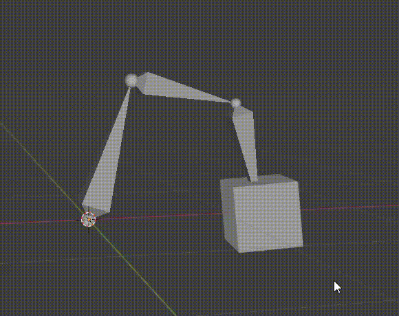
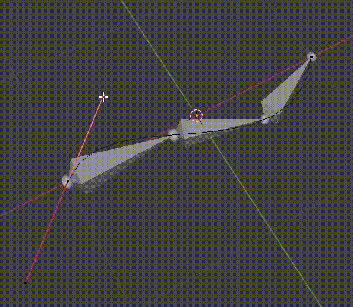
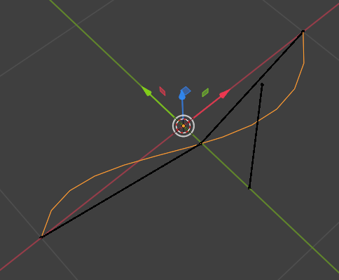
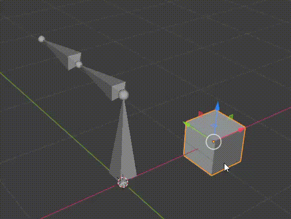
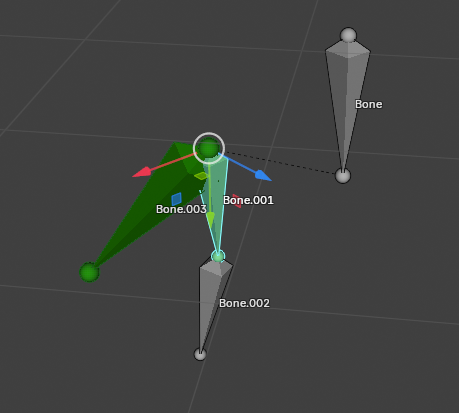

Object Mode 下，Constraint 也是生效的，这样才能以 Mesh 为 Target 的约束才能被改变 Pose。因为 Mesh 只能在 Object Mode 下被移动。

Pose Mode 只有在选中一个 Armature 时，才会出现。因此每个 Pose Mode，都有且仅有一个当前 Armature，Pose Mode 只能改变这个 Armature 的 Pose，不能操作其他的 Armature 或 Mesh。

Constraint 都是添加到 Bone 上的，不会挂着到 Armature 本身上，因为每个 Constraint 都是要约束具体的 Bone 或 Bone Chain 的。不同的 Bone 也可能添加不同的 Constraint。

Pose Mode 编辑的 Armature Pose 也会在 Object Mode 保持，但是 Object Mode 只能整体移动 Armature 和 Mesh，不能操作 Armature 中的骨骼。

Animation Window 记录动画时，无论是 Object Mode 下 Pose，还是 Pose Mode 下的 Pose，都会记录，只有为选择的 Bones 添加关键帧即可。

很多快捷键只能在对应的窗口中生效。而且 Blender 与很多其他的软件不同，不是窗口具有焦点（focus）就可以使用它里面的快捷键，而是完全看光标停留在那个窗口。例如，如果仅仅是将光标移动到 Collections 窗口，在 3D View 窗口中的快捷键（例如 G-移动，R-旋转）就不可用了，只能使用 Collections 窗口中的快捷键。还有，添加关键帧的快捷键（I、K）也只能在光标停留在 3D View 窗口中可用，如果光标移动到了 Animation 窗口，就没有了 I（Insert Keyframe）、K（Keyframe）快捷键了。

| 类型                                                | 示例            | 作用              |
| ------------------------------------------------- | ------------- | --------------- |
| **Inverse Kinematics（IK）**                        | “骨骼A 控制骨骼链末端” | 用控制骨骼驱动一整条骨骼链。  |
| **Copy Rotation / Copy Location / Copy Scale**    | 模仿另一个骨骼的姿态    | 常用于绑定同步控制。      |
| **Limit Rotation / Limit Location / Limit Scale** | 限制变换范围        | 防止骨骼姿态不自然。      |
| **Track To / Damped Track**                       | 让骨骼始终朝向目标     | 常用于眼球、头部、摄像机控制。 |

# Constraint 示例：

很多 Constraint 都需要为约束指定一个 target object。这个 Object 既可以是某个 Armature 的一个 Bone，也可以是一个 Mesh Object（即使 IK 也是如此）。

## SplineIK

将选择的骨骼链沿着 Spline 变形。其实就是将每个骨骼的 Joint 放在 Spline。

约束放在末端骨骼上，可以指定 Chain Length。选择的 Bone Chain 占满整个 Spline，即起始 Joint 位于 Spline 的起点，末端 Joint 位于 Spline 的结束。

因为 Spline 几乎不会与骨骼链在相同的位置。因此骨骼链会与 Parent Disconnect，直接排列在 Spline 上，没选中的 Bone 保留在原地。

## CopyRotation

简单赋值一个 Object 的旋转到 Bone 上。

Constraint 有几个 Copy 约束，提供它们是用来同步不同骨骼的 Pose，编辑一个 Aramture 时，另一个可以同步跟着改变。

## CopyLocation

实时赋值 Target 的 Position 到 Bone 的 Position。看起来 Bone（Head Joint）像是被绑定在这个 Target 上一样。类似 Unity PositionConstraint.

只可以应用到自由移动的 Bone 上，例如 Root Bone，或者于 Parent Disconnect 的 Bone。如果是 Connected Bone，设置这个 Constraint 没有作用，Bone 的位置总是被 Parent 控制。

