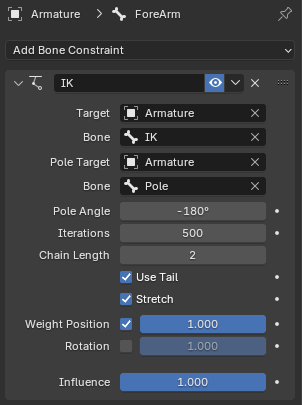
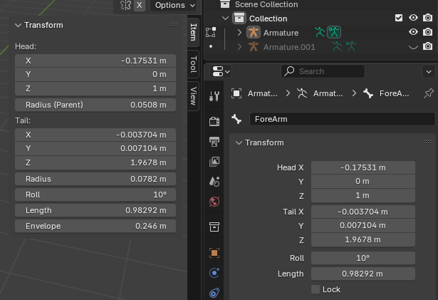
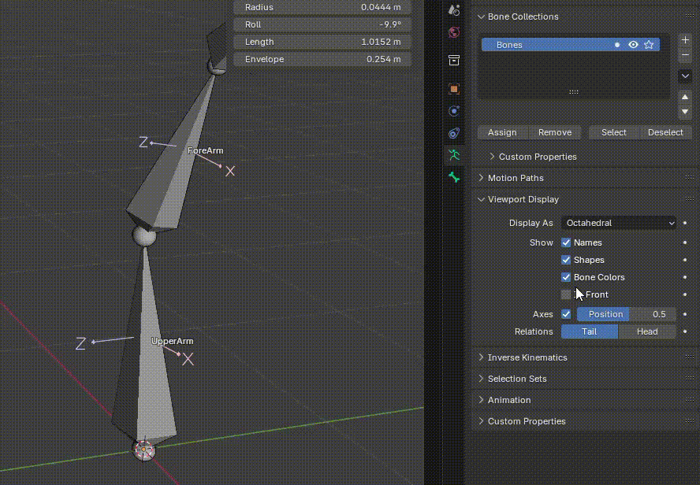

Inverse Kinematics（反向动力学，简称 IK） 是一种用于控制骨骼链（Bone Chain）的动画技术，能让你更自然、快速地为角色摆姿势（Pose）或制作动画。它是骨骼系统中最核心、最常用的功能之一。

# 功能和原理

## 正向动力学

- 在 FK 模式下，你是 从父骨骼到子骨骼 逐个旋转骨骼。
- 比如移动手臂时，必须先旋转上臂骨，再调整前臂骨，最后调手腕骨。
- 控制精确，但操作繁琐。

## 反向动力学

IK 的原理是 从末端骨骼（例如手或脚）反向计算父级骨骼的旋转。

也就是说，你只要移动“手”的骨骼，系统就会自动计算出上臂、前臂如何弯曲才能让手到达目标位置。

效果举例：

- 拖动角色的手，就能自动带动整条手臂自然弯曲。
- 让脚粘在地面上（比如走路或站立动画），不需要手动微调每一节腿骨。

# 如何使用 IK

1. 准备骨骼链

    - 在 Edit Mode 下创建一个连续的 Bone Chain，例如 ```upper_arm -> forearm -> hand```
    - 确保它们正确的父子关系

2. 添加 IK 控制骨骼

   通常会在骨骼链的末端 Bone 之外，在添加一个控制骨骼。

   所谓控制骨骼，就是 IK 的 Target，是骨骼链尝试达到的目标。它也是一个 Bone，不是 Mesh Object。

   - 进入 Edit Mode：Edit Mode 用于创建骨骼、修改骨骼结构、移除骨骼
   - 创建一个新的骨骼，例如命名为 hand_IK，放在手的末端
   - 退出 Edit Mode

3. 添加 IK 约束（IK Constraint）

   - 进入 Pose Mode
   - 选中要进行 IK 约束的骨骼（例如 forearm 或链中倒数第二节骨骼）
   - 在 Bone Constraint 面板中，点击 Add Bone Constraint -> Inverse Kinematices
   - 在参数设置中：
     - Target：选择 Armature
     - Bone：选择新创建的控制骨骼（hand_IK）
     - Chain Length：设置 IK 控制的骨骼链的数量，从末端骨骼开始算（例如 2 表示 forearm + upper_arm）
     - Pole Target：可选，可以用来设置骨骼链弯曲所在平面，例如一个 elbow_pole 控制骨骼，可以用来控制肘部弯曲的方向

4. 测试 IK 效果

   - 进入 Pose Mode
   - 选择 hand_IK 控制骨
   - 选择 G（移动）来移动它
   - 你会看到整条手臂自然地跟着弯曲，实现 IK 控制

# IK 的常见参数和技巧

## 参数

- Target：指定 IK 操作的 Armature
- Pole Target：控制骨骼的弯曲方向（骨骼弯曲所在平面的经过的点）
- Pole Angle:
- Chain Length：IK 操作的骨骼数量（从 IK 末端开始算）
- Iterations：求解精度（一般默认即可）
- Weight/Influence：控制 IK 的影响力

  可用于混合 FK 和 IK 动画。

  IK 计算本质就是为骨骼链上的每个 Bone 计算 TRS，然后赋值给 Bone。Weight 可以将这些数据与 FK 的数据以一定的 weight 混合。

## 技巧

- 如果肘部弯曲异常，调整 Pole Angle 或 Pole Target 的位置
- 可以通过 Custom Bone Shape 为 hand_IK 设定特殊形状，方便操控
- 动画中通常会通过 IK/FK 切换来实现手或脚的自然切换
- 确保链中所有骨骼的 Roll 一致，否则 Pole Angle 计算会混乱
- Ik 约束就是设置 Pose 的工具之一，跟直接操作 Pose 的 TRS，复制粘贴 Pose 一样

  - 可以一直设置，并时刻通过它来设置 Bones 的 Pose
  - 也可以一次性设置，调整好 Bones 的 Pose 后就丢弃

### 骨骼链在设置 IK 之前要有一定的弯曲

骨骼链在设置 IK 之前要有一定的弯曲，向 IK 提示你想让骨骼链弯曲的方向。这一点非常重要。

IK 的工作过程是，先根据骨骼链的初始弯曲方向建立一个弯曲平面，然后在绕着骨骼链起始端和末端的轴线旋转平面，旋转到 Pole Target 所在的位置。此后 Pole Target 就可以拖拽这个平面旋转，进而修改骨骼链的弯曲方向了。

如果初始时，骨骼链是完全直线的，没有任何弯曲，就会产生非常怪异的弯曲行为。因为IK 系统就无法计算应该在那个平面上弯曲骨骼链，它会算出一个，但是这个几乎就是随机的，不是你想要的方向。

如下面的 Armature 所示，本意是想让骨骼沿着 Hand 的方向进行弯曲，即让 Hand 也躺在弯曲平面上。但是骨骼链 ForeArm-UpperArm 是完全直线的，添加 IK 约束就会产生随机的完全平面，而这个平面跟 Hand 方向几乎不会一致，而这个平面在 IK 建立之初就固定了，因此跟 Hand 的角度差也是固定的，因此无论怎么调整 Pole Target，Hand 也不落在平面中。而且这个旋转平面与 Pole Target 的关系也是随机的，Pole Target 也不再这个平面上。总之非常混乱。

 

另一种情况可能是，建立 IK 之后，骨骼链并不弯曲，而是整体旋转跟随控制骨骼旋转，直到手动强制移动一下 End Bone，骨骼链才会正常弯曲，而且弯曲之后的问题与上面一样。

 

总之这些怪异的问题都是骨骼链初始没有一定的弯曲所致。如下图所示，初始让骨骼链有一定的弯曲，这样就可以像 IK 提示想要的弯曲方向（平面）。想让骨骼链向那个方向弯曲，就在 Edit Mode 中将骨骼链中的 Joints 向那个方向移动一点。此后骨骼链就可以正常弯曲了，而且平面落在 Pole Target，可以被 Pole Target 拖拽控制，进而控制骨骼链在世界空间中的弯曲方向。

此外，还可以设置一个 Pole Angle，可以绕着骨骼链起始段-末端的轴线在 Pole Target 基础上再偏移一定的角度，它的范围是 [-180, 180]。

这一切都必须在 IK 约束建立前设置好，否则建立起 IK 之后，在去调整 Rest Pose 是没有效果的，因为弯曲平面是根据 IK 建立时的弯曲方向计算的。如果有问题，只能移除现在的 IK 约束，重新建立一个新的。


**IK 骨骼链没有弯曲，是 Blender IK 系统的核心陷阱之一。** 如果骨骼链完全笔直，IK 会失去“弯曲方向”的参考，从而出现旋转错乱或不弯曲的情况。

# IK 属性

 

IK 建立在要进行 IK 约束的骨骼链末端 Bone 上，IK Target 指定的是 IK 控制骨骼，不是骨骼链的末端。开始时经常会误把骨骼链末端 Bone 设置到这个字段，其实 IK 约束放在末端骨骼上就已经指明了 Ik 约束点是这个骨骼。

无论是 IK target 还是 Pole Target，都先指定一个 Armature，然后再选择其中的一个 Bone 作为 Target。这说明无论时 IK Target 还是 Pole Target 都可以不是 IK 所在的自身 Armature 的 Bone，而可以是另外的 Armature 中的 Bone。

# Roll

骨骼的 Roll 是沿着骨骼本身的 Y 轴的旋转。骨骼本身的 Y 轴定义为 Head-Tail 的轴线。

骨骼与 Mesh Object 不同，它的姿态不是被一个具有 TRS 的 point 定义，而是被两个 Point 加绕着其轴线的旋转定义。



Head、Tail 的 XYZ 位置都是在世界空间中定义，不管 Transformation Orientation 设置为 Global 还是 Local。就是设置为 Local，旋转 Bone 也会发现其 Transform Gizmos 的方向是不变的，总是跟 Global 一致。

Bone 本身有自己单独的 Local 坐标系。这可以通过属性面板的 Aramture > Viewport Display > Axes 开启，并可以设置 Gizmos 在 Bone 上的位置。



Local 坐标系可能只看得见 X、Z 分量，因为 Y 分量总是从 Head 指向 Tail，它被包裹在骨骼形状的里面了。将骨骼的显示改为 Stick，就可以看见 Y 分量了。
