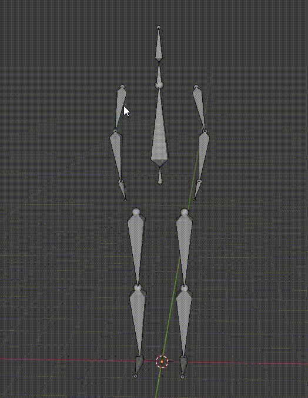

Pose Mode（姿态模式）中，你可以对骨骼的姿态（即在动画或绑定中的具体位置、旋转、缩放状态）进行编辑和控制。

Pose Mode 是骨骼动画的核心模式，区别于 Edit Mode（编辑模式）——后者修改骨架结构，而 Pose Mode 只修改姿态，不改变骨骼拓扑结构。

Pose Mode 本质上就是操作各个骨骼的位移和旋转（无论是手动操作，还是用各种程序化约束），将骨架放置到一个想要的姿势，这就是 Pose Mode 所做的工作。

使用 Pose 最多的地方就是动画。为创建角色动画，在不同世界点，编辑记录角色骨骼的 Pose，作为关键帧。两帧之间骨骼进行插值得到中间的位置和旋转。

Pose Mode 的核心工作和功能：编辑骨骼姿态。

# 基本变化功能

- 和操作 Mesh 元素一样的 G、R、Z（移动、旋转、缩放）
- 自由旋转：两次 R 键，Trackball Rotate

  

  其实 Mesh 编辑也一样有自由旋转的功能，它更适合跟踪球（类似鼠标的指针输入设备）操作。

  FreeRotate 就是直接拖拽 Rotate Gizmos 半透明的球体进行旋转，RR 是它的快捷键：

  

- 围绕特定轴旋转：R + X/Y/Z

- 重置姿态：Alt+G / Alt+R / Alt+S，重置位移/旋转/缩放到 Rest Pose。

  重置姿态只会重置选定的 Bones，而且可以选定只重置位移，或只重置旋转，或只重置缩放。

  Pose -> Clear Transform -> All 清楚所有**选中的 Bones** 的所有 Transform（位移、旋转、缩放）

  有了这个功能就不怕把 Pose 弄乱，因为总是可以回到这个默认的初始 Pose。

# 姿态管理

## 将当前姿态应用为 Rest Pose

Pose -> Apply -> Apply Pose as Rest Pose

常用于调整初始 Pose。

## 复制粘贴 Pose

Ctrl+C/Ctrl+V

复制选中的 Pose，并粘贴到当前帧，可配合对称骨骼使用。

如图所示，先为 Armature 的右臂设置一个 Pose，然后选择右臂 3 个骨骼，按下 Ctrl+C 就复制了这个三个骨骼的 Pose。然后可以改变这个 3 个 Bones 的 Pose，例如 Clear Transform。最后按下 Ctrl+V，就会发现右臂 3 个骨骼变成刚才复制时的 Pose。同时，如果这三个骨骼有镜像骨骼（.L .R），还可以在选项对话框中选择 Flipped on X-Axis，将 Pose 复制到镜像的骨 Bones，而不是原本的 Bones。

这个功能可以将 Pose 复制到镜像骨骼上。例如，先选中一侧的 Pose，然后 Ctrl+C 复制，然后直接 Ctrl+V 粘贴，这样会复制到源 Bones 上，此时没有任何效果，但是可以点击 Flipped on X-Axis 将 Pose 复制到镜像的 Bones 上，这样两边就具有了一样的 Pose 了。

这其实与 Clear Pose 是相同的原理，只是用法不同而已。Pose 本质就是选中骨骼的每个 Bone 的 Translate，Rotation，Scale 三个数据而已。复制 Pose，就是复制选中骨骼的 Translate，Rotation，Scale 的数据。所谓粘贴 Pose，就是将复制的 TRS 数据重新复制给选中的 Pose，Clear Pose 则是将记录的选中骨骼的 Rest Pose 的 TRS 数据复制给选中的 Bones。

## Flip Pose

上面将 Bones 的 Pose 复制到镜像 Bones 有一个快捷方式，就是先复制，然后按 Ctrl+Shift+V 快捷键，直接将 Pose 复制到镜像 Bones 上，不必先复制到自身，然后选择 Flipped on X-Axis.

菜单路径：Pose → Copy/Paste → Paste Flipped Pose

## 镜像编辑

可以在 Armature Tools 选项卡中开启 X-Axis Mirror，然后骨骼 Pose 就可以实时镜像对称编辑了。

### 镜像的数学原理

Blender 的镜像姿态是基于：

- 世界坐标 X 轴对称
- 骨骼局部旋转翻转
- 名称匹配规则（.L ↔ .R）

所以：

- 要求骨架在 X 轴左右对称；
- 骨骼轴向必须在建模阶段保持一致（比如 Edit Mode 下方向相同）。

## Pose Library

在侧边栏或 Action Editor 中，用于存储、重用特定姿态。类似 Rest Pose，可以立刻将 Armature 设置到保存好的某个 Pose 中.

Pose Library（姿态库）是一个非常实用的功能，用来 保存、重用和混合骨骼姿态（Pose）。在角色绑定和动画制作中，它能极大提高效率。

### Pose Library 的作用

- 保存当前骨骼的姿态（Pose）
- 快速恢复到已保存的姿态
- 混合（Blend）不同姿态，实现平滑过渡
- 作为动画参考或模板使用

### Pose Library 位置

新版 Pose Library 已整合到 Asset Browser（资源浏览器）系统中.

打开一个 Asset Browser 窗口：

Asset Brower 窗口默认显示所有种类的 Asset，尤其是 Brush。可以在右上角的 Filter 中取消 Brush，只显示 Action。Pose Asset 是 Action 相关的资源。

因为 Asset 都是保存到某个 Library 的，也可以选择 Library，只显示这个 Library 的 Asset：

### 创建和应用 Pose Asset

创建 Pose Asset 有三个地方：

- Action 窗口

  因为 Pose 是 Action 相关的资源。

  Action 窗口右边有停靠的对话框，可以点击箭头展开，也可以按 N 键 Toggle 对话框。对话框中的 "Create Pose Asset" 可以将当前 Pose 创建为 Asset，甚至是动画片段中 in-between 的 Pose（插值得到）也可以被创建为 Asset。

- Pose 菜单中包含 Create Pose Asset 菜单项

- Asset Browser 窗口的 Asset 菜单中包含 Create Pose Asset

这三者都可以创建 Pose。

创建 Pose 时，需要先选中要包含进 Asset 的 Bones。只有被选中的 Bones 才会被记录到 Pose Asset 中。如果想记录全身 Pose，就全选 Bones。

然后点击任何一个菜单或按钮，就弹出保存对话框，为 asset 起一个名字，就可以保存到 Asset Browser 中了。

使用时不必选择 Armature 中的 Bones，直接双击 Pose Asset 或右键点击 Apply Pose 就可以将 Pose Asset 中记录的 Bones 的 Transform 数据（Translate、Rotation、Scale）设置到相应的骨骼上，和 Paste Pose，Reset To Rest Pose 原理是一样的。它只应用记录的骨骼，对于这个 Pose Asset 没有记录的 Bones，完全不受它影响，原来是什么样，还保持什么样。

这样其实可以将 Pose 分解为不同的部分，每个部分单独保存和应用。例如，上半身的 Pose 单独保存一个 Asset，下半身的 Pose 单独保存一个 Asset。分别应用两个 Asset 就可以得到一个全身的 Pose。

Pose Asset 和 Rest Pose 一样，很多时候用来做参考，例如制作一个新的 Pose（用于动画关键帧），从头创建完全的 Pose 很麻烦，但是它跟某个 Pose Asset 很接近，那就可以应用这个 Pose Asset，然后基于这个 Pose 微调即可。

Apply Pose Flipped 和镜像粘贴 Ctrl+Shift+V 一样，将具有对称镜像的骨骼应用到对面。

另外 3D View 窗口底边缘，还有一个隐藏停靠的 Pose Asset Browser，可以快速应用 Pose Asset：

### Blend Pose

Apply Pose 时可以指定一个混合因子，以一定比例应用 Pose Asset 到当前 Pose 中：

选择 BlendPose 时，会弹出一个滑动条，范围从 -100% 到 +100%，它指定应用多少 Pose Asset 中的数据（Translate、Rotation、Scale）到当前 Pose 中。0 表示完全不混合 Pose Asset 中的 Pose，1 表示完全将 Pose Asset 中的 Pose 复制到当前 Pose 中。-1 则将完全 Flipped 的 Pose Asset 应用到当前 Pose 中。

“Poses” (姿态资源类型)

# Pose Constraints（姿态约束）

添加 Bone 直接的控制关系，例如 复制旋转，IK，位置限制。

查看 Constraints 内容。

# Pose Bone Properties

# Rest Pose

Rest Pose 是 是骨骼（Armature）在 未被任何姿态或动画影响时的默认形状和位置。也就是说，它代表骨骼的「自然状态」，或者说「初始绑定状态」。

- 当你在 Edit Mode（编辑模式） 中调整骨骼结构时，你实际上是在修改骨架的 Rest Pose。
- 而在 Pose Mode（姿态模式） 中调整骨骼时，你只是在临时改变它相对于 Rest Pose 的姿态。

## Rest Pose 的作用

| 用途                 | 说明                                                        |
| ------------------ | --------------------------------------------------------- |
| **绑定（Skinning）基准** | 当你把模型用 “Armature Modifier” 绑定到骨骼时，权重的参考位置就是骨骼的 Rest Pose。 |
| **动画参考姿态**         | 所有姿态变化（Pose Transform）都是相对于 Rest Pose 的变化。                |
| **重置姿态的基准**        | 使用 `Alt + G/R/S` 清除变换时，骨骼会回到 Rest Pose 的位置。               |
| **防止变形错误**         | 如果 Rest Pose 不正确，模型在动画时可能会出现“撕裂”或“错位”现象。                  |

## 和 Pose 的区别

| 模式                  | 操作            | 影响                      |
| ------------------- | ------------- | ----------------------- |
| **Edit Mode（编辑模式）** | 改变骨骼的结构、位置、方向 | 改变 Rest Pose（基础姿态）      |
| **Pose Mode（姿态模式）** | 改变骨骼的旋转、位置、缩放 | 改变骨骼的当前姿态（相对 Rest Pose） |

- 你在 Edit Mode 把手臂骨从身体侧面移到前方 → 这就改变了 Rest Pose。
- 你在 Pose Mode 把手臂抬起来 → 这只是改变了相对姿态，不影响 Rest Pose。

可以把当前 Pose 设置（Bake）为新的 Rest Pose，通过 Pose -> Apply -> Apply Pose as Rest Pose. 这样再进入 Edit Mode，骨骼也会变成这个姿态。这个功能很有用。因为在 Edit Mode 修改姿势很困难，因为 Child Bone 并不跟随 Parent Bone 变换。而 Pose mode 又是专门操作 Pose 的，提供了很多专门用于编辑 Pose 的功能。因此要设置 Rest Pose，就在 Pose Mode 中编辑，然后 Apply 为 Rest Pose。

## 常见误区

| 误区                       | 解释                                    |
| ------------------------ | ------------------------------------- |
| “Rest Pose 是动画的第一帧”    | 错。Rest Pose 是与动画无关的基础骨架结构。            |
| “修改 Rest Pose 会自动更新动画” | 错。修改 Rest Pose 后，现有动画可能会失效或错位，需要重新调整。 |
| “编辑模式改骨骼结构”           | 会改变 Rest Pose，但不会自动调整已有动画。请谨慎使用。      |

动画记录的是每个 Bone 相对 Rest Pose 的位移、旋转、缩放。因此当 Rest Pose 改变了，整个动画都会改变。即 Rest Pose 是 Base，动画记录的是增量。

上面的动画是基于双手下垂的 Pose，编辑了一个右臂抬起 45° 的动画。然后回到 Edit Mode，将 Armature 修改为右臂抬起 45° 的 Pose 作为 Rest Pose，再次播放同一个动画，可见动画变成了右臂从 45° 抬起到 90°.

Rest Pose 是骨架的“静止结构状态”，是所有姿态与动画的零点参考。

Object Mode 会显示 Pose Mode 的当前姿势，很多时候这不是 Rest Pose。这就是为什么从 Object Mode 进入 Edit Mode 时经常会出现 Armature 的位置、旋转、姿势的变化。

# Bone Collections

Blender 为各种要操作的元素都提供了 Collections 的功能（例如 Vertex Group）。Bones 也不例外，在属性面板中，可以创建 Bone Collections，每个 Collections 可以指定包含经常要一起操作、选中的 Bones，这样就不用每次都手动去选择了。

# Misc

Armature 动画不一定需要跟 Mesh 保存在一起。它本身就是单独的资源。它的动画就是对各个 Bone 的 Transform 的动画而已。

这样 Armature 动画可以编辑一次，然后为任意具有相同骨骼结构的 Skinned Mesh 使用。

## Bone 可见性

影响 Bone 可见性有两个因素：

- 每个 Bone 自己属性面板的 Viewport Display 的 Hide 选项，如果开启了，Bone 将不可见
- Bone Connections 用来包含一组 Bones，它可以整体隐藏和显示 Bones

无论哪种方法隐藏的 Bones，被隐藏的 Bone 都不可见，也不能被选中，只存在于 Collections Hierarchy 中。

因此发现找不到 Bone 时，先看 Bone 的 Hide 是否开启了，然后看是否它所在的某个 Bone Collections 被隐藏了。
