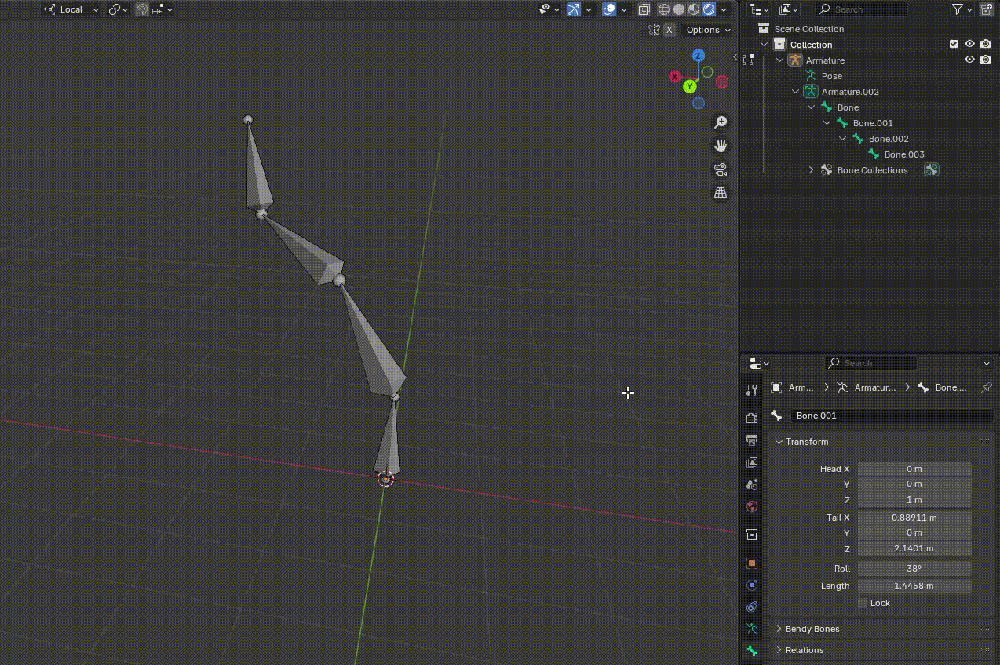
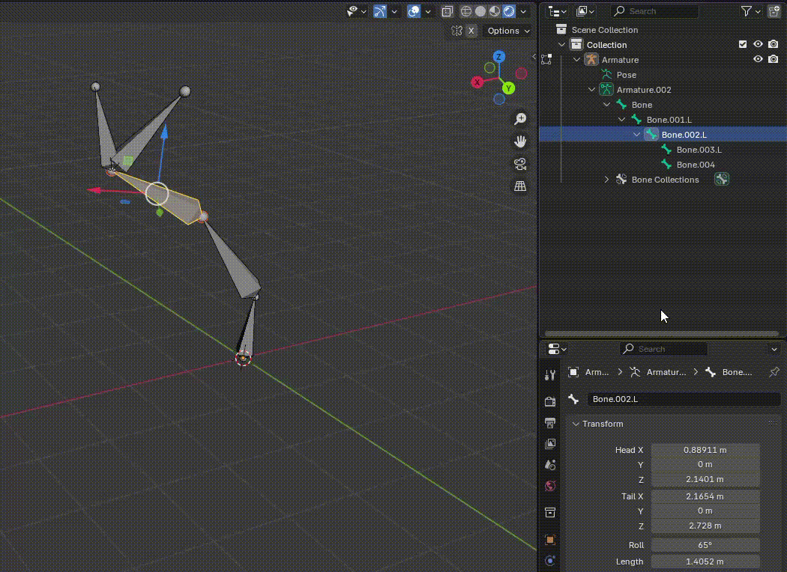
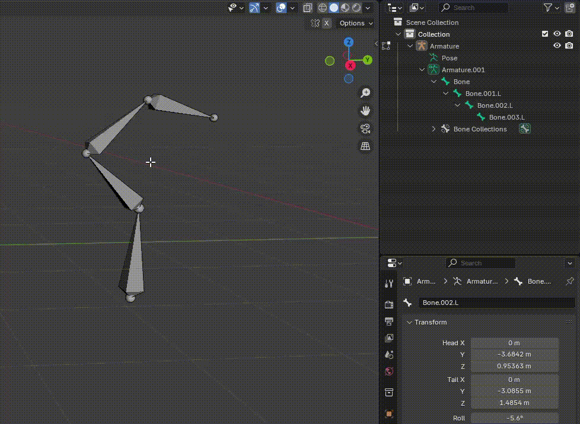
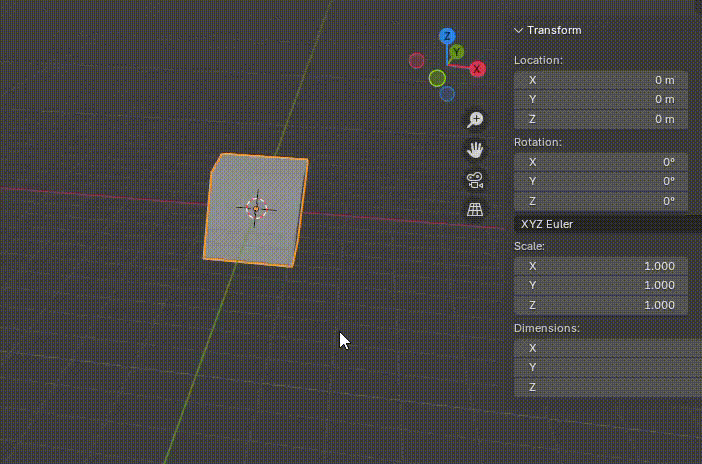
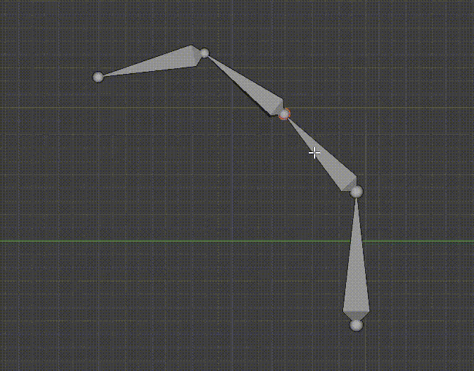

Symmetrize 用于为选择的 Bones 生成镜像骨骼。

进行 Symmetrize Bones 需要在名字中用后缀表示其的左右属性：

- 用 ```.``` 或 ```_``` 分割后缀
- 左边的用 L 或 Left，右边的用 R 或 Right

因此可选的后缀组合就有：

- .L .R
- _L _L
- .Left .Right
- _Left _Right

使用 Symmetrize 工具只应该对有意义的连续的骨骼链使用，可以带分叉，要避免对无意义的骨骼链（例如不连续的，有的带后缀的 Bone，有的不带后缀的 Bone 这样混乱的骨骼链）进行 Symmetrize。对于后者，Symmetrize 不仅结果很难理解，而且根本不实用。实践中完全用不到。因为 Symmetrize 就是为创建类似 Humanoid 这样具有对称结构的骨骼而提供的，而 Humanoid 最多 15 个骨骼，对称的骨骼只有 6、7 个，而且是单链（算上手指/脚趾也只是带一个分叉的骨骼链），其实任何模型的骨骼都不可能复杂，没有那么多骨骼的生物。因此 Symmetrize 只用于这些简单情况已经足够用了。而且 Symmetrize 可以使用多次，对多个 Bone 进行镜像，再结合骨骼 Duplicate、Connect 这些功能，就能处理所有能遇到的骨骼结构了。

因此，只对简单骨骼链（连续、单链、简单分叉）的进行 Symmetrize，避免对混乱复杂的骨骼链使用。

## 只在 X 轴上镜像

Symmetrize 只对骨骼在 Armature 本地坐标系的 X 轴方向进行镜像：



因此在创建一侧骨骼时，要沿着本地坐标系的 X 轴进行。

另外，如上图所示，可以为要镜像的 Bones 自动命名，加上 .L .R 后缀，以方便后面的 Symmetrize 操作。

## 绕着 X = 0（原点）镜像

Symmetrize 只绕着 X = 0 进行镜像，如果骨骼链的 Root 本来就在 X = 0，则镜像的骨骼与 Parent 也是 Connect 的，如果骨骼链的 Root 不再 X = 0，则镜像的骨骼仍然会镜像到 X 轴的另一侧，并且与 Parent Disconnect。


注意镜像后的骨骼如果 Root 与 Parent Tail 位置相同就会创建一个 Connected 的骨骼链，否则就会创建要给 Disconnected 的骨骼链。

## 对后缀进行字面量上的翻转

Symmetrize 不关系骨骼空间中的左右意义，它只看 Bone 名字的后缀，镜像时，只有是 .R 的就变成 .L，只要是 .L 就变成 .R，即使一个 .R Bone 绑定在一个 .L Bone 上面。

另外骨骼的名字，不仅可以双击 Collection 中的节点进行重命名，还可以在属性面板窗口的 Bone 属性窗口中直接命名。

如果骨骼链上有没有后缀的 Bone，则它不会被镜像，它只会保留在原来的骨骼链上，新镜像的骨骼链没有对应的骨骼。



# Mirror

Mirror 不是创建新的镜像骨骼，而是对选中的骨骼进行镜像，逻辑跟 Symmetrize 一样。或者说 Symmetrize 先 Duplicate 选中的骨骼链，然后，对新骨骼的后缀名挨个进行翻转，然后对新的骨骼链进行 X Local 的 Mirror 操作。

Mirror 操作有两个关键点：

- 坐标空间
  
  - Global：骨骼沿着世界空间坐标系的 X/Y/Z 方向进行镜像 
  - Local：骨骼沿着 Armature 本地坐标系的 X/Y/Z 方向进行镜像

- Pivot

  镜像的 Pivot 有当前 Blender 工作区的 Transform Pivot Point 决定

  - 3D Cursor
  - Individual Origins
  - Median Point
  - Active Element

  如果是 Median Point，就围绕骨骼链的 center 进行镜像。如果是 Active Element，就绕着最后选择的骨骼的 Head Joint 进行镜像，此时骨骼选择的顺序很重要。通常要最后选择 Root Bone。

  Symmetrize 与 Mirror 不同，它只会绕着 X = 0 进行镜像，不参考 Transform Pivot Point。

  注意 Mirror 的 Y Local / X Gloal 这些只指定镜像的方向，但是镜像不一定绕着原点 (0, 0, 0) 镜像，镜像的 Pivot 由 Transform Pivot Point 指定。


## 小心 Symmetrize 后，骨骼链重叠

如下图所示选择一条骨骼链，上面所有的骨骼都标记了 .L，执行 Symmetrize 后，会从骨骼链的根部生成同等级的一条骨骼链，只是每个骨骼的后缀都变成了 .R。



注意生成的新 Bones 与原 Bones 重合了。这是因为默认 Symmetrize 只会沿着 X 轴镜像，而这条骨骼链是在 Y 轴方向创建的，在 X 轴上的坐标都相等，因此镜像后的新 Bones 和原 Bones 位置相同。此时需要选中新生成的 Bones，然后选择 Mirror-> Y Local，将其沿着局部坐标系 Y 轴镜像，就可以看到镜像的新骨骼了。

Blender 默认的工作空间方向是 X 轴水平向右，Y 轴垂直屏幕向内，Z 轴垂直向上。因此默认沿着 X 轴镜像骨骼。

# 分清 Blender 工作区的方向

在 Blender 中工作要分清坐标系的方向，看左上角的 Axis Gizmos。Gizmos 由 3 对小圆球表示。标记 X/Y/Z 一端的小圆球是相应坐标轴的正方向，空心的那一端是坐标轴的负方向。因此要回到正常方向，旋转相机，将 X 球朝向右，Y 球朝向里，Z 球朝向上：



还有，点击 6 个小圆球会将相机设为 Ortho 正交相机，并从点击的坐标轴垂直看去。此时，视线朝向的那个小球会被标记坐标轴以及正负，例如 Y 或 -Y，即使它原来是空心球。

# 移动 Bone 或 Joint



编辑骨骼时可以移动 Bone 也可以移动单独的 Joint。移动 Bone 时，会同时移动两个 Joints。

可以使用 Translate Handle，也可以按 G 进行移动。

当两个 Bone 首尾绑定时，选择一个 Bone 的 Head，会选中 Parent 的 Tail，因为 Parent Tail 的 Joint Sphere 会包围 Child Head 的 Joint。移动时会同时移动 Bone 的 Head 和 Parent 的 Tail，但这对首尾绑定的 Bones 是预期行为。如果是 Disconnected Bones，可以单独选中 Child Bone 的 Tail Joint。