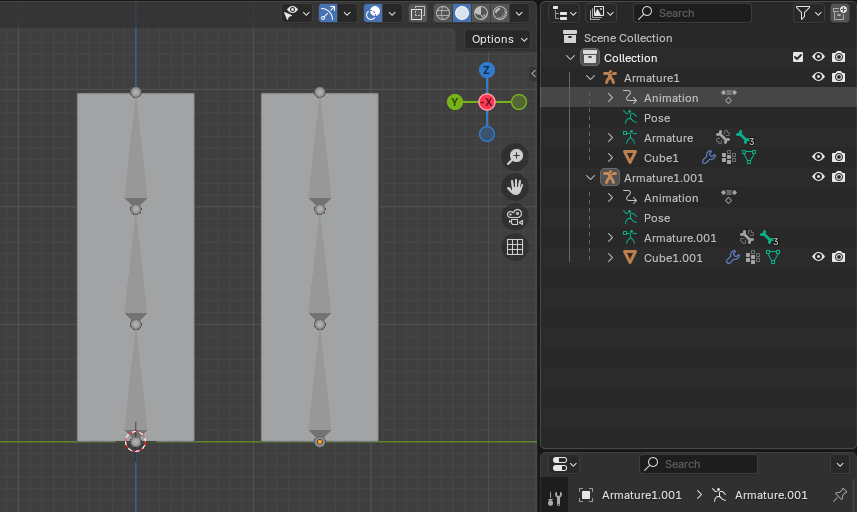
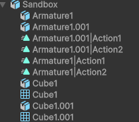
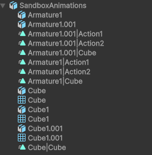
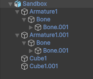

# 单位缩放

将 Blender 工程文件导出为 FBX 时，默认会将 Model 的 Scale 设置为 100，并且动画片段中也会在首尾添加 Scale = 100 的关键帧。

如果只是将模型作为显示使用，例如作为 Character Controller 下面的模型，所有控制、碰撞都在 Controller 身上，或者作为 Navmesh Agent 的显示模型。这样是没有问题的。只要导入到 Scene 中看起来正确，就没有问题。

如果想导入的 Unity 中的单位和 Blender 中一致，不把 Scale 设置为 100，以及动画首尾默认创建 Scale=100 的关键帧，只有一种可行的设置方式：

- Blender 导出时设置 Scale = 0.01 和 Apply Unit = true
- Unity 中设置 Scale Factor = 1 和 Convert Units (1cm to 0.01cm) = false

Blend 工程文件可以直接保存到 Unity 中，Unity 会自动导入它，而且模型没有任何单位转换的问题，Blend 中的 1m 就是 Unity 的 1m，而且动画也不会自动添加没有记录关键帧的 Transform 属性（Rotation、Scale）。

但是这样有一个问题就是无论常见中有多少动画 Action，它只会将所有 Objects 的动画合并成一个 名为 Scene 的 Clip，不会将每个 Action 导出为一个单独 Clip。因此这种方法只适合一个 .blend 文件只为一个 Object 创建一个 Action 的动画，但是可以将 Object 的不同动画片段放在唯一 Action 的不同时间位置上。

Blender 创建的模型动画（骨骼动画）在 Unity 中应放在模型的 Root 上，而不是 Armature 上。模型在 Unity 中有一个 Root GameObject，它下面有一个 Armature 骨骼链，以及一个 SkinnedMeshRenderer。动画应该放在 Root GameObject 上播放。

# 动画导出

Action 是独立的 data block，不与任何 Object/Armature 绑定，相反是 Object/Armature 选择 link 到某个 Action。

例如这里先为左边的 Cube 创建了一个动画，然后让右边的 Cube link 到这个动画，因为它们的 Armature 结构一样，因此可以正确播放

下面是为右边的 Cube 创建了另一个动画，两个 Cube 就各种播放不同的动画了：

上面说“为 XXX 创建动画”是不对的，Action 与 Object 并无绑定。正确的说法是，“以 XXX 为 Target/模特/属性模板” 创建一个动画，之后只有具有相同属性的 Object/Armature 都可以 link 并播放这个动画。

Blender 中这两个 Armature 的结构是这样：

导入到 Unity 之后，是这样：

可见每个 Action 为每个 Armature 创建了一份。但是只有一份能正常播放（就是以它为 Target 创建的 Action），其他都是空的冗余的。这应该是与 Slot 有关。

因为 Action 是独立的 data block，它不与 Armature 绑定，Unity 不知道哪个动画应该放在哪个 Armature 上播放，因此它简单地为每个 Armature 重复导出所有的 Action，在 Unity 中生成 Animation Clip，然后在 Unity 中筛选有效的 Clip。

如果继续创建一个 Cube 以及一个动画，可见导入后，Cube 的动画也为每个 Armature 创建了一份，但是 Armature 的动画却没有为 Cube 创建 Clip，为什么这样，很难理解，但就是很混乱，但这已经是 Blender 能和 Unity 能正常交互仅有的方式了。

如果将 Blender 工程作为 .blend 文件保存到 Unity 中，可见它只将当前 scene 中播放的动画整体 bake 到一个 Scene 动画中：

对于 Blender 导入的模型，需要将 Asset 整体拖拽到 Scene 中，才能直接创建可用的 GameObject Hierarchy。否则，Bones 结构只能手动创建，而且其中的 Bones 几乎不可能与 Blender 创建的骨骼 Pose 相同，因此除了直接拖拽模型资源，没有别的办法正确使用这个模型，另外动画 Animator 要放在 Root GameObject（即图中的 SandboxBlend）上播放，而不是下面的 Armature1：

Blender 是完全独立强大 3D 创作工具，它的种种功能都是为了自己的目标设计的，并不会考虑与游戏引擎兼容。因此它的很多功能在 Blender 中是非常好用的，但是无法用在游戏引擎中。相反是游戏引擎选择兼容 Blender 的部分功能，以使用它来创建游戏资源。因此只有一部分功能用在游戏引擎中是没有问题的，其他的无法导入。

即使能导入，还有各种问题，例如 Unit 的缩放，动画片段的冗余等等。因此不要把 Blender 能用在 Unity 中的功能视为理所当然，不兼容才是常态。

另外 Blender 不能创建 Unity 的那种 GameObject Hierarchy 动画。

# 总结

Blender 有自己独立地目标和工作方法。Blender 能与 Unity 正常交互的方法非常有限，而且并不是流畅的。

但是也只能使用 Blender 了。UModeler 建模工具不够高级，选择元素总与 Handle 冲突，编辑高模的 Mesh 性能急剧下降，UMotion 界面违法直觉，属性列表都没有分组功能，几乎难以使用。只有 Blender 无论建模还是动画功能都非常强大、丰富、流畅，但是与 Unity 交互又不是很流畅。但是综合而已，还是使用 Blender 优势最大，只是注意遵循它能与 Unity 正常交互的少数方式方法：

- 仅包含 Mesh 的话，可以放在一个工程中，任意编辑
- 仅包含 Mesh（包括蒙皮的 Mesh）可以使用 .blend 文件导入到 Unity 中
- 包含动画的话，不能用 .blend 文件导入 Unity 中，因为 .blend 只会把 Scene 中当前播放动画导出到 Unity 中的单一 Scene 文件，不会每个 Action 一个 Clip。但是如果所有动画都放在一个 Action 中，就可以用这种方式，然后在导入的 Scene Clip 中切割出各个 Action Clip
- 不能创建 GameObject Hierarchy 动画，只能创建骨骼动画
- 不要使用多 Slot 和 NLA，只使用简单动画 Action
- 对于角色动画，最好每个角色一个 Blender 工程，这样导出时，没有冗余的动画片段
- 可以把骨骼动画单独一个工程，只导出动画，然后所有的 Mesh 一个工程，这样动画片段不会为 Mesh 重复

其他的功能、方式方法很难在 Unity 中正常使用。
