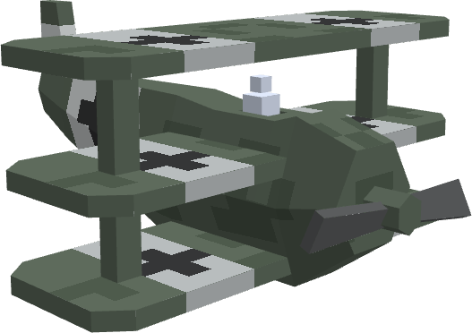
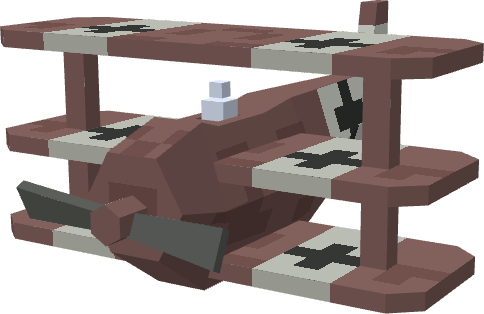
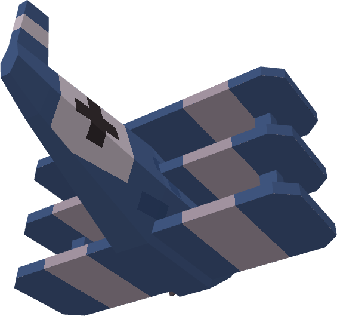
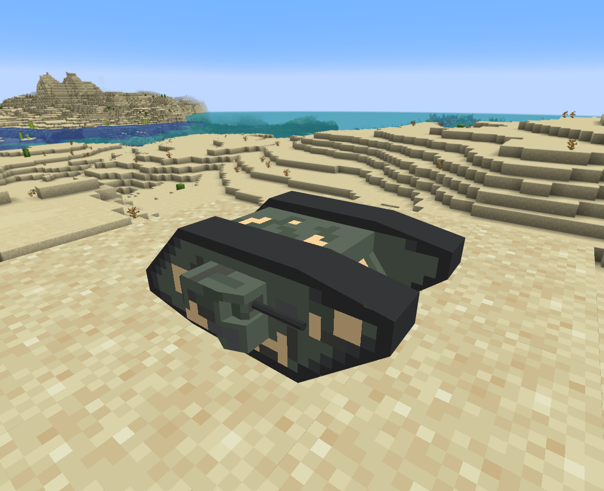
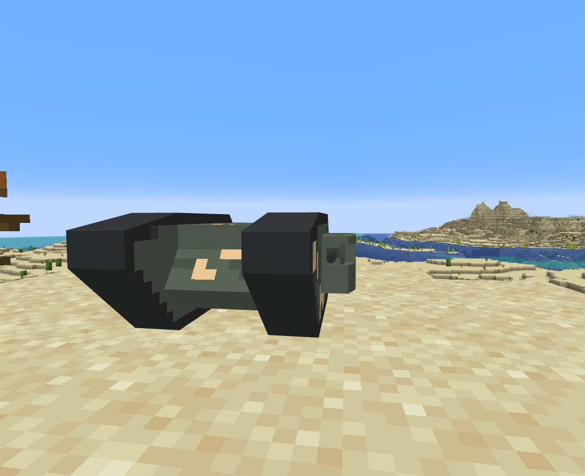
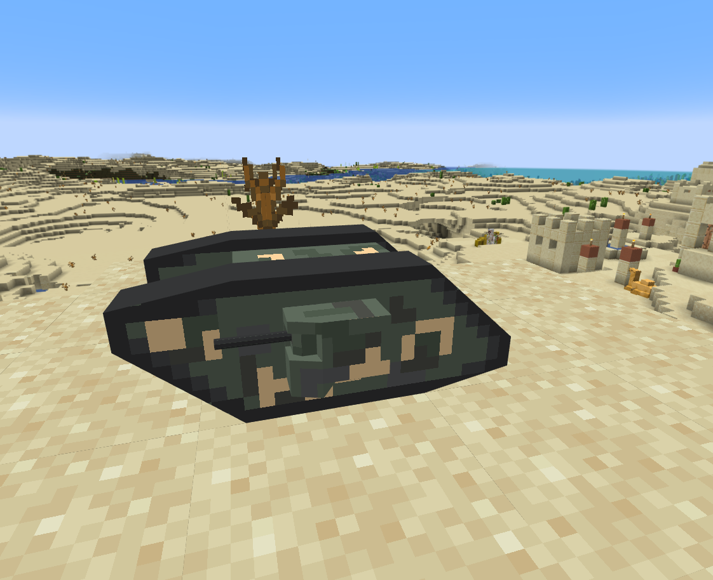

3d Lowpoly + 2D Pixel Art

- 保持美术风格的一致性。UI、模型、特性、环境都需要保持一致，不可能只一些地方特别精致，而其他地方粗糙。因此，在一个地方追求精致会对整个美术风格（各种各样的资源）都提升了要求，增加了非常多的工作量
- 保持简单，使得创建新的模型、新的角色更简单，可以添加更多细节、更多元素，使游戏环境更容易变得丰富

技巧

- 环境元素要多，每个元素尽量简单
- pixel 纹理尽量多种颜色，表现某个细节或特征不要只使用一种颜色，但是要尽量使用接近的颜色，体现层次感
- 纹理像素大小保持统一，不要使用 mixel

限制 scope，限制工具集，精通而不是泛泛。不可追求视觉或声音体验，所有精彩点只能体现在程序方面。声音方面的要求，无声或简单一个背景音乐即可。动画限制到 Unity Animation 能支持的程度。特效只是用简单的 Sprite，Cube/Sphere Mesh。总之视觉方面，美术资源有即可，声音方面只需要一个简单背景音乐即可，动画和特效足够简单但反馈强烈，UI 只是用基本UI 或 UIToolkit 的 USS 外观能达到的程度即可。最终，精彩的点只能突出在程序上。

lowpoly 要么结合 pixel art 纹理，要么使用纯色加严格受限的简单纹理。后者，大部分面的使用单色，只有少部分面展开 uv 使用一些极简之突出显著特征的纹理（也是极简画风）。此时可以使用 size 稍大一些的纹理（例如128x128），然后占用一小部分区域画一组色块作为纯色 uv 取色区域，剩下的空间用来绘制一些细节纹理。也可以使用 vertex color 结合纹理，但这需要 shader 支持。

所有工具，技术限制到当前已经掌握的集合，不再扩展。只使用当前掌握的工具技术开发。游戏的精髓在设计，真正优秀的游戏能用最简单工具和技术设计出来，如果做不到，即使学会更多的工具和技术也是徒劳无用的。现在所掌握的已经超出很多成功游戏需要的水平。如果有的游戏类型用当前的工具技术做不到，那就不必去做。idea 本身就不一定可靠。用熟悉的工具建立生产线批量实现 idea 才是关键。

循序渐进，工欲善其事必先利其器。士兵不可能拿着自己不熟悉的武器上战场。由简入难。先把简单的掌握精通了再往难的发展。先把 blockbench，unity 基础（transform，render，ui，animation，particle system 等）掌握到精通，再学习更难一点的，况且这些基础已经足够做出很多成功的游戏了，最高难度就是 blender lowpoly + gimp 极简纹理。不要大跃进，在基础掌握不熟练的情况下强行进入更难的领域。先精通，然后前进一步，精通基本工具和技术不会浪费，相反它们是进阶到更高难度领域的基石，它们的原理技巧一样应用到更高难度的领域。

Blockbench 不到一个小时的成果

已经完全可以用在游戏中了。

Style 风格非常简单，核心只有一点：突出特征，忽略细节。
只要将最关键的特征突出显示，让人一眼就能看出是什么，就算大功告成。然后再夸张一下比例，让胖的地方变得更胖，让细的地方更细。

例如：

- 特林机枪的主要特征就是6个枪管，只要创建6个枪管，就会一眼看出这是加特林机枪
- 直升机的特征就是一个圆鼓鼓的身子+一个细长的尾巴+头上3片旋翼+尾部2片旋翼
- 上面三翼飞机主要特征就是三个平行的机翼，仅此而已

这与人类（不仅是儿童）喜欢看动画片是一个原理，只显示关键特征，让大脑一下就识别出要表达的事物，免去识别繁复细节消耗的能量。

只需要突出关键特征即可，不需要保持写实一样的比例，让人识别出来即可。事实上，即使不成比例，“粗糙一点” 可以看起来更像是手工制作，更别有一番风味，就好像你画我猜的游戏。

这样不仅画风有趣，而且非常简单，节省大量的时间，半个小时就能制作一个完整可用的模型。按照这种风格，创建一个宏大丰富的世界大战战场完全不成问题。

为此，要尽量简化模型，限制到最多不能超过 10 个部件（10个子mesh），强制要求必须用不超过 10 个部件体现出物体的关键特征。并限制可用工具的集合，不能使用太高级的工具（否则就会一路向写实方向狂飙）。因此 Blockbench 足够用，强制将 blockbench 作为主要建模工具。

平时可学习一些 pixel art 技巧，用于绘制 lowpoly 的纹理。有趣是颜色光照的运用。不可使用单色，否则过于单调。多使用几种颜色，就可以让模型丰富起来，但是不可过多，颜色不可对比太强烈，否则会显得非常突兀割裂。绘制纹理细节，尽量使用相近的几种颜色，例如渐变，绘制具有层次感的纹理。

每个模型足够简单，只显示关键特征。然后创建足够多的模型（事物），填满丰富整个游戏世界，让游戏世界包罗万象，但其中每个事物又足够简单，只显示出关键特征，一眼就能识别出是什么。

不仅要简化模型组件数量（子 mesh），限制工具集，还要限制模型细节程度，例如能用 cube 就不要用 sphere/cylinder，能用16x的纹理，就不要用32x的纹理。但是注意整个游戏世界必须使用相同密度（blocks per unit）的纹理，保持画风一致。因此所有物体必须基于一个统一的参照物进行建模，例如一个标准 1m 的立方体（一个 unit）的立方体，然后所有的模型使用统一密度的纹理（例如 16x 或 32x）。

