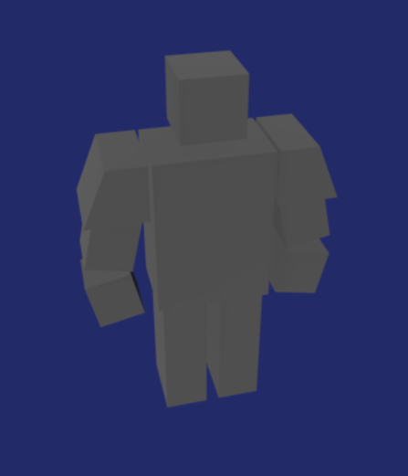

Lowpoly 模型要“精致”，关键是要能视觉上分割模型的各个部件。避免出现大片相同颜色的区域，因为这样将在视觉很难区分，不仅单调而且增加大脑的负担。极端情况，就是使用 unlit shader，只能看见模型的边缘外形，看不清模型的细节。

Lowpoly 本身是简化模型，只突出关键特征（部件），不突出模型细节，只需展示模型不同部分即可。不同的部件要很容易在视觉上独立，容易被区分。

例如下面的模型，很难区分各个部分

如果用白线描出各个边，则看起来好多了

类似四色原理，两个相邻部分尽量使用不同颜色绘制。或者中间留出空间。真实世界中这些空间会因为 AO 显示为黑色，这可以有效将模型部分分开。如果没有 AO，则可以在 Lowpoly Texture 中手动绘制 AO。

现实世界中，即使相同颜色的部件，因为部件之间的空间，和光照，很容易突出部件的各个组件。因此在游戏中也应该注意使用光照来让模型的部件区分开来，尤其是 AO。

将模型逻辑上划分为不同的组件、部分。每个部分在视觉上区分开。另外即使单个部分，如果是很大的区域，也应该添加一些细节，不要现实为单一纯色区域。

可以参考现实世界中的乐高模型，即使使用非常少的颜色，也可以得到很好的结果。注意调整场景光照，尤其是 AO 和阴影。

如果不知道怎么给模型上色，可以参考乐高模型。

