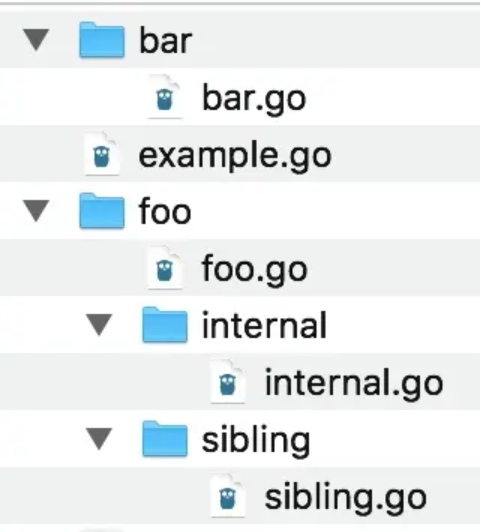
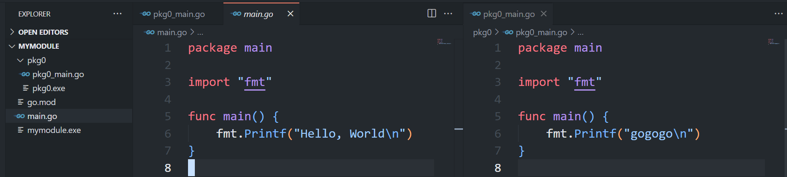
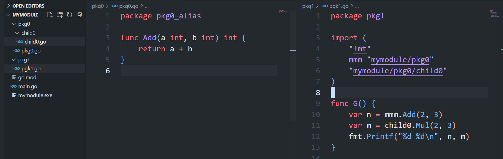
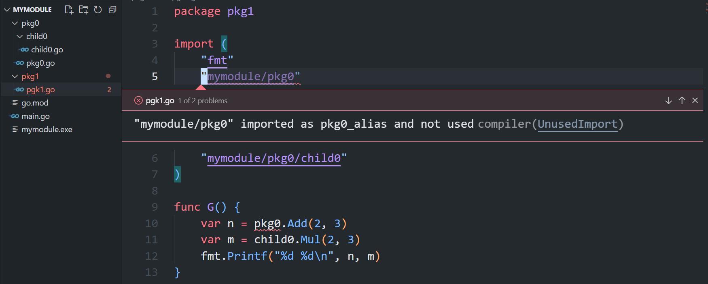
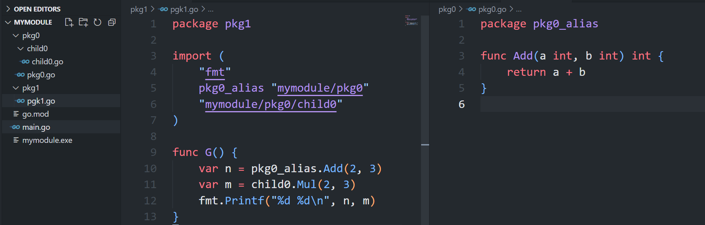
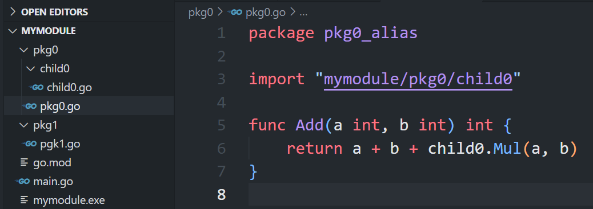
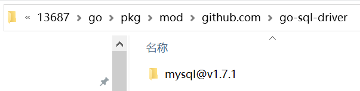

# Golang 模块

通常一个项目（工作空间，workspace）包含多个模块，一个模块包含多个包，要给包包含多个文件。

模块是带有 go.mod 文件的目录。工作空间是带有 go.work 文件的目录。 

go work 提供了项目（工作空间）的支持，go mod 提供了模块的支持。

创建项目步骤：

```sh
mkdir <workspace> && cd <workspace>
go work init
mkdir <module> && cd <module>
go mod init <module_id>
cd <workspace>
go work use <module_dir>
```

go work use 告诉 go，use 的模块在在构建时应该是 main modules，这样在 workspace 的任何子目录下这个模块都是 active 的。就是一个 module 可以直接引用 workspace 下的另一个模块（这是 local 模块之间的引用），无需再通过 go.mod 的 replace 指令来实现 local 模块之间的引用。

go.work 可以代替 go.mod 中 replace 指令，来在多个 local modules 之间工作，例如在一个模块中改变它，然后在另一个模块中使用。

模块是一组包的集合，一个包是一个目录下所有源文件暴露内容的集合。源文件名无关紧要，没有约定，可以使用任何文件名。源文件只是为包提供内容的。

模块名和模块目录没有必然关联，包名和包目录也没有必然关联，它们彼此都可以是不同的。但通常会让它们一致，这样可以让我们浏览模块内容时，保持一致的思维，不必引入不必要的麻烦。

通常在 github 上托管和发布模块，会使用 github.com/username/repository 作为模块的唯一标识，即其他模块可以使用这个路径唯一指定应用这个模块。其中 repository 就是模块名。当使用 go get 下载导入一个这样的模块时，会从 github 上下载相应的仓库，并保存在 GOPATH 目录下，就按照模块的路径组织目录。

import 引用的是包，不是模块，但是需要指定包的完全限定名，这样就要包含模块的路径。Go 中 import 包的路径和目录路径一样，使用 / 分割。

Go 包中源文件中小写开头的私有，对外不可见的，大写开头的是到处的 API 内容。

模块中有一个特殊的包：main 包。它是模块作为 standalone 程序的入口。要编写 standalone 程序，就需要创建一个目录，或者就是用模块的根目录，作为包的目录，然后它里面的某个源文件包含 main 函数，作为入口函数，源文件名没有必然的要求。

Go 编译器将所有的模块，模块中所有的包都编译到一个单元，模块名、包名，本质上都是名字空间作用，为每个到处的 API 前面加上限定名。

import 一个包时，使用完全限定名，在 code 中使用包时，只需使用包名（完全限定名最后一部分）。如果两个包的模块不同，但是包名相同，就会导致包名冲突，code 中引用这个包名就会不知道引用的是哪个包。此时应该使用别名避免包名冲突。

包中只有大写开头的才是导出内容，小写开头的只在包内可用。但是有时候我们希望一些包在模块内可以被其他包访问，但是对模块外不可见，例如将一些共享的函数、常数、类型放到一个包中，此时不能将这些内容变成小写开头，否则就不能被其他包访问，但是变成大写开头又会被模块外看见。此时就可以使用 internal 包。internal 包中的内容只可以在包含它的直接父包和兄弟包访问，就是从和它同级的文件和目录开始才可见。



foo 包中的 foo.go 和 sibling 包中的 sibling.go 都可以访问 internal 包中的 internal.go。但是 bar 包中的 bar.go 或根包中的 example.go 则不能，编译器会报错。

internal 和 main 是 go 中两个特殊的包。main 的特殊之处是 go 会将它构建为一个可执行程序。和 internal 一样，模块中可以有多个 main 包，只要它们的路径不同即可，这与普通的包是一样的，可以重名，但是路径必须不同，那就是不同的包。每个 main 包都可以构建为一个可执行程序。库模块中包含一个或多个工具应用并不罕见。

Go 的特色就是编译快，像脚本语言一样，不必像其他静态语言必须先构建在运行，可以从源代码直接构建运行。为此，Go 不允许在包之间循环依赖，即 A 直接或间接引用了 B，B 不能再直接或间接引用 A。如果两个包彼此之间循环依赖，很可能它们应该合并到一个包中。这时在模块的根中创建一个 cmd 目录。在 cmd 中，为每个从模块中构建的二进制创建一个目录。例如，可能有一个模块包含web应用以及分析web应用数据库中数据的命令行工具。在每个目录中使用 main 作为包名。

例如这个模块中，模块跟目录有一个 main 包，pkg0 目录下也有一个 main 包，它们都可以构建为可执行程序：


同一个目录下所有源文件必须 package 到同一个包中，否则编译器就会报错。

通常应当让包名与目录名一致。如两者不一致就很难知道包名是什么。但是，有一些场景会要求使用的包名和目录名不一样：

- 第一种我们一直在做，可能都没意识到。那就是声明Go语言入口的包，包名为main。因为不能导入main包，这并不会产生导入语句的困扰。
- 包名与目录名不一致的另一个原因不那么常见。如果目录名称中包含的字符不是合法的Go标识符，那么就需要选择一个与目录名不同的包名。本例中，format不是有效的标识名，所以使用format替换。最好避免创建不是有效标识符的目录名。
- 最后一个原因是使用目录来支持版本。

看起来 go 中 import 时指定的是 package 的路径，而不是 package 的名字。例如这里 pkg0 目录下的源文件被打包为 package 为 pkg0_alias 这个名字。但是 import 的时候，仍然使用的是包的路径 pkg0，而且要在 import 时给它指定一个别名：


如果不指定别名，编译器就会报错：


而 IDE 默认会使用 pkg0_alias 作为别名：


父包和子包只是代码组织时目录有父子关系，在代码中，子包引用父包，父包引用子包，兄弟包之间引用，以及任何包以用第三方包，都需要指定包的完全限定名，没有相对引用这样的东西，这些包都是平级的：



## 发布模块

要发布模块，只需要生成一个模块仓库的 release，然后为它打上标签 tag。使用 go get 下载远程模块时，可以使用 @ 指定要下载的模块的版本，例如：

```sh
go get github.com/go-sql-driver/mysql@v1.7.1
```

下载的包会存储在 GOPATH 的路径下，并且模块名最后添加上了 "@version_number"。



## 最佳实践

- 一个仓库只管理一个模块，不要管理多个模块
- 模块名、包名都是小写，导出的 API 首字母应该大写
- 包名应该是名词，到处的函数是动词，就像对象和方法一样
- 使用别名避免导入的两个包名冲突
- 如果模块仅用于要给 standalone 应用，则让模块的根目录为 main 包。模块的根目录也可以作为一个包目录，通常就用作 main 包。目录下所有源文件都应该 package main。main 包应该最小化，将逻辑都放在 internal 包中，main 函数中只添加调用 internal 的代码，这样可以保证没人创建依赖于这个模块的模块
- 如果模块用作库向外分发，模块的根目录应该和仓库名一致
- 总而言之，Go 社区倾向使用约定而不是配置，尽可能保持模块名和模块路径一致，包名和包路径一致，这可以让代码更容易理解，而这正是 Go 的目标。如果无法达成，尽量修改冲突的另一方，而保持这个约定
- 使用 go workspace 在多个 local 模块间协作
