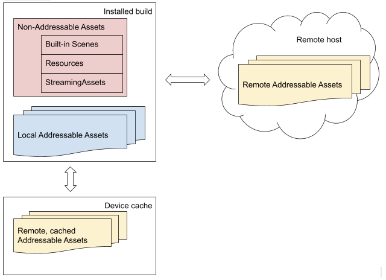

# 简介

Addressables package 提供工具和脚本组织和打包应用程序的内容，以及在运行时加载和释放 assets 的 API。

当你创建一个 AA（asset Addressable），可以从任何地方使用这个 asset 的地址 address 加载它。无论 asset 在本地应用程序内，还是在 CDN 中，Addressable 系统可以定位并返回它。

采用 Addressables 系统可以帮助你在以下领域改善你的项目：

- 灵活性：Addressable 可以让你灵活地调整在哪里放置你的 assets。你可以将它们安装在应用程序中，或者按需下载。你可以在项目的任何阶段改变从哪里访问一个特定的 asset，而无需重写任何 game code。
- 依赖管理：系统自动在系统返回内容给你之前，加载你要加载的任何 assets 的所有依赖，即所有的 meshes，shaders，animations，和其他 assets。
- 内存管理：系统自动卸载、加载 assets，并计算引用计数。Addressables 包还提供了一个 Profiler 来帮助你定位潜在的内存问题。
- 内容打包：因为系统映射和理解复杂的依赖链，它可以高效地打包 AssetBundles，即使你移动或重命名 assets。你可以同时为 local 和 remote 部署准备 assets，来支持 DLC（downloadable content），以及减少应用程序大小。

## 概念

- Addressables tools

  Addressables 包有一些 windows 和 tools 可以用了组织、构建，和优化你的 content。

- Asset Address

  一个 string ID，标识一个 Addressable asset。可以使用它作为一个 key 来加载这个 asset。

- Asset loading and unloading

  Addressables API 提供它自己的用于在运行时加载和释放 assets 的功能。

- Asset location

  一个运行时 object，描述如何加载一个 asset 和它的依赖。你可以使用一个 location object 作为一个 key 加载 asset。

- AssetReferences

  一个你可以用来支持将 Addressable assets 赋值给 Inspector window 中的 fields 的类型，就像 SO 架构的各种 scriptable object 一样。AssetReference 类还提供自己的 load 方法。

- Content builds

  作为一个单独的步骤，在你构建一个 player build 之前，使用一个 content build 来收集和打包你的 assets。就像 AssetBundles 的 build 脚本。

- Content catalogs

  Addressables 使用 catalogs 映射你的 assets 到包含它们的 resources。

- Dependencies

  一个 asset dependency 是一个 asset 被另一个使用，例如一个用在 scene asset 的 prefab，或者一个用在 prefab asset 的 material。

- Dependency 和 resource 管理

  Addressables 系统使用引用计数来跟踪哪些 assets 和 AssetBundles 正在被使用，包括系统释放加载或卸载了依赖。

- Group

  你在 Editor 中将 assets 指定到 groups 中。Group settings 配置 Addressables 如何打包 group assets 到 AssetBundles 中，以及它如何在运行时加载它们。

- Key

  一个标识一个或多个 Addressables 的 object。Keys 包括 addresses，labels，AssetReference 实例，和 location objects。

- Label

  一个 tag，可以被赋予多个 assets，并用来将相关资源作为一组一起加载。

- Multiple platform support

  build system 对不同的平台分别进行内容构建，并在运行时解析正确路径。

默认 Addressables 使用 AssetBundles 来打包 assets。你还可以实现自己的 IResourceProvider 类来支持其他访问 assets 的方式。

## Asset addresses

Addressables system 的一个关键特性就是你为 assets 指定 addresses，并使用那些 addresses 在运行时加载它们。Addressables 资源管理器在 content catalog 中查找地址，来找到 asset 存储在哪里（本地还是远程）。Assets 可以构建到你的程序中，本地缓存中，或者存储在远程。资源管理器加载 asset 和任何依赖。

- Remote host 存储远程 Addressable Assets
- Local 存储本地（和应用程序一起打包的）Addressable Assets
- Device cache 设备上（应用程序之外，本地）保存 Remote 或 Local Assets 的缓存
- 应用程序内其他的 Assets 不是 Addressable，包括 Built-in Scene 内的 Assets，Resources 文件夹内的 Assets，Streaming 文件夹中的二进制数据。

Addressable 通过地址加载 assets，无论它们在哪。

因为地址不绑定到 asset 的物理位置上，你有一些选项来管理和优化你的 assets，无论在 Editor 中还是在 runtime 中。Catalogs 映射 addresses 到物理位置。

尽管为 assets 指定一个唯一地址是最佳实践，一个 asset address 不必须是唯一的。你可以将一个地址指定给多个 assets。例如，如果你有一个 asset 的 variants，你可以将同一个 address 指定给所有这些 variants，并使用 labels 来区分 variants：

- Asset 1: address: "plate_armor_rusty", label: "hd"
- Asset 2: address: "plate_armor_rusty", label: "sd"

Addressables API 方法

The Addressables API methods that only load a single asset, such as LoadAssetAsync, load the first instance found if you call them with an address assigned to multiple assets. Other methods, like LoadAssetsAsync, load multiple assets in one operation and load all the assets with the specified address.
