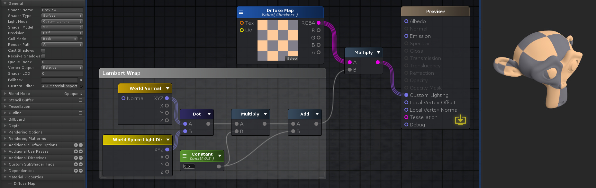

# ASE

## Editor

- 在Node Properties中命名Shader名字，通过正斜线/添加category
- 文件名和shader名可以不一样

## Canvas UI

- Node Properties面板调整当前选择的Node属性。默认显示OutputNode属性
- 手动/自动更新Shader
- 移除未连接的nodes
- 在文本编辑器中打开创建的shader
- Select & Focus Output Node
- Focus选择的nodes，如果没有选择任何nodes，将focus整个node网络
- F键自动zoom
- Node Palette面板显示可用的Node列表
- Node Properties和Node Palette面板都可以最小化，只留下工作区间
- 右键单击弹出上下文菜单式Node List
- 按住shortcut点击Canvas任何区域创建一个新node，shortcut显示在Node List中Node名字前面
- 如果Node Input Ports没有输入连接，ASE将使用内部默认值，默认值在Node属性面板中调整

## Material And Shader Mode

- shader或者material模式，依赖从shader还是material加载的shader
- shader：绿色边框，blue：蓝色边框
- 将material想象成shader的不同实例

## Output Node

- 直接引用Unity Shader Reference文档

### 通用属性

- Shader Name：shader的路径和名字，使用/定义种类，与shader文件名不一定相同，这是显示在material的shader选择列表中的名字
- Shader Type：项目中可用的shader模板。ASE预设的模板包括post process effects，particles，sprites，UI，unlit shader，surface shader，默认是surface shader
- Light Model：定义表面如何反射光照。ASE提供了Standard（Metallic），Standard Specular，Lambert，Blinn Phong和自定义光照（基于node构建特定的光照函数，光照就是一个shader函数）
- Cull Mode
- Render Path
- Cast Shadows
- Receive Shaders
- Queue Index
- Vertex Output：默认relative，可以是absolute，此时Output Node的Local Vertex Offset自动变成Local Vertex Position

### Standard Shader Input Ports

- Albedo：shader表面的基础颜色，接收color或texture
- Normal
- Emisssion
- Metallic/Specular/Smoothness/Ambient Occlusion/Transmission/Translucency/Refraction（TODO）
- Opacity（Transparent Render Type）：透明度
- Opacity Mask：cut off透明度，0完全透明，大于0完全不透明
- Local Vertex Offset（Relative Vertex Output）：通过位移在局部空间调整vertices的位置
- Local Vertex Position（Absolute Vertex Output）：通过位移在世界空间调整vertices的位置
- Local Vertex Normal：偏移顶点法向量
- Tessellation：Tessellation允许mesh三角形的子划分，将它们在运行时划分成更小的三角形以增加给定mesh的surface细节
- Debug：生成一个preview shader，其忽略所有其他激活的input ports，只绘制插入到它的input port的颜色，不考虑光照。不是所有nodes，或者特定组合可以在debug mode预览

### Blend Mode属性（混合模式）

- Blend Mode：预制的一些混合模式（Opaque，Masked，Transparent，Translucent，Alpha Premultiplied），选择一种模式时自动将下面的参数调整为相应值。Custom则自定义混合模式，手动调整混合参数
- Render Type：RenderType tag。将shader分类为若干组（Opaque，Transparent，Transparent Cutout，Background，Overlay，Tree Opaque，Tree Transparent Cutout，Tree Billboard，Grass，GrassBillboard）
- Render Queue：优化物体的绘制顺序。Render queues将物体按照距离排序，从远到近地绘制。可选项Background，Geometry，Alpha Test，Transparent和Overlay。每个队列在前一个队列后面绘制，创建一个层次系统
- Mask Clip Value：不透明alpha的比较默认值，小于等于这个值的完全透明，大于这个值的完全不透明。默认为0。通常用于Transparent Cutout材质
- Refraction Layer：当指定这个值时，grabpasses将以这个值偏移，为refraction效果创建了一个layered system
- Alpha To Coverage（TODO）
- Blend RGB and Blend Alpha：当图形被渲染时，在所有Shaders被执行以及所有纹理被应用之后，像素将被写入到屏幕上。它们如何与以及存在的像素混合是通过Blend command（op）控制的。ASE提供了Custom、Alpha Blend、Premultiplied、Additive、Soft Additive、Multiplicative、2x Multiplicative模式
  - Blend Factors（SrcFactor & DstFactor）：下面所有属性对Blend command的SrcFactor和DstFactor都有效。Source引用要写入的颜色，Destination引用当前以及存在与屏幕的颜色。如果Blend Op使用逻辑运算符，Blend Factors被忽略
    - One：1，让Src或Dst等于1
    - Zero：0
    - SrcColor：既可以用于Source Color，也可以用于Destination Color
    - SrcAlpha
    - DstColor：既可以用于Source Color，也可以用于Destination Color
    - DstAlpha
    - OneMinusSrcColor
    - OneMinusSrcAlpha
    - OneMinusDstColor
    - OneMinusDstAlpha
  - Blend Op RGB & Blend Op Alpha：Add，Sub，Rev Sub，Min and Max
- Color Mask：写通道掩码，只写入部分通道

### Stencil Buffer属性

通用目的逐像素掩码，保留或舍弃像素。每像素可以写入8位byte。这个值可以写入、增加、减少。之后的draw call可以测试这个值，来决定像素是否应该在执行片段着色器之前被舍弃。当Cull模式设置为Off，这个菜单显示额外的比较选择，为front和back分别使用不同的buffer

- Reference：与要写入buffer的值进行比较的值（如果Pass、Fail、ZFail设置为replace）（Comp != always），0～255
- Read Mask：将要比较的两个值进行掩码操作（Reference Value & readMask） comp （stencilBufferValue & readMask）
- Write Mask：写入buffer时对值进行掩码
- Comparsion（front and back）：用于比较reference value和buffer的当前值的操作，默认always
- Pass（front and back）：测试通过时的行为（keep）
- Fail（front and back）：测试失败时的行为（keep）
- Pass（front and back）：stencil测试通过，depth测试失败时的行为（keep）

### Tessellation属性

- 曲面细分
- Phong：修改subdiviced faces的位置使得结果surface更加遵循mesh的法向量一点（0～1）
- Type：使用的细分技术，Distance Based，Fixed，Edge Length，Edge Length Cull
- Tess：细分系数，1～32
- Min：最小细分距离
- Max：最大细分距离
- Edge Length：开始细分前edge可以具有的最大长度
- Max Disp（TODO）

### Outline属性

使用inverse hull（反转外壳）技术创建一个可自定义的outline效果

- Mode
  - Vertex Offset使用一个值偏移外壳
  - Vertex Scale使用一个百分比偏移外壳
- Color：定义outline的颜色
- Width：offset或者scale的值

### Billboard属性

- Type
  - Cylindrical类型的billboard只绕着Y轴旋转
  - Spherical类型的billboard总是朝着相机旋转
- Ignore Rotation：忽略billboard transform旋转

### Depth属性

- ZWrite Mode：控制物体的像素是否写入到depth buffer（默认on）。对于不透明物体on，对与透明物体off
- ZTest Mode：深度测试如何执行。默认LEqual，ASE提供Less，Greater，LEqual，GEqual，Equal，NotEqual，Always
- Offset：允许使用两个参数factor & unit指定一个depth offset。可以强制一个polygon绘制在另一个上面即使它们具有相同的位置
  - Factor：缩放最大的Z slope，考虑polygon的X或Y
  - Units：缩放最小可分辨深度值

### Rendering Options属性

- 可选开启或关闭一些shader特性

### Rendering Platforms属性

### Additional Includes属性

### Additional Pragmas属性

### Custom SubShader Tags属性

- 自定义shader tags

## Material Properties属性

### 引用自定义属性

一些特定shader选项例如Cull Mode或者Stencil，也可以被shader properties（具体地说是Ints和Floats）配置，而不是使用它们的预定义值

在Canvas中定义个Property，在属性面板的选项中选择引用这个属性，而不是在属性面板设置默认值

## Shader Functions

- 单独的node networks
- 构建可重用函数
- SF **asset**不绑定在任何shader，可以在project中任意使用，甚至可以与他人共享
- 简化Canvas，将复杂network打包进一个node，这与编码中的函数是一样的（不仅仅是为了重用，还为了可读性）
- Features
  - 可使用所有ASE节点
  - 可配置Input/Output节点
  - 在Shader和SF直接可以复制粘贴nodes
  - 可重用的独立资源，不绑定任何shader或者project
  - 无缝编辑器工作流，可拖放到任何打开的shader，或者将其加入Node列表
- 创建SF资源
  - Assets/Create/Shader/Amplify Shader Function
  - 在ASE编辑器中打开SF资源
  - 添加Function描述，调整Inputs/Outputs/Material Properties顺序
  - 通过Node List中的Function/Input和Function/Output添加输入输出端口。可以添加其他的SF，但是不能添加自己以避免无限循环
  - 选择一个输入节点，设置参数类型
    - 开启Auto Cast选项可以在左侧的tab中自定执行此过程
  - 连接结果到输出节点
  - 保存修改，点击Return回到之前打开的Shader或Material
- 使用SF资源
  - 从Node List中选择。SF节点就像任何ASE节点一样使用
  - 直接将SF资源拖放到Canvas
  - 双击打开SF编辑器

## Translucency（半透光）

Translucency提供了一个模拟光线散射的快速方法。它不是真实的模拟方法，但是是灵活和快速的近似。

参数

- Strength：效果强度系数
- Normal Direction：定义法向量失真distortion的程度
- Scattering Falloff：散射下降曲线指数（从中心向四周呈多大区域散射）
- Direct：直接光对translucency效果的影响程度
- Ambient：全局光照/环境光对translucency效果的影响程度
- Shadow：Self-shadowing对translucency效果的影响程度，在shadows区域减少效果

## 自定义光照模型

ASE允许创建自定义lighting model shaders。这些仍然是unity surface shaders，它们允许替换unity的光照函数。在ASE中，这意味着你可以设置Light Model为Custom Lighting。这样做的话，将导致Output Node只包含emission和opacity端口（其他端口例如Normal,Specular, Gloss, Transmission, Translucency, Refraction, Opacity, OpacityMask都被关闭，因为它们都是内置光照函数用来计算最终物体的光照颜色的。如果自定义光照的话，这些参数就都不使用了，因此就不必连接它们了）

使用这个功能，可以利用已有的节点和额外的光照节点为特定目的创建一个优化和裁剪的shader。shader是逐物体应用的，因此自定义光照的shader只影响使用它的物体

下面的图显示如何创建一个包含简单的Lambertian的shader，可以被用在非常低端的平台上

