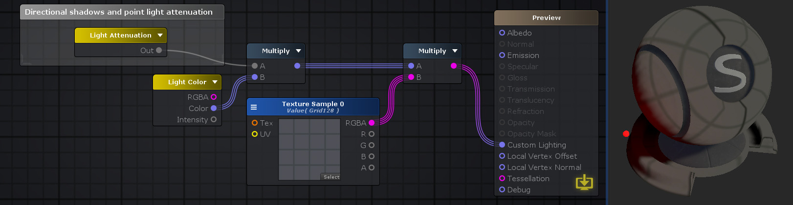
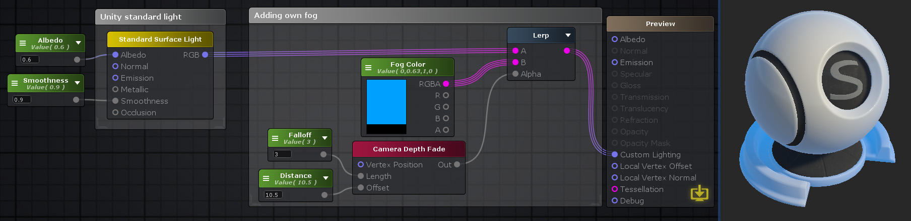

# Light

## Fog And Ambient Color

输出关于fog和ambient light的特定数值。需要的数值通过Color选项指定。

Color

- Sky Ambient Light
- Equator Ambient Light
- Ground Ambient Light
- Fog

## Fog Params

输出fog参数用于fog计算

- Density/Sqrt(Ln(2)): Exp2 fog
- Density/Ln(2): Exp fog
- -1/(End - Start): Linear mode
- End/(End - Start): Linear mode

## Indirect Diffuse Light

从Unity global illumination系统获取diffuse ambient light。等价于说它获取周围light probes的信息。只用于某些情况下自定义光照，因此只有在Light Model选项设置为Custom Lighting
时才有效

Normal Space

- Tangent：使Normal Port接收tangent空间法向量（内部转换为世界空间法向量）
- World：使Normal Port直接接收世界空间法向量

## Indirect Specular Light

从Unity global illumination系统获取specular reflections。等价于说它获取周围reflection probes的信息。只用于某些情况下自定义光照，因此只有在Light Model选项设置为Custom Lighting

### 参数

- Normal Space：Tangent/World
- Roughness：模糊反射结果的常量值。Roughness是Smoothness的补（R = 1 - S）。0意味着完全镜面反射，1意味着完全无光泽的材质
- Occlusion：闭塞，使反射结果暗淡的常量值

## Light Attenuation（衰减）

包含Unity光照和阴影信息。光颜色衰减程度。衰减考虑了光源的各种类型和距离等信息，因此只需要将这个factor乘以光照颜色就得到最终照射到物体表面的光照颜色

方向光衰减返回完全白色或黑色区域（没有任何衰减渐变）（物体或者被照亮，或者位于阴影中），随光源设置变化

点光源和spot光源还包含衰减渐变（smooth falloff），随光源设置变化

只包含强度衰减信息，不包含强度和颜色信息，通常与Light Color一起使用

Custom Lighting有效

连接Output Node的Custom Lighting端口执行自定义关照，端口上游使用各种光照nodes计算最终照射到表面的光照颜色

## Light Color

输出光照颜色RGBA，光照强度Intensity，以及二者的乘积Color

## Object Space Light Dir

输出物体局部空间坐标系中标准化的光照方向

方向光就是光源的方向，point和spot光源计算光源到像素的夹角

输出float3

## Shade Vertex Light

给出物体局部坐标系空间的位置和法向量，计算逐顶点光照和环境光

参数

- Vertex Postion
- Vertex Normal
- Light Amount(光照计算使用的最近光源的个数，0～8，默认4)
- IsSpotLight（光源是point还是spot，spot更消耗性能）

## Standard Surface Light

在Standard Surface Shader中，光照直接在Output Node中计算。当使用Custom Lighting时，需要手动计算光照。这个节点将Standard Surface光照计算过程封装在一个节点中，使得在自定义光照中可以执行这个过程。那些因为开启Custom Lighting而在Output Node中关闭的端口都成为这个节点的输入端口。可以在Workflow选项中选择使用Metallic还是Specular光照计算

## World Space Light Pos

根据光源类型，输出世界空间中光源的标准化光线方向向量或者光源位置

对方向光，Dir/Pos输出端口输出世界空间方向，Type设置为0

对于其他光源，Dir/Pos输出端口输出世界空间位置，Type设置为1

## World Space Light Dir

输出世界空间中光线方向的标准化向量

对于方向光，结果就是方向光的方向；对于其他光源，结果就是世界空间中光源和GameObject之间的方向