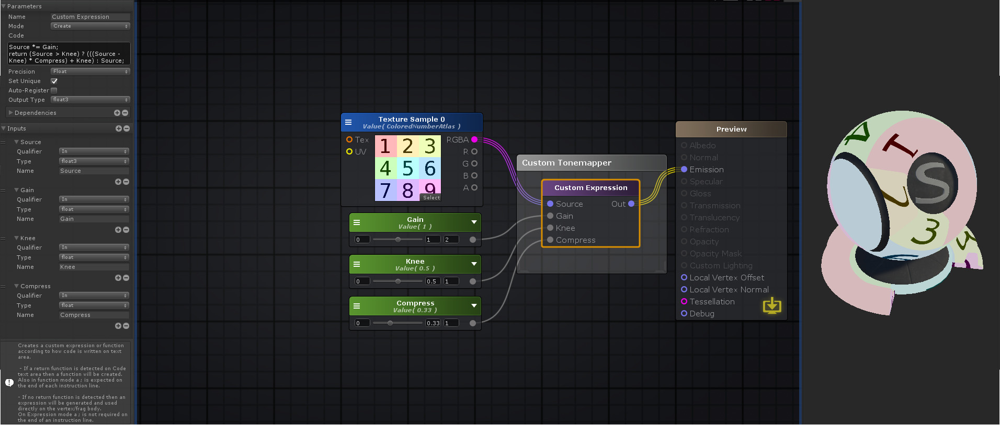

# Miscellaneous

## Billboard

选择vertex数据（position和normal），对齐object的axis到当前camera

这个node与其他nodes不太相同，因为它向vertex shader注入一些必要代码来直接写vertex的position和normal。它输出一个0值，使得它可以被直接连接到vertex port（only if relative vertex offset）（因为只有被连接的node才生成code，而输出0又不影响vertex的position），或者可以被用在Add节点因此接下来的vertex操作可以被放置

Type

- Cylindrical：只有X和Z axis和camera对齐（用来渲染tree等）
- Spherical：所有axis都和camera对齐

Ignore Rotation：object初始和camera axis的旋转偏移，可以被忽略或覆盖，或者可以被用来作为billboard最终计算结果的delta rotation

Billboard node最终只应该被连接到vertex ports上（中间可以包含其他计算节点）

## Color Space Double

输出可以被用来乘以到texture采样上的值使得总是可以输出正确的结果，而与使用linear还是gamma空间无关

## Custom Expression

允许shader code可以直接从graph中注入到源文件中。
根据code在Code text area中是如何写的，可以inline注入，或者创建一个function

function模式下，每一行必须以分号结束

expression模式下，生成一个表达式并直接在vertex/frag body中使用

在Node属性面板为节点添加Input Ports，在Code输入框输入包含自定义Input Ports的表达式

- Name：节点名字，被内部用来命名生成的中间变量或者函数
- Mode：决定如何使用Code文本框中的代码
  - Create：输入端口和Code中代码片段的结果直接赋给输出端口
  - Call：Code中放置的指令在shader body中inline放置，它们不被赋给任何东西。这对于调用声明在shader其他部分或者包含在其他cginc的函数非常有用
- Code：编写自定义表达式或函数的地方。根据指令是否包含一个return语句确定创建函数还是表达式
- Set Unique：将一个唯一id附加在function/variable名字后面，这样不同的Custom Expression可以又相同的名字，但内部使用不同但名字
- Auto-Register：即使输出端口没有连接，也注册生成的函数
- Output Type：新创建的表达式或函数返回值的类型，只有在Call模式关闭时有效
- Dependencies：指定表达式依赖的其他Custom Express Node，使得这些依赖node先生成
- Inputs：通过+添加新的输入，-移除输入，输入端口可以在表达式中直接通过名字引用它们
- Qualifier：为function mode下，每个输入端口（参数）添加类型修饰符
  - In
  - Out
  - InOut
- Type：Input端口的输入类型, int/float/float2/float3/float4/float3x3/float4x4/sampler1D/sampler2D/sampler3D/samplerCUBE
- InputName：输入端口的名字，内部用来命名中间变量或函数
- InputValue：输入端口的默认值，如果没有输入连接的话

## Decode Depth Normal

从编码过的Float4解码Depth（float）和Normal（float3）值

## Encode/Decode Float RG

## Encode/Decode float RGBA

## Decode Lightmap

## Encode/Decode View Normal Stereo

## Diffuse and Specular From Metallic

从Metallic获取Diffuse和Specular

- Input
  - Albedo
  - Metallic：用来获取diffuse和specular的metallic的值
- Output
  - Out（diffuse）：Albedo颜色乘以计算的One Minus Reflectivity
  - Specular
  - One Minus Reflectivity

## Distance-based Tessellation

通过Tessellation Factor、camera Minimum/Maximum Distance，根据使用shader的object到camera的距离设置tessellation

这个技术允许在运行时子划分mesh的三角形为更小的三角形，以便增加mesh表面细节。细分在Minimum处最高，在Maximum处最低。比Maximum更远时没有细分

使用这个node自动激活Master Node上的Tessellation选项，并设置Type为Distance-based。Shader Model自动设置为4.6，因为这是这个技术需要的最低shader版本

## Edge Length Tessellation

根据object三角形边在screen上的长度进行细分

类似Distance-based Tessellation，自动激活并设置Tessellation选项

## Edge Length Tessellation with Cull

类似Edge Length Tessellation，但是还执行frustum culling（消耗更多的性能），但是避免GPU对camera view之外的mesh部分执行Tessellation

## Get Local Var

允许访问通过Register Local Var创建的局部变量

Reference列出所有可用的局部变量，选择一个

## Layered Blend

将每个Layer端口的输入混合在Layer Base上，混合通过Weights端口指定的插值系数进行

Base Layer上进行blend的layer数量通过Weights端口输入的类型确定。例如一个Vector4连接到Weight端口，将有4个Layer可用。Base Layer将使用Weights.x与第一个Layer进行插值混合，结果作为后面的Layer的Base Layer，后面的Layer将依次使用y，z，w作为插值参数

If Layers are of different types and have different channel amounts then a cast is done for each to match the one with the most amount of channels.（TODO）

## LOD Fade

当使用LOD Groups时，这个节点输出level-of-detail fade值。

unity shader，ase shader通过uniform变量像shader传递了很多变量（像GameObject.transform，LOD Groups只能是被ASE内置传入，因为它们都是Shader应用层的数据，而不是shader定义的数据）。这些uniform变量就是shader中在vert/frag之外声明的变量，它们可以通过script设置，也可以暴露在材质面板中进行调整。像GameObject transform，LOD Groups这些数据毫无疑问是在Shader中定义的变量，但是没有在材质面板中出现，因此肯定是没有暴露在材质面板中，而是通过script设置的。

## Noise Generator

使用Type指定方法，根据UV输入，创建一个[0, 1]之间的float噪声

输入的数据必须在geometry表面上不同，因为相同的输入值产生相同的噪声值。简单的方法是将Texture Coordinates节点输入给它

噪声类型：Simplex 2D，Simplex 3D，Gradient

## Register Local Var Node

使用Var Name属性作为名字创建局部变量，将输入端口的值赋给它。之后局部变量可以通过Get Local Var访问。类型自动判定

## Relay

直接将input转发给output，但是它具有一个preview窗口，可以查看它当前连接的结果

## Summed Blend Node

类似Layered Blend，但是没有Base Layer，而是各个layer乘以各自的weight，然后相加在一起。

Weights.x*Layer1 + Weights.y*Layer2 +Weights.z*Layer3 +Weights.w*Layer4

## Switch by Face Node

当Cull Off时，根据face是面向camera还是背向camera的，切换不同的Input并将其转发给Output

## Vertex To Fragment

允许数据在vert中计算，并传递给frag并进行插值

## Weighted Blend

类似Summed Blend，但是输出平均和

( Weights.x*Layer1 + Weights.y*Layer2 +Weights.z*Layer3 +Weights.w*Layer4 )/ (Weights.x + Weights.y + Weights.z + Weights.w )
