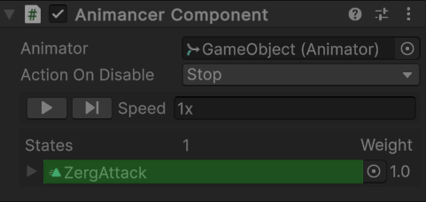
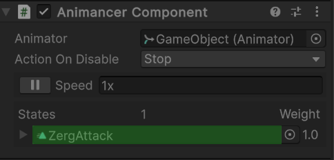

# Animancer

Animancer 维护一个 playable graph。PlayableGraph 是一个 playable 的有向图。每个节点是一个 Playable，相互连接整合，最后输出到一个节点 output 中。对于 Animancer 的 output 是 Animator。

Animancer 的 PlayableGraph 的 Playable 节点是 AnimancerState。AnimancerState 由 AnimationClip 创建。通常就是一个 clip 对应一个 state。Animancer 以 state 操作每个动画。state 可以指定一个 string key。播放 state 时可以使用 clip，也可以使用 key，它内部维护一个字典，记录哪个 clip 或 key 对应哪个 state。Animancer 播放动画时是使用 key 找到 playable state，然后在它上面 Evaluate，得到输出沿着 playable graph 向下路由直到 output。

State 的 stop 是 inactive 它的 playable，使得不会像 output 输出数据。

对于 Loop 的动画，State.NormalizedTime 自动在 0-1 之间循环。对于非 Loop 的动画，NormalizedTime 一直向后增长。

State 的 stop 状态，和 NormalizedTime 是两个独立的概念。State stop 后，NormalizedTime 可以在任何地方。如果 NormalizedTime > 1，即使 animancer.Play 再次播放这个动画，也没有动画效果，因此动画已经超过结尾，要得到动画，需要将 NormalizedTime 重置到 0. Animancer.Stop 可以同时将 state 设置为 stop 状态，以及将 NormalizedTime 重置到 0，这样下次播放就正常了。

Animancer 还需要 Layer，至少一个 Base Layer。使用 Animancer.Play 动画时如果还没有 Layer，会自动创建 Layer。

一旦 Animancer 开始播放动画，PlayableGraph 就始终向 output 输出数据，即使所有的 Playable 都 stop 了，graph 也会将当前的数据源源不断输出到 output。因为 graph 不知道也不需要知道哪些 playable stop 了，甚至是否所有 playable stop 了，它只是将自己当前的数据输出到 output。如果有变化的数据，output 就有变化，否则 output 就保持不变。这样，即使没有播放任何动画，gameobject 还是被动画控制，脚本对 gameobject 的改变会被覆盖。要停止动画系统对 gameobject 的控制，需要停止 output 向 gameobject 输出数据。这有两种方法：

- Animancer 的 output 的 Animator 组件，可以 disable Animator 组件
- Pause Animancer 的 playable graph。这通过 animancer.Playable.PauseGraph() 和 animancer.Playable.UnpauseGraph() 完成

Animancer Inspector 中的这个播放和暂停按钮就对应的是 Graph 的 pause 和 unpause。

AnimancerState 
