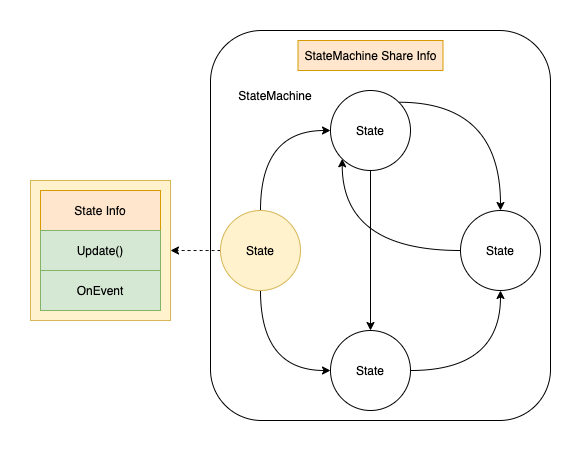

状态机核心工作就是维持一个当前 State。

State 通过 CanEnter CanExit 定义是否可以从当前状态进入，或者作为当前状态退出。这些条件定义 State 之间的 Connection。

有其他脚本根据发生的事件触发状态转换，即在状态机上调用 TrySetState。

每个状态有自己的数据（状态），因此每个状态需要单独定义一个类。StateBehavior 将一个 MonoBehavior 变成一个状态，这样可以直接拖放在 GameObject 上。

```C#
public interface IState<TState> where TState : class, IState<TState>
{
    /// <summary>Determines whether this state can be entered.</summary>
    bool CanEnterState(TState previousState);

    /// <summary>Determines whether this state can be exited.</summary>
    bool CanExitState(TState nextState);

    /// <summary>Called when this state is entered.</summary>
    void OnEnterState();

    /// <summary>Called when this state is exited.</summary>
    void OnExitState();
}
```

这个声明的意思是 IState 泛型类的定义需要一个参数 TState，这个参数用于成员函数的参数，例如 CanEnterState(TState previousState)，这需要参数类型和这个类本身的是一样的类型，或者它的子类，因此在 where 里指定类型参数 TState 需要是和这个类型一样的类型即 IState<TState>，或者是它的子类。Where 是定义这个 TState 类型参数的约束的，而不是定义这个类 IState 的约束的，它是再说这个类型 TState 是什么，而不是泛型类 IState 是什么。
 


状态机是一个非常简单的事，Animancer.FSM 感觉仍然复杂。

状态总是和时间相关的。函数式程序没有状态，总是提供一个输入瞬间给出输出，除了输入不依赖任何数据。状态则是在时间上持续的。任何数据只要在超过瞬间的时间上有效（无论一帧还是两帧，只要不是瞬间），就是状态。

状态就是在 > 0 的时间内有效的数据。

状态机本身就是一组状态集合，以及一个状态指针，指向当前 active 的状态。任何时刻状态机只有一个 active 的状态。每个状态有自己的状态数据，状态机本身还可以有一些所有状态共享的数据。

状态机数据 + 状态集合 + 状态指针 就是状态机的全部东西。

状态机的更新就是它的当前 active 状态的更新，所有其他状态都是睡眠的，不处理任何输入事件。Active 状态应该响应任何事件，并且每一帧 Update 进行 tick，以处理时间相关逻辑。在 Unity 中，可以在 tick 中查询 Input 事件已经任何事件（事件轮询），因此只需每帧 Update Active State 就可以了。

每个状态执行这个状态下需要执行的更新逻辑。

状态机由一组状态组成，任意时刻只有一个 state 激活并 tick，其他 states 都是睡眠的。

状态机最主要的特征就是状态转移。它定义了状态直接的连接（有向图），以及每个状态转移的条件。状态转移应该是在每个状态中自己定义的。状态转移涉及两部分：当前状态是否可以退出 CanExit（即当前状态已经不满足了），以及下一个状态是否可以进入（即下一个状态是否已经满足了）。每次 Active State tick 时，根据时间或事件，会改变状态数据，这些数据在一定范围内是满足状态定义的，超过这个范围当前状态就不满足了，因此当前状态需要退出。然后需要判断下面应该进入那个状态，即判断数据变化之后那个状态被满足了。判断当前状态退出和接下来状态的进入在逻辑上通常是紧密耦合的，因为它们定义了逻辑上的状态转移以满足功能需求。所以它们应该在同一个地方完成（CanExit 和 CanEnter 应该在同一个转移中定义）。因为当前只有一个 State 激活，因此就应该在 State 上完成，它根据时间或事件改变数据，如果判断状态不满足，就选择下一个满足当前数据的状态，然后将它变成 Active 的，自己变成 Sleep 的。

Animancer.FSM 的问题是：

- CanExit 和 CanEnter 被分开定义了，这就导致这个紧密耦合的逻辑需要在两个地方来做，可能会导致不一致
- State 只定义了 CanEnterState/CanExitState/OnEnterState/OnExitState，然后在 StateMachine 中设置了 SetState，似乎倾向于在 StateMachine 中执行状态切换的功能，State 只是被动的提供是否可以进入退出的判断方法，被 StateMachine 调用。但实际上 State 才是主动执行逻辑的地方，StateMachine 应该被动的调用来设置和保存当前 Active 的 State。因此 CanEnterState 和 CanExitState 不必保留，甚至不必定义，因为每次 State tick 时都要检测当前状态是否还满足，以及不满足时应该进入那个状态。当判断要执行状态切换时，将下一个状态设置为 Active State（设置指针）。对于退出的状态执行 OnExitState，对于进入的状态执行 OnEnterState。

正确使用状态机的方法是：

- 每个状态引用后继状态
- 每个状态引用状态机（或者一个指针，指向当前 Active 的 State，也足够用）
- 每次 tick 当前 Active State
- 每个状态 Update 时，更新数据，判断状态是否满足，如果不满足，选择下一个满足的状态，然后将它设置为 Active State
- 对退出的状态发送 OnExitState 事件，对进入的状态发送 OnEnterState 事件

向想上面说的，状态机本身是一个非常简单的事情，自己实现就没有问题。

Animancer.FSM 提供的状态机有些复杂，并且思路也有一些问题。

每种持续一定时间的恒定范围的数据就是状态。即如果一组数据在一定时间内总是处于一定范围，而它们在逻辑上都是一个单位，那这就是一个状态。一旦数据变化使得它们不能再在逻辑上视为一个单位，就应视为两个状态。
