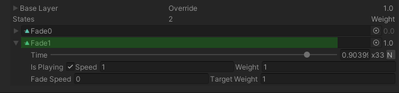

没有 Animancer，你需要引用一个 Animator 组件来控制动画，但是使用 Animancer，你可以引用 Animancer 组件。

Animancer 和 AnimatorController 是等价体，都是用来管理 PlayableGraph 的。Animator 用来处理最终的 PlayableGraph，无论 PlayableGraph 是通过 AnimatorController 还是 Animancer 制作的。

没有 Animancer，你需要创建一个 Animator Controller 来定义 animation states 和 transitions。但是使用 Animancer，你可以直接引用要播放的 AnimationClips（直接在 PlayableGraph 上创建 Node）。

```C#
[SerializeField] private AnimationClip _Idle;
[SerializeField] private AnimationClip _Action;

/*
Play 方法返回 AnimancerState，它管理那个动画，使得你可以访问和控制运行时动画的各种细节，例如
state.Time = 1; // 跳过动画中的 1s，直接调整播放指针
state.NormalizedTime = 0.5f; // 跳过动画的一半
state.Speed = 2; // 以 2 倍速播放动画
*/
var state = _Animancer.Play(_Action);

// 当动画结束时，调用 OnActionEnd 
state.Events.OnEnd = OnActionEnd;

private void OnActionEnd()
{
    // 现在 action 以及播放完了，但是相比于立即对齐到新动画，这里让它在 0.25s 中平滑地 fade in，使得它可以平滑过渡
    _Animancer.Play(_Idle, 0.25f);
}
```

## playing 和 fading 动画的方式

Play 方法在 fadeDuration 时间内 fading in 新的动画，同时 fade out 同一个 layer 的所有其他 states，返回 state。

State.NormalizedTime、State.Time、State.Events.OnEnd 都不管循环，前二者会随着时间一直增长，需要对 State.Length 时间长度求余才能得到在一个 loop 中的位置。onEnd 在第一个 loop 结束时就会调用，并且之后每一帧都会调用它，包括后续的 loop。

Animancer 在一个 Sequence 中记录事件序列，这是和动画数据分离的资源，这样使得事件序列可以在不同的动画中共享。

State.Events 就是一个 Sequence，它包含一系列 AnimancerEvent。每个 AnimancerEvent 是一个 Struct，包含一个 normalizedTime 和一个 callback（System.Action）。OnEnd 是 State 上的一个特殊 AnimancerEvent，被单独处理。

OnEnd AnimancerEvent 的 normalizedTime 定义了 end 事件触发的时间，它也可以通过 State.NormalizedEndTime 来访问和设置。

普通的动画事件（使用脚本通过 State.Events.Add 添加的以及动画片段中定义的）会考虑 loop，在每个 loop 中都会调用。例如，如果你想定义一个每个 loop 结束都执行的事件，则使用普通的 Events 定义就可以，然后将 normalizedTime 设置为 1. End 事件不考虑循环，只会在第一个 Loop 中执行一次，并且之后每一帧都会被调用。如果第一个 Loop 还没有到 NormalizedEndTime，新的 State 就开始播放，则当前 State 的 End 事件和普通事件一样被清除，不会被调用。

如果 layer 当前 AnimancerNode.Weight = 0，这个方法将会 fade in 这个 layer 自身，并且简单地 AnimancerState.Play(AnimationClip) 这个 clip。一个动画贡献数据的权重 = layer.weight * state.weight。如果 layer.weight = 0，即这个 layer 当前就没有贡献权重，则在这个 layer 上播放一个动画，直接将 state.weight 这是为 1，然后 fade layer 本身。

动画 State 一旦播放完成就没有用了，保持它的数据也没有意义（包括动画事件）。可以认为逻辑上，一个 State 完成之后就销毁了，尽管它可能被缓存。即使它被缓存，并在之后重新返回，逻辑上也是重新创建的，之前注册的事件不一定有效也不一定有意义。因此需要在 State 每次创建之后都需要注册事件。

像这里展示的一样，每次播放一个新的 State 都重新注册动画事件。这是对于 Script 注册的事件，但是因为就是一段代码而已，因此对于开发也是只注册一次，只是在运行时会每次重新注册而已。对于 AnimationClip 中在 Inspector 中注册的事件，每次 Play(Clip) 时，Animancer 自动为创建的 State 重新注册事件。总而言之，就是 State 事件在运行时每次都重新注册。

End 事件的时间是可以配置的，默认就是在动画真正结束的时刻，但是也可以提前一定时间。如果 End 时间向前配置了一点，如果动画 State 还在维持正常播放，End 时间线之后每一帧都会调用 End 事件，保证不会 miss End 事件。但是就像这里展示的一样，End 事件中通常会播放一个新的状态。但 Play 一个新的状态时，这个 State 就开始了，成为当前 State，之前的 State 就结束了，State 结束时，会清除 State 上的所有 Events，因此 End 也只执行一次而已。一旦进入新的 State，原来的 State 就只剩下 fade out 残余痕迹，没有任何影响了，就像是被丢弃了，让它自己完成自己的 fade out，自生自灭。

当 Play 一个动画时，这个 State 就立刻变成当前 State，之前的 State 立刻就被丢弃了（State 被丢弃的时刻 Event 立刻被清理掉），被丢弃的 State 只会留下一些 fade out 的痕迹，它在 fadeDuration 时间内权重过渡为 0. 旧的 State fade out 和新的 State fade in 是两个完全独立的过程，唯一的联系就是 fadeDuration 是相同的。Play 的过程基本就是：

1. 清理之前 State 上的 Events（包括 OnEnd）。在 fadeDuration 将它 fade out，这个过程不考虑之前 State 剩余的时间以及动画是否是循环的，总之 State 仍然会正常播放：
   - 如果它是循环的，依旧循环播放
   - 如果不是循环的而且剩余时间小于 fadeDuration，在到达最后一帧之后，后面始终输出最后一帧的数据

   无论哪种情况，weight 总是会在 fadeDuration 时间内过渡到 0，只有在 fadeDuration之后，这个 State 才会完全被丢弃。这在 Animancer 组件的在 Inspector 上的 UI 可以看得到。

2. 开始新的 State，并且 State 在 fadeDuration 时间内 fade in。不管之前的 State 如何，这两者是完全独立的。例如如果之前的 State 的 NormalizedEndTime = 1，在它结束时立刻调用 Play(newClip, 0.25f)，之前的 State 总是会在 0.25s 内 fade out（无论是继续 loop 还是 freeze 到最后一帧），新的 State 则会在 0.25s 内 fade in。

新 State 的 fadeDuration 为之前的 State 定义 fadeout 时间，为新的 State 定义 fadein 时间。




Animancer Inspector 在运行时可以显示 debug 信息，用于查看 Animancer 内部的状态。

动画系统由 Layer 组成，每个 Layer 由 States 组成，Layer 和 State 信息都会在 Inspector 中显示出来。

- 立即从前一个 pose 对齐到新 action 的 start

  _Animancer.Play(_Action)

  如果 action 已经被播放了，它将从当前位置继续播放。但动画结束后，它将会冻结在最后的 pose 上，即 State 始终输出动画文件的最后一帧作为当前状态

- 当 action 动画完成后播放一个 Idle 动画

  _Animancer.Play(_Action).Events.OnEnd = () => _Animancer.Play(_Idle)

  无论何时一个新的 animation 被播放时，所有的 events 被自动清除。这确保上面的 Play 方法不用担心其他方法可能设置了自己的 events。

- 播放一个动画并确保从头开始，而不是从当前位置继续，如果这个动画当前正在播放

  _Animancer.Play(_Action).Time = 0

- 在 0.25s 中平滑过渡 action

  _Animancer.Play(_Action, 0.25f)

  CrossFade 总是有 Transition 后面的 State 定义，即新的 State 定义过渡时间。当播放新的 State 时，前一个动画无论在什么时间线，都在指定的时间内 fade out，而新的 State 在指定的时间内 fade in。

  最终的 fadeDuration 设置为指定的 fadeDuration 和前一个 State 剩余时间的最小值。

- 从 Start 执行 CrossFade 的不好做法

  _Animancer.Play(_Action, 0.25f).Time = 0

  和 PlayFromStart 不一样，当 cross fade 时，设置 Time 并不好，因为它阻止了前一个 pose 到新的动画的平滑过渡

  这里指的是从头开始播放一个当前正在播放的动画。这是因为这样 Play 会返回之前已经存在的状态，将它的 Time 设置为 0，就会立即将当前正在播放的动画重置到 Start

- 从 Start 执行 CrossFade 的好做法

  _Animancer.Play(_Action, 0.25f, FadeMode.FromStart)

  相反，我们可以使用 FadeMode.FromStart 来确保这是平滑的，即当前动画状态继续 fade out，然后这个动画另一个新的 State 从头开始 fade in。

- 从 Start CrossFade Action 然后播放 _Idle

  _Animancer.Play(_Action, 0.25f, FadeMode.FromStart)
    .Events.OnEnd = () => _Animancer.Play(_Idle, 0.25f)

## Sequence Coroutine

AnimancerState 还可以用在 Coroutine 中:

yield return state;

## NamedAnimancerComponent 组件

- 通过名字播放 animations

  _Animancer.TryPlay("Humanoid-Idle");

  这需要 animation 以及在 NamedAnimancerComponent 已经具有 state，在示例中已经通过 Inspector 中添加好了。

  如果它没有被添加，这个方法简单地不做任何事

- _Animancer.States.Create(AnimationClip)

  在运行时注册 AnimationClip 的状态。然后可以通过 clip.name 来调用。

  _Animancer.TryPlay(clip.name)

  也可以直接通过 clip 播放

  _Animancer.Play(clip)

  NamedAnimancerComponent 只是为 clip-states mapping 建立一个额外的 name-states mapping。NamedAnimancerComponent 本身是 AnimancerComponent 的子类。

## HybridAnimancerComponent

使用 HybridAnimancerComponent 在一个 character 上播放 RuntimeAnimatorController 中的动画和单独的动画片段。

HybridAnimancerComponent 是 NamedAnimancerComponent 的子类。

HybridAnimancerComponent 在自己的 Controller 字段中引用一个 AnimatorController Asset。AnimatorController 是 Mecanim 中的 AnimancerComponent，是另一种管理 PlayableGraph 中 States 的方法。HybirdAnimancerComponent 使用这个 AnimatorController 并提供了相似接口来操作 AnimatorController。注意这里 Animator 本身仍然不引用 AnimatorController 组件。Animator 只处理最终的 PlayableGraph。AnimancerComponent 和 AnimatorController 只用来操作 PlayableGraph。

```C#
HybridAnimancerComponent _Animancer;

AnimationClip clip;

_Animancer.SetBool("IsWalking", value);

_Animancer.Play("Run");

_Animancer.Play(clip);

_Animancer.PlayController(); // 播放 Controller 中的动画
```


