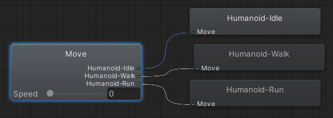
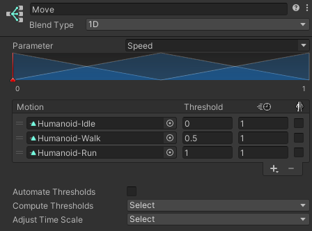
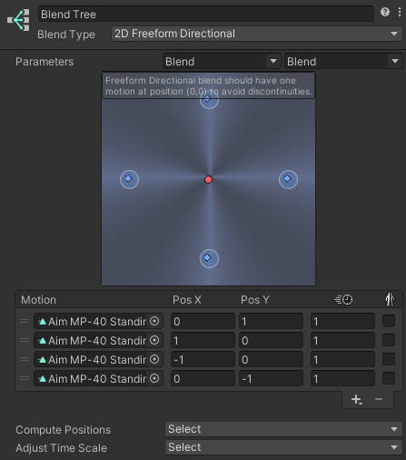
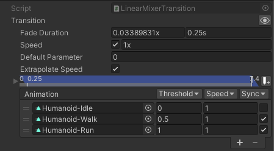

包装一个具有一个 blend tree 的 RuntimeAnimatorController 的到一个 Float1ControllerState 以更容易地控制它的参数。

```C#
[SerializeField] private Float1ControllerTransition _Controller;
```

- Float1ControllerTransition 引用一个 FloatControllerTransition Asset。
- 这个 asset 引用一个 AnimatorController asset
- 在 Inspector 中设置 FadeDuration，StartTime，EndTime，ParameterName
- Parameter Name 应用 AnimatorController 中的一个 float 参数名字，这里是 Speed
- Float1ControllerTransition 是一个 Transition Asset，可以在多个 Objects 中共享，我们不能再每次想要的时候简单地访问 _Controller.Transition.State，因为它只会保存最近播放的 state。因此在播放之后立刻保存 state
  ```C#
  _Animancer.Play(_Controller); // Play(ITransition)，播放一个 ITransition
  _State = _Controller.Transition.State;
  ```
  返回的 Float1ControllerState 包含对 RuntimeController 的引用，并可以访问参数 Parameter(speed)，对参数地访问将传递到 RuntimeController。
- 可以在 Inspector 上注册 EndEvent 回调函数
- AnimatorController 里面设置了一个 BlendTree，并通过参数 Speed 控制

  

动画系统中有 3 种混合：Fade(Transition)，Layer，和 Mixer。前两者概念都一样，Mixer 在 Mecanim 中称为 Blend Tree。

Mixer/Blend Tree：多个状态同时存在，基于一个或多个参数控制每个动画贡献数据的权重，类似于模糊逻辑。

Blend Tree 在 Unity 中有 4 种，不同类别具有不同的控制参数：

- 1D
- 2D
- Direct

这两个例子使用 ControllerTransition 引用 AnimatorController，然后在 Controller 中定义了一个 1D Blend Tree，使用一个参数 Speed 控制一组动画的混合比例，因此这个例子称为 Linear Blending。

1D 在 Inspector 中配置动画序列和每个动画的权重范围：



Animancer 中：
- LinearMixerState 等价于 1D BlendTree，用一个 float 参数控制一组动画的输出权重，每个动画有自己的权重范围
- CartesianMixerState/DirectionalMixerState 等价于 2D BlendTree，使用两个参数控制一组动画的输出权重，每个动画有自己在 2D 空间中的权重范围
  
- Direct BlendTree 不使用一组共同的参数控制所有的动画，而是每个动画可以单独选择自己的参数，最终 Unity 将所有动画的参数权重标准化(2, 3 => 0.4, 0.6)。Animancer 没有提供 Direct BlendTree 的对应 Mixer，可能是因为这种每个 State 使用一个参数控制权重在 Animancer 可以非常简单地实现，而在 Unity 中 Mecanim 不够灵活才专门提供了这样一个 Mixer。之所以提供 2D 版本的，是因为有一些 2D 方向计算的工作是共同的。

LinearMixerLocomotion 示例展示了使用 LinearMixerState 基于一个 Speed 参数混合一组动画。这和上面的 AnimatorController 中定义的 1D BlendTree 完全一样，但是使用的是 Animancer 的对应组件。

LinearMixerLocomotion.cs 引用了一个 LinearMixerTransition asset。



和 1D BlendTree 一样，可以在 Inspector 中定义动画列表和权重范围。

调用 Animancer.Play 并传递这个 Transition，就将这个 Transition 添加到了 Playable Graph，然后访问 transition.Transition.State. 因为这个 Transition 是一个 asset，可以在多个脚本中共享，因此它内部的 Transition 记录这最后一个 transition。再访问它的 State，就可以得到新创建的 LinearMixerState 了。然后通过这个 State 就可以访问控制参数了。这个参数不需要像 AnimatorController 一样需要在 Inspector 中指定，因为它只定义了一个参数。

```C#
[SerializeField] private LinearMixerTransition _Mixer;
private LinearMixerState _State;

private void OnEnable()
{
    _Animancer.Play(_Mixer);
    _State = _Mixer.Transition.State;
}
```

MixerState.Transition2D 是一个 serializable ITransition，当传递到AnimancerPlayable.Play(ITransition)，它可以创建一个 CartesianMixerState 或 DirectionalMixerState。

创建一个 movement state 但是先不播放它。

这确保我们可以实际播放时，在其他方法中访问 _MovementAnimation.State。播放时仍然通过 Animancer.Play(ITransition) 播放。

```C#
Animancer.States.GetOrCreate(_Move);
```

_Move.State 访问 Transition 创建的 State，Transition 被播放时或者 Animancer.States.GetOrCreate(ITransition) 时，创建 State，并在 Transition.State 字段引用这个状态。如果 Transition 引用的是 Asset，并在多个地方共享，即在多个 GameObject 的 Animancer 上调用 Play(Transition)，每次创建的状态都会覆盖之前的状态，因此在 Play(Transition) 之后立刻引用 State 字段来保存它。但是这里没有共享 Transition asset，因此不用保存 State。

设置 _Move.State.Parameter 参数，在这里是 Vector2，然后根据 LinearMixerTransition 中每个动画的权重范围计算各自的 Weight。

通过 _Move.State.Speed = 0 控制 State 的速度。Transition 的 Speed 只是创建 State 的 Speed，State 播放时的速度只能通过 State.Speed 控制。
