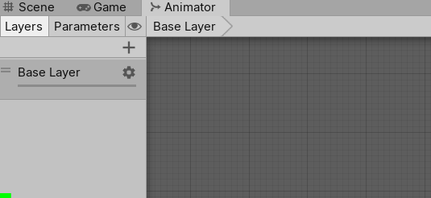
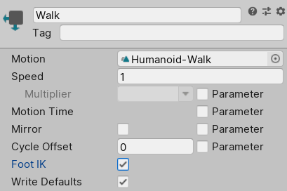

## Inverse Kinematics

绝大多数动画使用 FK。

Animancer 允许你与和 Mecanim 相同的方式使用 Unity 的内置 HumanoidIK 系统，但是是通过在一个 state 或 layer 上设置 AnimancerLayer.ApplyFootIK 或 AnimancerLayer.ApplyAnimatorIK，而不是在 Animator Controller 通过 toggles 开启。

你还可以使用 AnimancerComponent Inspector 中的 Context Menu Function 开启和关闭 IK，用于测试。这个 setting 将不会存储在 scene 或 prefab 中，因此你总是需要在运行时脚本中开启 IK。

## IK Pass

IK Pass(Pose 后处理) 导致 Unity 在 Animator GameObject 上的每个脚本上每帧调用 OnAnimatorIK(int layerIndex) 方法。

IK 就是对 Pose 的后处理，而这个 Pose 可以仅仅是某个 State 的输出，也可以是所有 State 的输出。下面展示了应用 IK 的 3 个 scope：所有 States，指定 Layer 的所有 States，指定的 State。一个 State 就是一个数据源，它可以输出 Pose 数据，这个 State 可以是一个简单的 AnimationClip，也可以是一个复杂的 BlendTree，甚至一个子状态机。说白了，就是指定了3个时机，全部 States 输出完，指定 Layer 的 States 输出完，指定 State 输出完，在这些时刻之后执行 IK 后处理。IK 后处理后面还可能有其他的后处理（例如 RotationLimit 甚至自定义脚本）。

```C#
void EnableIKPass(AnimancerComponent animancer, AnimationClip clip)
{
    // Enable IK Pass for all states:
    animancer.Playable.ApplyAnimatorIK = true;

    // Enable IK Pass for all states on a specific layer:
    animancer.Layers[0].ApplyAnimatorIK = true;

    // Enable IK Pass for a specific state (and any children if it is a mixer):
    var state = animancer.States.GetOrCreate(clip);
    state.ApplyAnimatorIK = true;
}
```

这等价于在一个 AnimationController Layer 上开启 IK Pass，除了由于 Playables API 中的限制，Unity 传递给 OnAnimatorIK 的 layerIndex 总是 0



默认情况下，states 在它们被指派时，将会自动被赋予它们 parent 的 IK Pass 设置（例如当创建一个新的 state 或移动它到一个不同的 layer）。这可以通过在改变 parent 之前 设置 AnimancerNode.ApplyParentAnimatorIK = false 来阻止。

## Foot IK

Foot IK 允许 Unity 在 retargeting animation rig 到 model rig 之后使 character feet 更接近原始动画位置。这可以减少不同 rig 比例导致的 foot sliding，但是它也经常具有不期望的结果，因此它应该基于具体场景来选择。

与 ApplyAnimatorIK 一样，只不过这次是 ApplyRootIK

```C#
void EnableFootIK(AnimancerComponent animancer, AnimationClip clip)
{
    // Enable Foot IK for all states:
    animancer.Playable.ApplyFootIK = true;

    // Enable Foot IK for all states on a specific layer:
    animancer.Layers[0].ApplyFootIK = true;

    // Enable Foot IK for a specific state (and any children if it is a mixer):
    var state = animancer.States.GetOrCreate(clip);
    state.ApplyFootIK = true;
}
```

这等价于在一个 Animator Controller state 中开启 Foot IK



默认情况下，states 在它们被指派时，将会自动被赋予它们 parent 的 IK Pass 设置（例如当创建一个新的 state 或移动它到一个不同的 layer）。这可以通过在改变 parent 之前 设置 AnimancerNode.ApplyParentFootIK = false 来阻止。

## Animated Properties

AnimatedBool，AnimatedFloat，AnimatedInt 类允许你在运行时访问访问动画中自定义 curves 的 values。这通常用于控制 IK 的权重使得动画的一部分控制比其他部分使用更多的 IK。0 意味着 limb 将会被动画完全控制，1 意味着被 IK 系统完全控制。

IK 不是动画的一部分，IK 是动画数据的后处理。

```C#
[SerializeField] private AnimancerComponent _Animancer;

private AnimatedFloat _FootWeights;

private void Awake()
{
    _Animancer.Layers[0].ApplyAnimatorIK = true;

    _FootWeights = new AnimatedFloat(_Animancer, "LeftFootIK", "RightFootIK");
}

private void OnAnimatorIK(int layerIndex)
{
    // [0] is the first name we passed into the constructor:
    float currentLeftFootWeight = _FootWeights[0];

    // [1] is the second name we passed into the constructor:
    float currentRightFootWeight = _FootWeights[1];

    ...
}
```

添加自定义 curves 到 animation 依赖于它的位置使用不同的方式完成。

- 如果 animation 作为 model 的一部分被导入，你可以在 Import Setting > Animation Tab > Curves 添加 curves
- 否则，你可以使用 Animation 窗口添加 custom curves

在 Animator Controller 中，你可以通过提供相同名字的参数访问自定义 curves，使得 Unity 将会每帧自动使用 curve 的 values 更新这些参数，然后你可以从这个参数读取 value。

## Exposed Curves

Before Animated Properties were implemented, previous versions of Animancer allowed access to custom curves by using using an ExposedCurve class to extract a curve from the AnimationClip in the Unity Editor and serialize it separately so that it can be accessed directly at runtime. That class can now be downloaded from here and using it is fairly straightforward:

1. Create an ExposedCurve using Assets/Create/Animancer/Exposed Curve.
2. Assign the AnimationClip containing the curve and enter the Property Name of the curve.
3. Any future changes to the original curve in the AnimationClip will automatically be retrieved by the ExposedCurve. Unfortunately it is not currently possible to edit the curve using the ExposedCurve Inspector. You need to edit the curve in the Animation window or the model import settings.
4. Reference that asset in your script and evaluate it during OnAnimatorIK to determine how much weight to give the IK system during each frame:

```C#
[SerializeField] private AnimancerComponent _Animancer;
[SerializeField] private ExposedCurve _RightFootWeight;

private void OnAnimatorIK(int layerIndex)
{
    var currentWeight = _RightFootWeight.Evaluate(_Animancer);

    ...
}
```

Note that an ExposedCurve can only evaluate the target curve from a single animation where an Animated Property will automatically Blend the value according to all the animations currently playing.

## Tips

Unity 默认的 IK Pass 在通过各种方式开启时被触发，对于 Mecanim，是在 AnimatorController 的 Layer setting 菜单中开启。对于 Animancer 是通过脚本在 Animancer.Playable 或 Animancer.layer[n] 或 Animancer.State 上开启。而 FinalIK 是在 IKSolver 的 LateUpdate 中计算的。

Foot IK 是 AnimatorController 的 State 的 Inspector 中设置的。即 Foot IK 在运行时数据源（AnimationState）上设置，而不是在 AnimationClip。因为 Retarget 发生在运行时，将一个 AnimationClip 的动画 retargeting 到另一个模型上。静态的 AnimationClip 没有指定的骨骼（运行时角色）就没有所谓的 FootIK。

FinalIK 是在 Animation 输出数据后的后处理，而 FootIK 是 Animation 过程的一部分，将 AnimationClip 重定向到 character 的骨骼上，当整个动画的数据都计算出来并输出后，才轮到 FinalIK 发挥作用。

Animancer 本质上就是一个 Playable Graph 管理器，使用 State 管理 Graph 中的各个 Node，仅此而已。Playable Graph 是 Unity 动画底层的机制，因为 Mecanim 过于受限，Unity 才将 Playable API 暴露出来方便开发者定制。而直接处理 Playable Graph 过于繁琐，因此才出现了 Animancer，作为一个便捷的 Playable Graph 管理器。

Playable Graph 的核心就是各个 Node 基于权重混合数据。
