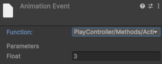
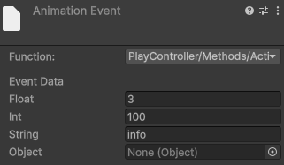
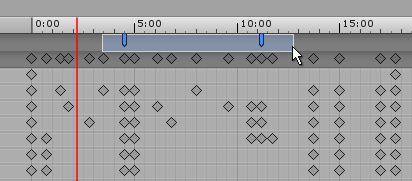

​​使用 Animation Event 在特定时间调用函数​​.

你可以在时间轴上的​​指定时刻​​通过 ​​Animation Event​​ 调用脚本中的函数。该函数可以位于挂载到同一 ​​GameObject​​ 的​​任意脚本​​中，但必须满足以下条件：

- 只能​​接受 0 个或 1 个参数​​。
- 参数类型只能是 ​​float、int、string、对象引用（Object）​​，或 ​​AnimationEvent​​。

通过 ​​Animation 事件​​调用时，函数名需与事件中填写的函数名一致，且可被反射找到（通常为 ​​public​​）。

要在当前播放头位置为剪辑添加 Animation Event（Animation Event），点击 Event按钮。要在任意位置添加 Animation Event，在事件线（Event line）上你希望添加事件的位置点击右键，并从上下文菜单中选择 Add Animation Event。添加完成后，单击并拖动该 Animation Event 即可在事件线上重新定位。


当你添加一个事件（Event）时，Inspector（检视面板）窗口会显示 Function（函数）字段。使用该字段来选择你想要调用的方法。请注意，Animation Events（动画事件）仅支持带有一个参数的方法。你不能选择接受多个参数的函数。

不过，你可以使用一个 AnimationEvent（动画事件）对象 来同时传递多个参数。AnimationEvent 对象接受 float（浮点数）、int（整数）、string（字符串） 和 object reference（对象引用） 作为成员值。该对象还提供了关于调用该函数的动画事件的相关信息。


```C#
public class PlayController : MonoBehaviour
{
    public void Action1(float v)
	{
		print($"Action2 {v}");
	}

	public void Action2(AnimationEvent evt)
	{
		print($"Action1 {evt.floatParameter} {evt.intParameter} {evt.stringParameter}");
	}
}
```

如果在 AnimationEvent 的 Function 中选择 Action1（参数只有一个 float），则 Inspector 中就只显示一个 float 参数：



如果在 AnimationEvent 的 Function 中选择 Action2（参数为一个 AnimationEvent），则 Inspector 中，会显示 4 个参数（Float，Int，String，Object），可以一次传递 4 个参数，但是每种类型只能传递一个：



你可以在​​事件线（Event Line）​​上选择并操作多个​​事件（Events）​​。要选择多个事件，按住 ​​Shift 键​​，然后​​逐个单击每个事件标记​​。

要从当前选择中移除某个已选中的标记，按住 ​​Shift 键​​，然后单击该已选中的标记。

你也可以使用​​选择框（selection box）​​来同时选择多个​​动画事件（Animation Events）​​：

在​​事件线​​内​​单击并拖动​​，即可框选出多个事件进行批量选择。



要删除一个动画事件（Animation Event），选择它并按下 Delete 键。你也可以右键单击该动画事件，然后从上下文菜单中选择 Delete Event（删除事件）。
