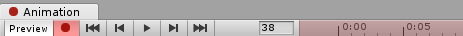
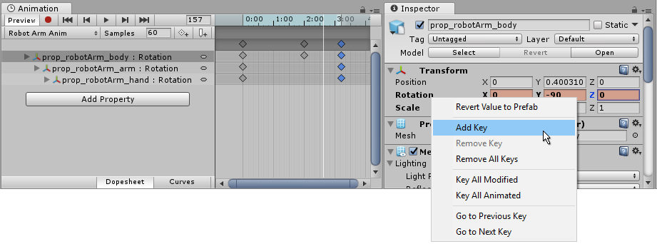

在 Animation window 中有两种方法可以动画 GameObjects：Record mode 和 Preview mode。

- Record mode（又称为 auto-key mode）

  

  在​​录制模式​​下，当你在被动画化的 ​​GameObject​​ 上​​移动​​、​​旋转​​或修改任何​​可动画属性​​时，​​Unity​​ 会自动在​​回放头​​所在位置添加​​关键帧​​。按下带有​​红色圆圈​​的按钮即可启用录制模式。处于录制模式时，​​Animation 窗口​​的时间轴会变为​​红色​​。

- Preview mode

  

  在​​预览模式​​下，修改被动画化的 ​​GameObject​​ 不会自动添加​​关键帧​​。每次将对象调整到期望的新状态（例如​​移动​​或​​旋转​​）时，你都必须手动添加关键帧。按下 ​​Preview​​ 按钮可启用预览模式。处于预览模式时，​​Animation 窗口​​的时间轴会变为​​蓝色​​。

  在​​录制模式​​下，​​Preview​​ 按钮同样处于活动状态，因为此时你正在预览现有动画，同时录制新的关键帧。

  Record mode 是自动记录关键帧。但是 Preview mode 下还可以手动创建和设置关键帧。

  将 playback head 移动到想要添加的位置，点击 Tools Bar 下面的“添加关键帧”按钮，或者右键菜单的“添加关键帧”，就可以为选择的属性添加关键帧。然后再左边的属性列表中可以手动输入关键帧数据。这样就可以完全手动创建简单的 Clip。

  

# Record keyframes

要为选定的 ​​GameObject​​ 录制关键帧，点击 ​​Record​​ 按钮。这将进入 ​​Animation Record Mode（Animation 窗口的录制模式）​​。在此模式下，对 ​​GameObject​​ 的修改会被记录到 ​​Animation Clip（动画剪辑）​​ 中。

一旦进入录制模式，你可以通过将白色的回放头（Playback head）设置到 Animation 时间轴上的目标时间点，然后修改你的 GameObject，使其达到你希望在该时间点呈现的状态，从而添加关键帧。

Animation Editor 能记录的组件属性，就是 Inspector 可显示的可序列化字段。如果一个字段能在 Inspector 中显示，就能在 Animation Clip 记录。例如，如果一个 float 字段是 private 的，但是如果标记为 [SerializedField]，它就可以在 Animation Clip 记录。在 Record 模式，可以在 Inspector 中操作这些可序列化属性，以为它添加关键帧。因此 get/set 属性不能被记录到 Clip 中。

模型导入的动画只能操作角色动画。但是游戏中还有其他关于场景、UI、粒子、物理等等只能在 Unity 内实现的动画，因此 Unity 内置动画编辑器非常必要，是必需的。甚至可以将它作为 Timeline 使用，将 Timeline 涉及的所有 GameObjects 都添加为 Root GameObject 的 child，这样 Root 的 Clip 就可以动画下面的所有 GameObject。

你对 GameObject 所做的修改，将被记录为关键帧，并出现在 Animation 窗口 中当前白色线条（即回放头）所指示的时间点。

对任何可动画属性（例如其位置或旋转）的修改，都会导致该属性的关键帧出现在 Animation 窗口中。

点击或拖动时间轴栏可以移动回放头，并显示回放头当前时间点所对应的动画状态。

在下面的截图中，你可以看到 Animation 窗口 处于录制模式。时间轴栏呈现为红色，表示当前为录制模式，而被动画化的属性在 Inspector 中会以红色背景显示。

你可以随时再次点击 Record（录制） 按钮来停止 Record 模式。当停止录制模式后，Animation 窗口会切换到 Preview（预览） 模式，这样你仍然可以根据动画时间轴看到 GameObject 处于其当前的位置状态。  

在 Animation 录制模式 下，你可以通过操作 GameObject 来对其任意属性进行动画制作。移动、旋转或缩放该对象时，Animation Clip 中会为这些属性添加对应的关键帧；同样地，在录制模式下直接在 GameObject 的 Inspector 中调整数值也会添加关键帧。这适用于 Inspector 中所有可动画化的属性，包括数值、复选框、颜色以及大多数其他类型的值。 

当前正在被动画化的 GameObject 的所有属性，都会显示在 Animation 窗口 左侧的属性列表中。未被动画化的属性不会显示在该窗口中。任何你新动画化的属性（包括子对象上的属性），只要你开始对其进行动画操作，就会立即被添加到属性列表区域中。  

Transform 属性较为特殊，其 .x、.y 和 .z 分量是相互关联的，因此为其中一个分量设置关键帧时，系统会同时为这三个分量添加对应的曲线。  

你还可以通过点击 Add Property（添加属性） 按钮，将可动画化的属性添加到当前的 GameObject（及其子对象） 中。点击该按钮会弹出一个列表，其中包含该 GameObject 所有可动画化的属性，**这些属性与你在 Inspector 中看到的属性相对应**。

一个 GameObject 的可动画属性就是 Inspector 中显示的属性，并在点击 Add Property 按钮时以列表显示。

在预览模式（Preview）或录制模式（Record）下，白色的垂直线表示当前正在预览的 Animation Clip 的哪一帧。此时，Inspector 与 Scene 视图会显示该帧对应的 GameObject 状态；该帧上各个已动画属性的数值会显示在属性名称右侧的一列中。

处于动画模式（Animation Mode）时，白色垂直线同样表示当前正在预览的帧。

## Timeline

在 ​​Animation 窗口​​ 的时间轴上，可以单击任意位置将​​播放头​​移动到该帧，并在 ​​Animation Clip​​ 中预览或修改该帧。时间轴上的数字以​​秒​​和​​帧​​显示，因此 ​​1:30​​ 表示 ​​1 秒 30 帧​​。

Timeline 在 Preview mode 显示为蓝色，在 Record mode 显示为红色。

# 在 Preview mode 中添加关键帧

除了在录制模式（Record Mode）下修改 GameObject 时自动添加关键帧之外，还可以在预览模式（Preview Mode）中通过修改 GameObject 的某个属性，然后显式地为该属性添加关键帧。

在预览模式下，Inspector 窗口中被动画化的属性会以蓝色高亮显示。当您看到这种蓝色高亮时，意味着这些属性的值正由当前在 Animation 窗口 中预览的 Animation Clip 的关键帧所驱动。

如果在预览时修改了这些蓝色高亮的属性（例如旋转一个其旋转属性已被动画化的 GameObject，如上图所示），那么该 GameObject 便处于一个​​经过修改的动画状态​​。此时，Inspector 窗口中的对应字段颜色会变为​​粉色​​，以此提示您该属性值已被修改。由于当前并未处于​​录制模式（Record Mode）​​，因此你的修改尚未被保存为关键帧。

例如，在下图中，旋转属性的 Y 值被修改为了 ​​–90​​。但该修改尚未被保存为 ​​Animation Clip​​ 中的关键帧。

在这种修改状态下，必须手动创建一个关键帧来“保存”此次修改。如果移动了播放头，或者将选择切换到其他对象（即不再选中该动画化的 GameObject），那么所做的修改将会丢失。

## 手动添加关键帧

在​​预览模式（Preview Mode）​​下修改了 ​​GameObject​​ 之后，有三种不同的方式可以手动创建关键帧。

- 通过右键单击你所修改的属性的​​属性标签（property label）​​来添加关键帧
  
  此时可以选择仅为该属性添加关键帧，或为​​所有已动画属性（all animated properties）​​一次性添加关键帧。

- 也可以单击 ​​Animation 窗口​​中的 ​​Add Keyframe​​ 按钮来添加关键帧。

  还可以使用快捷键：​​K​​ 或 ​​Shift-K​​（下文说明其区别）

上面只能为左边已经记录的动画属性添加关键帧。若想记录新的属性，必需先手动在属性列表添加这个属性。否则，仅修改属性，然后 Add Keyframe，不会为这个属性记录关键帧，因为 clip 中还没有这个属性的“track”。

如果在 Inspector 上修改了动画属性，则可以直接在 Inspector 的属性的右键菜单中在当前 clip 中为这个属性添加关键帧，不需要回到 Animation Window。

当你添加了一个关键帧后，新的关键帧将在 Animator 窗口 中显示为一个菱形符号（如下图红色标注所示），同时该属性字段会恢复为蓝色高亮，这表示你的修改已被保存为关键帧，并且你现在预览的是由动画关键帧所驱动的值。

新添加的 keyframe，在 inspector 中提示为红色。

还可以在 Animation Window 中点击 Add Keyframe 添加一个关键帧：

或者可以通过快捷键 K 或 Shift-K 添加 Keyframe 或 Keyframes。

# 快捷键

- K：为所有动画属性，在 playback head 的当前位置，记录一个关键帧
- Shift-K：在 playback head 的当前位置，为所有修改的属性，记录一个关键帧（但是属性必需在 clip 的属性列表中，不可能为 clip 没有记录的属性记录关键帧）
