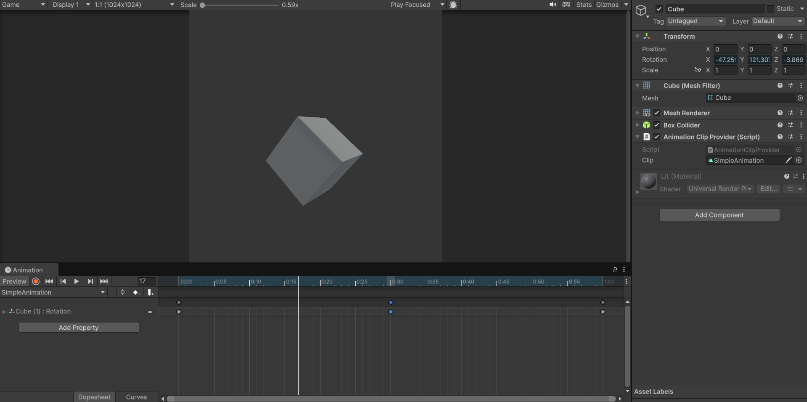

一般 Animation Clip 对属性的引用是：```./child0/child1.attribute```。这类似于 Unix 文件路径。

对于 root GameObject，操作它的属性视为 ```..attribute```。因为 root GameObject总是记录为 ```.```，因此这个动画片段如果只操作 root GameObject 的属性，那么即使将这个 clip 用于另一个具有不同名字的 GameObject 也没有问题。

但是对于下级 GameObject 的属性，就必须严格按照 GameObject 名字的路径记录。如果想将在一个 GameObject 记录的 Clip 用于另一个 GameObject，那么后者必须具有和前者一样的，在 Clip 中记录的 GameObject 路径。例如如果 Clip 记录了 ```./child0/child1.attribute``` 的动画数据（动画曲线），那么重用这个 Clip 的 GameObject 下面必须也具有 child0 和 child0/child1 两个 GameObject。否则，播放 Clip 时，动画系统就会找不到 Clip 中动画曲线对应的 GameObject。对于找不到 target 的动画曲线，会被动画系统忽略。注意，root GameObject 的名字可以是不同的，因为它们的属性在 Clip 内部都记录为 ```.``` 的属性。

Unity 创建的动画片段，可以动画以下属性：

- GameObjects 的 position，rotation，scale
- 组件的属性，例如 material color，light intensity，sound volume
- 自己脚本的属性，包括 float，integer，enum，vector，boolean
- event：调用你自己脚本中的函数的时间点

Unity Animation window 可以预览、创建、修改关联到 GameObject 的 animation clips。还可以使用 Animation window 为 animation clip 添加 Animation Events。Animation Event 在一个指定时间点调用一个函数。

# 创建、播放动画的相关元素

## 播放动画

不要被 Unity 创建动画时又是添加 Animator 又是创建 Animation Clip Asset，又是创建 Animator Controller Asset 的繁琐过程误导了，在 Unity 中创建动画其实很简洁，而且 Clip 的创建完全不依赖 Animator 和 Controller。GameObject 上完全不需要 Animator，更不用说 Animator 上不需要 Controller。

Unity 动画相关元素的关系如下图所示：


- Animator 根据输入的动画数据，实际真正操作 GameObject
- 动画数据保存在 Clip 中
- 无论时 Animator Controller 还是 Animancer，都是基于 Playable API 将动画片段 Clip 转换为动画数据的组件，并在 clip 之间执行一定的 blend 功能，形成最终输出的混合的动画数据
- Animancer 只在动画片段之间进行 blend 并输出数据，具体播放哪些 clip，在哪些片段之间进行 blend，完全由脚本（script1）控制，脚本负责管理 clips，并决定播放哪些片段
- Animator Controller 还负责了一定 clips 组织和管理的功能，它已状态机的方式将 clips 组织在一起，并定义条件（绿色的箭头）在它们之间进行切换，脚本（script0）通过触发状态机的不同条件（Condition0，Condition1，...）来 clip 之间切换

由此可见，Animator 和 Clip 才是底层元素，要播放一个动画并不依赖 Controller 和 Animancer，实际可以使用 Playable API 直接播放一个 clip 到 Animator：

```C#
//建一个 ​​PlayableGraph​​，把目标 ​​AnimationClip​​ 作为源，连接到对象的 ​​Animator​​ 输出口，即可播放；不需要挂 ​​Animator Controller​​，也不占用状态机资源。
using UnityEngine;
using UnityEngine.Playables;
using UnityEngine.Animations;

public class PlayClipDirect : MonoBehaviour
{
    public Animator animator;
    public AnimationClip clip;
    private PlayableGraph _graph;

    void Start()
    {
        if (animator == null || clip == null) return;

        // 创建图与输出
        _graph = PlayableGraph.Create("PlayClipDirect");
        var output = AnimationPlayableOutput.Create(_graph, "AnimationOutput", animator);

        // 创建 Clip 源并连接
        var clipPlayable = AnimationClipPlayable.Create(_graph, clip);
        output.SetSourcePlayable(clipPlayable);

        // 可选：设置循环
        clipPlayable.SetLooped(true);

        _graph.Play();
    }

    void OnDestroy()
    {
        if (_graph.IsValid()) _graph.Destroy();
    }
}
```

但是因为 Unity 先前动画就是以基于 Controller 状态机的方式提供的，因此到现在 Animator 组件中仍然保存对 Controller 的引用，但是如果不使用 Controller 组织 clips，并不需要它。

## 创建动画

编辑动画同样不需要 Animator Controller，甚至连 Animator 都不需要。



注意：当编辑动画时，如果 GameObject 上带有 Animator，当 Animation Window Preview 或 Record Clip 时，Animator 会被自动 disable。

```ai
这是 Unity 的预期行为：当你在编辑器里对带有 ​​Animator​​ 的对象进行“预览/播放式”操作（例如在 ​​Animation 窗口​​点击预览按钮、或与 ​​Playable Director/Timeline​​ 一起预览）时，Unity 会临时禁用该对象上的 ​​Animator 组件​​，改由编辑器的预览系统接管动画求值，从而避免预览与组件实时更新产生冲突。因此在预览期间你会看到 ​​Animator.enabled​​ 被设为 ​​false​​；停止预览后又会自动恢复为 ​​true​​。如果对象在预览时被脚本或其他逻辑再次禁用，就会出现“一启用就又被禁用”的现象。
```

可见 Animation Window 编辑动画时，不仅不需要 Animator，甚至 Animator 某种程度上称为“累赘”。因为 Animation Window 内部由自己的动画求值系统，因为它还有兼顾预览、与 Editor 操作的需求。

实际上，要能在 Animaition Window 上编辑动画，只需要有一个实现了 IAnimationClipSource 接口的组件即可。它有唯一的接口 ```void GetAnimationClips(List<AnimationClip> clips)```，Animation Window 就是通过它读取 GameObject 上的有哪些 clips 的，并将这些 clips 显示在 Animation Window 左边的 clips 列表中，因此你只需要像其中 Populate 想要编辑的动画片段即可，如下所示：

```C#
public class AnimationClipProvider : MonoBehaviour, IAnimationClipSource
{
	public AnimationClip clip;
	
	public void GetAnimationClips(List<AnimationClip> clips)
	{
		if (clip != null) {
			clips.Add(clip);
		}
	}
```

注意：Animation Window 总是从这个接口读取 clips。因此即使动画列表下拉菜单中的 Create New Clips 仍然可以创建新的 Clip，但是 Clip 只会保存到 Folder，不会出现在下拉列表中，就与在 Project View 中右键创建一个 Animation Clip 没有区别。另外，Animation Window 只会在 GameObject 被选择时读取一次，不会实时读取。因此如果 IAnimationClipSource 中更新了动画列表，Animation Window 不会立刻更新动画列表。此时可以取消选择 GameObject，然后再重新选择它，就可以看见新的动画列表了。

Animancer 的 AnimancerComponent 和 SoloAnimaiton 都实现了 IAnimationClipSource 接口。因此如果使用它们播放动画，可以直接在 Animation Window 中编辑动画。

简单单一的动画播放只需 Animator 和 SoloAnimation 即可。

虽然编辑动画时，不需要 Animator，但是运行时播放动画仍然需要 Animator。


虽然总是以一个 GameObject 为目标创建 clip，但是 Clip 并没有与 GameObject 绑定。GameObject 只是作为“模特”，作为参考和预览目标，为 Clip 指出有哪些子节点路径和可动画的属性，并使用 Unity Editor 的 Scene View 和 Inspector 中的 UI 编辑功能方便地为这些属性设置关键帧数据，仅此而已。UMotion Pose Editor 称为 Target。这也是为什么不指定 GameObject（target）就没办法创建动画，但是创建的动画 Clip 又不与 GameObject 绑定的原因。

Clip 内部以 ```.``` 表示 Root Node，然后以类似 Unix 路径的方式标记 Hierarchy 的每个子节点，为子节点上的可序列化属性编辑、保存动画曲线。如果在另一个 GameObject 上播放同一个 Clip，Root Node 以下的 Child Node 应该具有相同的 GameObject 名字，否则就找不到属性的路径。但是应用这个 Clip 的 Root GameObject 可以是任何名字，因为在 Clip 内部，总是以 ```.``` 引用当前播放动画的 GameObject。

UMotion 只处理 Pose 相关动画，不记录 Pose 之外的动画，提供了很多便于 pose 编辑的功能。但是 Unity 可以记录任何可序列化属性的动画，甚至可以当简单 Timeline 使用。

Unity Animation Window 直接以选择的 GameObject 作为目标“模特”创建动画，而 UMotion 需要在 Pose Editor 中指定 Target，然后在 Clip Editor 中基于这个 Target 创建动画。
