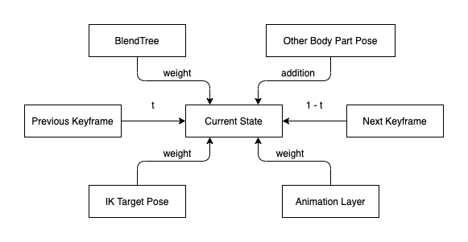
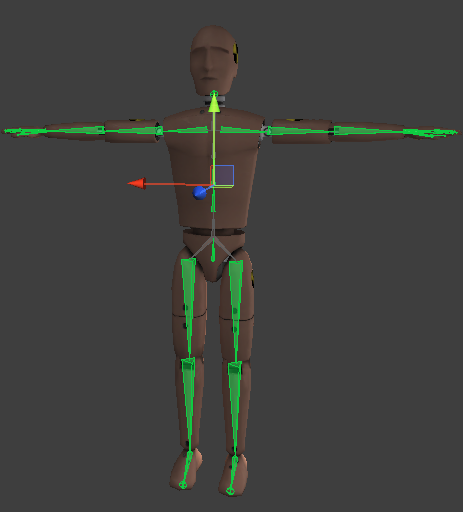
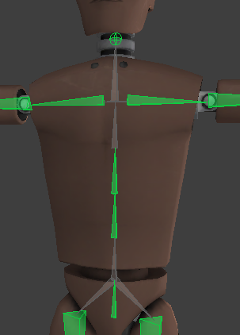
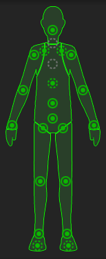

IK 不是动画，而是制作骨骼关键帧的技术。它基于一个 Pose，end effector，bone chains，target position，pole 等参数，计算一个 bone chains 中各个 bone 的旋转，使得每个 bone 旋转之后，end effector 达到 target position。它是手动设置 bone chains 使得 end effector 靠近 target 的程序化代替者，manually 和 IK 二者最终的输出都是一个 bones 的关键帧，记录每个 bone 的 transform（尤其是 rotation）。无论是 manually 还是 IK，一旦确定 keyframe，动画过程都是一样，每个 keyframe 记录各个 bones 的 transform，如果没有记录则使用之前的数据，两个 keyframe 之间使用插值，对每个 transform（position，rotation，scale）数据进行 blending 变化。

IK 是一个计算过程，使用 Pose，end effector，bone chains，target position，pole 等参数计算 bone chains 中各个 bone 的旋转，输出的结果可以作为一个 keyframe，这个 keyframe 和手动设置的 keyframe 完全等价，但是 IK 可以在运行时动态计算得到，而手动设置的 keyframe 只能在 AnimationClip 中记录为固定数据。

骨骼动画就是两个关键帧记录的各个 bones 的 transform 随时间 blending。

动画系统的关键功能就是数据混合 data blending，所有动画系统的高级功能本质都是 data blending。Translation，CrossFade，BlendTree，Layers Additive，IK，Playable 等等。骨架是有一个一个骨骼组成的，处理骨架就是处理每一个骨骼。在某一时刻，骨骼的 transform 由各种参考 source 数据源 blending 得到，每个 source 数据源有一个 weight 权重控制。有的权重（和相应的数据源）是预定的，比如 Animation Clip 时间线上的 keyframe 数据源，它的权重是当前时间在两个 keyframe 之间的 normalized time，这通常不是被程序主动控制的，而剩下的所有 source 和权重都是暴露出来由程序控制的，比如 BlendTree 中的 blend factor，到 IK Target Pose 的 blend factor（如果为 0，则当前 pose 就是其他 source 计算的数据，如果为 1，则当前 pose 就是 IK Target Pose 数据，中间的权重这就是二者的混合）。



包含 IK channel 的动画片段，IK 是单独的一个数据通道，另一个通道就是普通的 keyframe 数据。IK 通道数据记录的是在这个 frame 中，IK 的数据，动画系统根据初始 pose 和 IK 数据计算这一帧中的 pose，然后这个 pose 就和普通 keyframe 记录的 pose 没有什么区别了，之后就可以按照普通的 keyframe 进行动画了。将 IK channel 烘焙 bake 成普通 keyframe 的过程就是，计算 IK Pose 并将它记录到正常的 keyframe channel，再删除 IK channel，之后的动画片段就是完全普通的动画片段了。

运行时 IK 系统，例如 Unity 内置的 IK 系统，或者 FinalIK 等，是在运行时动态指定 end effector 和 target position，然后使用权重因子 weight 将正常动画的 pose 和这个运行时 IK pose 进行混合，在一段时间之后完全变成 IK pose，使得 end bone 完全落在 target position 上。IK 过程只计算一个 bone chains 的 pose，而不是全身，因此混合时，其他部分保持正常动画 pose，IK bone chains 从正常 pose 混合到 IK pose，这个混合程度通过随着时间的 weight 控制，这个过程类似 avatar 动画加法，身体一部分的动画数据和另一部的动画数据混合在一起，组成所有骨骼的动画。完整的骨骼动画就是一组 bones 的动画数据，动画加法就是一部分骨骼的数据在一个片段保存，另一部分骨骼的数据在另一个片段保存，加起来就是全部的 bone 数据。此外，IK 系统每次计算一个 bone chains 的 pose，但是当前 pose 不能直接变成 IK pose，而是要随着时间混合到 IK pose。但是在随着时间前进 rig 骨骼也可能会发生变化（root motion），则刚才计算的 IK pose 在新的 frame 已经无效了（例如一个 character 一边走一边按下世界空间中的一个开关），因为 bone chains root 的 position 甚至 rotation 已经变了，按照刚才的 IK pose 旋转各个 bones，end bone 不能到达世界空间中的 position。因此运行时 IK 系统应该在每一帧都重新计算 IK pose，即保持 IK pose 实时更新。这也是为什么运行时 IK 消耗性能的原因，虽然 IK pose 是实时计算的，但是 character 骨骼同样不能瞬间变成 IK pose，同样是使用一个随着时间变化的 weight（从 0 到 1）混合正常 pose 和 IK pose，正常 pose 就是随着时间从动画片段中采样不同的 pose，IK pose 当然也可以随着时间不同，只不过正常 pose 是从 clip 中采样的，IK pose 则是每一帧从正常 pose 计算到 target 的 pose。就是 normal pose 和 IK pose 都是随时间变化的（normal pose 从文件中采样，IK 在运行时计算），只是 weight 随着时间从 0 到 1 变化。权重 weight 平滑变化是动画自然变化精髓，无论两个相差多么大的 pose，只要 blending weight 从 0 到 1 平滑变化，动画就可以非常自然地平滑过度。

PuppetMaster 也是同样的原理，在正常播放的 pose 和物理 pose 之间，使用一个 weight 因子进行程序化混合控制，从一个 pose 到另一个，再从另一个 pose 回来。

动画就是输出 bone 数据，每帧都有 state 无限 clamp 之前和之后 loop 数据

动画就是输出 bone 数据的文件。Animation clip 在运行时称为 Animation State，因为 State 是一直持续的状态，只要不改变，角色就一直处于这个状态。状态就是数据。当在一个状态时，AnimationState 就必须为 character 一直提供数据。无论是 looping 的还是 non-looping clip，无论是只有一帧的 clip 还是有很多帧的 clip，都是能够持续地提供数据。当时间超过 clip 的时间之后，如果 clip 是 loop 的，就在 loop 上循环求余得到相应的帧（如果只有一帧，则总是这一帧的数据）。如果 clip 不是 loop 的，则在 clip 之前和之后的数据根据 clip warp 模式确定如何获取，例如使用 clip 的第一帧作为 clip 之前的 pose，使用 clip 的最后一帧作为 clip 之后的 pose，总是一个 state 对任何时间都提供数据。

物理系统也是程序化动画的一种，只是它不是通过预先的 keyframe 数据混合得到的，而是通过物理规则计算得到。

FinalIK demo 中，character 的骨骼结构是：

```
|__ Pelvis
    |__ Spine
        |__ Left Thigh
        |__ Right Thigh
        |__ Spine 1
            |__ Spine 2
                |__ Spine 3
                    |__ Neck
                        |__ Head
```


在 Avatar 中：

- Hips = Pelvis
- Spine = Spine1
- Chest = Spine2
- Upper Chest = None
- Left Upper Leg = Left Thigh
- Right Upper Leg = Right Thigh

其中 Spine 被跳过了。这说明 Avatar 中的骨骼是可以被跳过的。FinalIK 中 IK chain bones 也支持跳过。骨骼动画骨骼主要的 transform 是 rotation。这说明在 Unity Avatar 中 Spine 和 Left Thigh、Right Thigh 必须是兄弟关系，而不是父子关系。这样才能做出俯身的动作。从生物学上来说，脊柱和大腿也不是父子关系。

Avatar 匹配的过程中只是找到 Avatar 预定义骨骼对应的实例骨骼，然后被用作旋转。因此可以跳过骨骼，被跳过的骨骼被作为上一级骨骼的一部分，不会被 transform，就像它们是一体的 rigid 一样。找不到实例的预定义骨骼则为 None，那么在 retargeting 动画过程中就不会有实例骨骼被相应旋转。







在这里 Avatar 的 root 实际上有两个 bones，Pelvis -> Spine。然后 Left Thigh，Right Thigh，Spline 1 构成一个三角，独立地围绕着 root 旋转。

另外 Upper Chest 并没有找到。Head 找到了。在绿色的小人里面，找到的骨骼显示为绿色实心的圆圈，没找到的骨骼显示为灰色空心的圆圈。点击实心绿色的圆圈可以选中相应的骨骼。Head 通过 Upper Chest 连接在 Spine 上。虽然 Upper Chest 没有找到，但是可以手动将 Spine 3 指派给它，即使不指派，动画仍然可以正常 retargeting。因为动画的 Upper Chest 将被忽略，而 Spine 1 骨骼将带着它 到 Head 骨骼 (Spine 1 -> Spine 2 -> Spine 3 -> Neck -> Head) 一起 transform（rotation），然后 Head 在执行自己的 transform（rotation）。

因此就是，Avatar 匹配过程中，骨骼可以被跳过，可以为 None，最终骨骼几乎只用于旋转。

模型动画 Asset Hierarchy 是：

```
|__ Model GameObject
    |__ Skeleton Root
    |   |__ Pelvis
    |       |__ Spline ...
    |__ Mesh GameObject
```

Model GameObject 包含 Animator，其中有 Controller 和 Avatar 的引用。

Skeleton Root 是用 GameObject Hierarchy 表示模型骨骼结构，其中每个 GameObject 没有任何组件，只用于表示 bones 之间的父子关系和骨骼位置。

Mesh GameObject 则包含模型的 Mesh 定义，在 Skinned Mesh Renderer 中包含 Mesh，以及骨骼的 Root Bone。这里 Skinned Mesh Renderer 引用的 Root Bone 是 Skeleton Root，而不是 Pelvis，因为 Skinned Mesh Renderer 应用的骨骼 Hierarchy 必须和建模时一致。

动画 Retargeting 时，Unity 通过 Avatar 找到实例 bone，然后旋转这个 bone，这个骨骼则变形 Skinned Mesh 影响的三角形。

FinalIK 的 IK 组件和 Animation Rigging 的 Rig Builder 都必须和 Avatar 在同一个 GameObject 之上，即 Model GameObject。

学习最好的方法就是先学习再实践。无论多么复杂的东西，通过研究几个实际例子就能把大多数的技巧都能学到了。

如果骨骼绑定正确，但是角色姿势不对（不是标准的T形）。在 Scene 中可看到消息“Character not in T-Pose”，通过 Pose->Enforce T-Pose 或旋转其它的骨骼来变成 T-Pose。

Muscle 配置: 对于过于夸张的一些动作（比如动画重定向过来的时候，小孩的动画用在大人身上）可以通过对骨骼限定范围来进行调整，让骨骼只在这个范围内运动，这样，就不用重新制作动画

- 点击Muscles & Settings栏
- 点击要限制的骨骼
- 调整骨骼的运动范围的参数，旋转运动的幅度（min-max slider）
- 配置完成后点击 Apply

