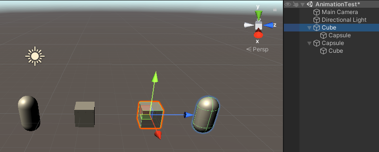
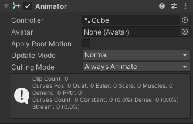
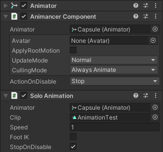
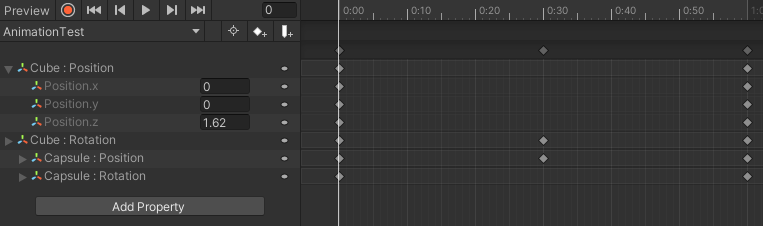
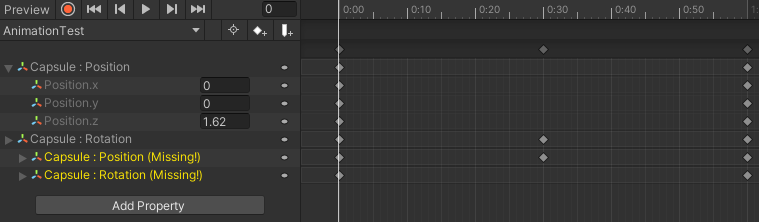
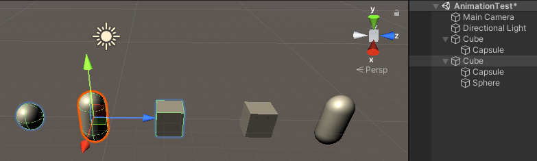

如上图，创建两个 Hierarchy，Parent 和 Child 名字相反。

第一个 Hierarchy Cube 使用 AnimatorController 播放动画，第二个 Hierarchy Capsule 使用 Animancer 播放动画。

打开 Animation 为第一个 Hierarchy 创建一个动画，包括 cube 和 capsule 的 position/rotation。

然后将这个动画片段直接应用到第二个 Hierarchy 上，就会报告 Child Capsule 的属性 missing。但是 Parent Capsule 的属性仍然能找到，并且就是原始动画片段中的 Cube 的属性。

将第二个 Hierarchy 的名字改为和第一个 Hierarchy 一样，则动画 clip 中的属性都能找到，动画可以正确播放。此外，root gameobject 的名字可以不同，例如不叫 Cube 也可以，但是下面的 gameobject 的名字必须相同。还有，hierarchy 下面还可以挂载其他的 gameobject，只要保证 clip 中使用 gameobject 存在就可以。比如这里在下面添加了一个 Sphere，它随着 Parent Cube 一起 animate，只不过动画片段里面不包含它的动画数据而已。

## 总结

- 动画片段是文件，无法更具体的模型绑定在一起，但因此也可以在多个模型中复用。
- 动画片段记录的是 hierarchy 上每个骨骼随时间的变化，这些变化通过关键帧记录。
- 动画片段记录的骨骼从 Hierarchy Root（即 Animator 所在的 GameObject）就开始记录，Hierarchy 下面的所有的 bone（GameObject）都可以被记录，不仅仅是模型中的骨骼
- 动画片段在运行时绑定到使用它的模型（Hierarchy）上。绑定是通过骨骼的路径名字完成的。动画片段使用骨骼在 Hierarchy 上的绝对路径名记录它(/bone1/bone2/bone3)。Animator 在运行时 Hierarchy 上按照相同的路径查找实例 bone，然后将 transform 数据输出给它。如果找不到对应的骨骼，就会报告属性 missing。属性 missing 不会阻止动画片段被使用，只是不会应用 missing 的数据。Root 骨骼没有名字，只通过(/) 指定就可以。这就像 Unix 路径名一样，这就是为什么 root transform 可以不同的原因。
- Humanoid 在人形模型骨骼和标准 Avatar 之间建立一个映射，然后通过 Avatar 在模型之间进行和上面一样的动画片段到实例骨骼 Hierarchy 的绑定。
- Generic 也可以有 Avatar，但是 Avatar 只映射一个 root bone。
