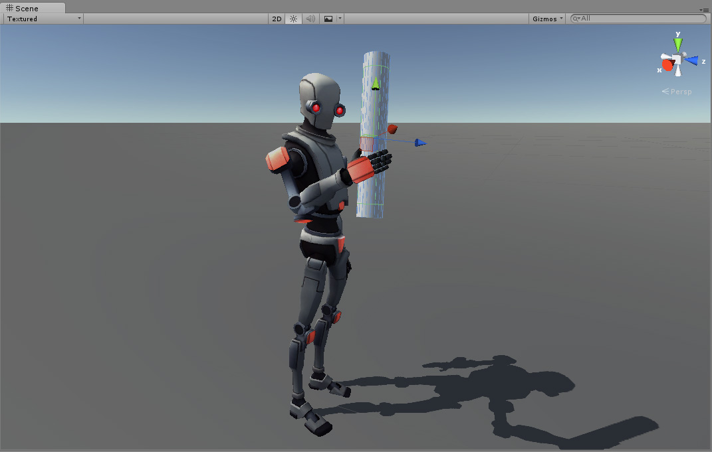

# Inverse Kinematics

绝大多数 animation 通过旋转一个骨骼中的 joints 的角度到预定义的 values 来产生。

Forward kinematics。

Inverse Kinematics（IK）：给定 space 中的一个 position，从 end 到 root 查找一个有效的方式旋转 joints 使得 end point 放在特定位置。这可以用于当你想要一个 character touch 一个 user 选择的位置上的 object，或者可信地放置它的 feet 到不平坦的地面。在 Mecanim 中任何被正确配置 Avatar 的 humanoid character 都支持 IK。



为一个 character 设置 IK，你通常在 scene 中有一个 character 交互的 objects，然后通过脚本设置 IK，具体就是，Animator functions，例如 SetIKPositionWeight，SetIKRotationWeight，SetIKPosition，SetIKRotation，SetLookAtPosition，bodyPosition，bodyRotation。

在上图中，展示了一个 character 抓住了一个 cylindrical 物体。这是如何完成的呢？

首先为 character 设置一个有效的 Avatar。

接下来，创建一个 Animator Controller，其包含至少一个角色动画。然后在 Animator window 的 Layers pane 中，点击 Layer 的齿轮 setting icon，并点击弹出的菜单中的 IK Pass checkbox。


Setting the IK Pass checkbox for the Default Layer

确保 Animator Controller 被赋予 character 的 Animator Component：


接下来，为它挂载一个脚本，这个脚本实际上处理 IK。这个脚本设置角色 right hand 的 IK target，它的 look position 使它看着它抓住的 object。

```C#
using UnityEngine;
using System;
using System.Collections;

[RequireComponent(typeof(Animator))] 

public class IKControl : MonoBehaviour {
    
    protected Animator animator;
    
    public bool ikActive = false;
    public Transform rightHandObj = null;
    public Transform lookObj = null;

    void Start () 
    {
        animator = GetComponent<Animator>();
    }
    
    // 用于计算 IK 的回调
    void OnAnimatorIK()
    {
        if(animator) {
            
            // 如果激活了 IK，直接设置 position 和 rotation 到 goal 
            if(ikActive) {

                // 如果设置了 lookObj，设置 look target position
                if(lookObj != null) {
                    animator.SetLookAtWeight(1);
                    animator.SetLookAtPosition(lookObj.position);
                }    

                // 如果设置了右手要握住的 object，设置 right hand target position 和 rotation
                if(rightHandObj != null) {
                    animator.SetIKPositionWeight(AvatarIKGoal.RightHand,1);
                    animator.SetIKRotationWeight(AvatarIKGoal.RightHand,1);  
                    animator.SetIKPosition(AvatarIKGoal.RightHand,rightHandObj.position);
                    animator.SetIKRotation(AvatarIKGoal.RightHand,rightHandObj.rotation);
                }        
                
            }
            
            // 如果 IK 没有激活，将 hand 和 head 的 position 和 rotation 设置回原始 position
            else {          
                animator.SetIKPositionWeight(AvatarIKGoal.RightHand,0);
                animator.SetIKRotationWeight(AvatarIKGoal.RightHand,0); 
                animator.SetLookAtWeight(0);
            }
        }
    }    
}
```

因为我们不想 character 的 hand 到达 object 的内部中心，我们放置一个 empty child object 在 cylinder 的表面，hand 应该放在这个位置。然后 hand targets 到这个 child object。

而 look target 被设置到 cylinder 自身，因此 character 之间看向 cylinder 的中心，即使 hand 接触的是 cylinder 底部。

进入 Player mode，你就应该可以看见 IK come to life 了。观察当你点击 IKActive checkbox 时，character grabbing 和 ungrabbing object，然后在 playmode 下尝试四处移动 cylinder 以及 arm/hand 如何跟随 object。

